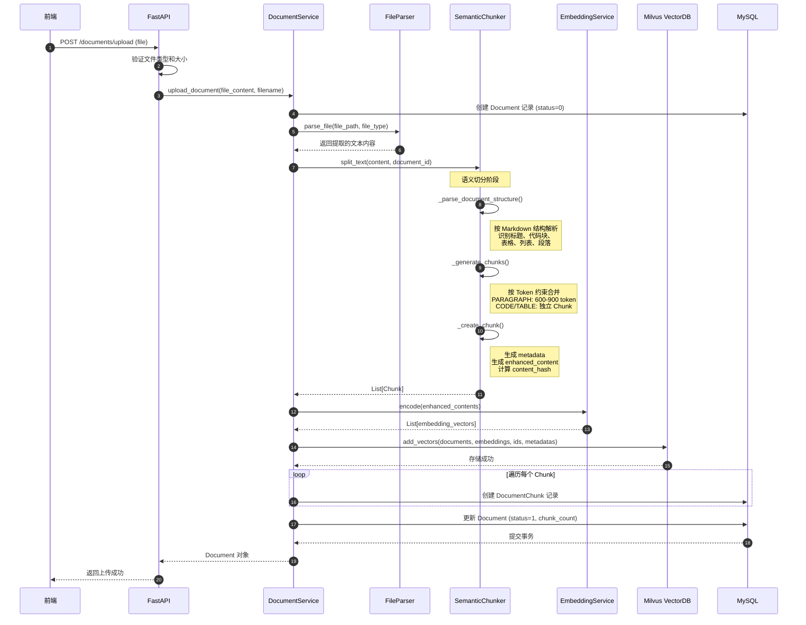

# 文档上传接口 /documents/upload

## 接口概述

| 属性 | 值 |
|------|-----|
| **接口路径** | `POST /api/v1/documents/upload` |
| **功能说明** | 上传文档并自动进行解析、切分和向量化存储 |
| **支持格式** | PDF、Markdown、TXT、DOCX |

## 请求参数

| 参数名 | 类型 | 必填 | 说明 |
|--------|------|------|------|
| file | File | 是 | 上传的文档文件 |
| max_file_size | int | 否 | 文件大小限制（默认 10MB） |
| allowed_extensions | str | 否 | 支持的文件扩展名 |

## 响应参数

```json
{
  "success": true,
  "message": "文档上传成功，正在处理中...",
  "data": {
    "id": 1,
    "filename": "技术文档.pdf",
    "file_type": "pdf",
    "file_size": 1024000,
    "status": 0
  }
}
```

---

## 完整切分流程

### 流程概览

```
┌─────────────────────────────────────────────────────────────────────────────┐
│                           文档上传完整处理流程                                │
├─────────────────────────────────────────────────────────────────────────────┤
│                                                                             │
│  ┌─────────┐    ┌─────────────┐    ┌─────────────┐    ┌─────────────────┐  │
│  │  1.文件  │───►│  2.解析    │───►│  3.语义    │───►│  4.向量化      │  │
│  │  验证   │    │  文档内容   │    │  切分      │    │  生成 Embedding │  │
│  └─────────┘    └─────────────┘    └─────────────┘    └────────┬────────┘  │
│                                                               │            │
│                                                               ▼            │
│  ┌─────────┐    ┌─────────────┐    ┌─────────────┐    ┌─────────────────┐  │
│  │  完成   │◄───│  7.更新状态 │◄───│  6.保存    │◄───│  5.存储向量    │  │
│  │  返回   │    │  入库       │    │  数据库    │    │  到 Milvus     │  │
│  └─────────┘    └─────────────┘    └─────────────┘    └─────────────────┘  │
│                                                                             │
└─────────────────────────────────────────────────────────────────────────────┘
```

### 详细步骤说明

#### 第一步：文件验证

```python
# 验证文件类型
file_type = file.filename.split(".")[-1].lower()
if file_type not in settings.allowed_extensions_list:
    raise HTTPException(status_code=400, detail=f"不支持的文件类型")

# 验证文件大小
file_content = await file.read()
if len(file_content) > settings.max_file_size:
    raise HTTPException(status_code=400, detail=f"文件大小超过限制")
```

**验证内容**：
- 文件扩展名是否在白名单内（pdf/md/txt/docx）
- 文件大小是否超过限制（默认 10MB）

---

#### 第二步：文件解析

**解析器工厂模式**，根据文件类型调用不同的解析器：

```
┌─────────────────────────────────────────────────────┐
│                   FileParser.parse_file()            │
├─────────────────────────────────────────────────────┤
│                                                     │
│  根据 file_type 分发到不同的解析方法：                 │
│                                                     │
│  ┌─────────┐    ┌──────────┐    ┌──────────┐       │
│  │  PDF    │───►│ parse_pdf │    │  返回     │       │
│  │         │    │ (pypdf)  │───►│ (文本,页数)│       │
│  └─────────┘    └──────────┘    └──────────┘       │
│                                                     │
│  ┌─────────┐    ┌───────────────┐    ┌──────────┐  │
│  │ Markdown│───►│parse_markdown │    │  返回     │  │
│  │         │    │(清理链接/图片) │───►│ (文本,行数)│  │
│  └─────────┘    └───────────────┘    └──────────┘  │
│                                                     │
│  ┌─────────┐    ┌──────────┐    ┌──────────┐       │
│  │  TXT    │───►│ parse_txt │    │  返回     │       │
│  │         │    │(直接读取)│───►│ (文本,行数)│       │
│  └─────────┘    └──────────┘    └──────────┘       │
│                                                     │
│  ┌─────────┐    ┌──────────┐    ┌──────────┐       │
│  │  DOCX   │───►│parse_docx│    │  返回     │       │
│  │         │    │(python-  │───►│ (文本,段落)│       │
│  │         │    │docx)     │    │           │       │
│  └─────────┘    └──────────┘    └──────────┘       │
│                                                     │
└─────────────────────────────────────────────────────┘
```

**各格式解析要点**：

| 格式 | 解析工具 | 提取内容 | 输出单位 |
|------|---------|---------|---------|
| PDF | pypdf.PdfReader | 逐页提取文本 | (文本, 页数) |
| Markdown | 内置 I/O + re | 清理链接/图片标记 | (文本, 行数) |
| TXT | 内置 I/O | 直接读取 | (文本, 行数) |
| DOCX | python-docx | 段落 + 表格内容 | (文本, 段落数) |

---

#### 第三步：语义切分 (SemanticChunker)

**核心切分策略**：结构优先 + Token 约束 + Overlap 机制

```
┌─────────────────────────────────────────────────────────────────────────┐
│                        SemanticChunker.split_text()                      │
├─────────────────────────────────────────────────────────────────────────┤
│                                                                         │
│  ┌───────────────────────────────────────────────────────────────────┐  │
│  │                    _parse_document_structure()                      │  │
│  │                    解析文档结构，识别 Markdown 元素                  │  │
│  ├───────────────────────────────────────────────────────────────────┤  │
│  │                                                                   │  │
│  │   逐行遍历，识别以下元素并创建 Block：                              │  │
│  │                                                                   │  │
│  │   ┌─────────┐  # 标题 ──► 创建新 Section                          │  │
│  │   ├─────────┤  ``` 代码块 ──► CODE Block                          │  │
│  │   ├─────────┤  | 表格   ──► TABLE Block                           │  │
│  │   ├─────────┤  - * 列表  ──► LIST Block                          │  │
│  │   └─────────┘  普通文本  ──► PARAGRAPH Block                      │  │
│  │                                                                   │  │
│  └───────────────────────────────────────────────────────────────────┘  │
│                                 │                                        │
│                                 ▼                                        │
│  ┌───────────────────────────────────────────────────────────────────┐  │
│  │                    _generate_chunks()                              │  │
│  │                    根据 Block 类型生成 Chunks                       │  │
│  ├───────────────────────────────────────────────────────────────────┤  │
│  │                                                                   │  │
│  │   PARAGRAPH: 累积段落，按 600 token 目标合并，超 900 token 强制拆分   │  │
│  │   CODE:     独立 Chunk，不合并                                     │  │
│  │   TABLE:    保留表头，按行拆分                                     │  │
│  │   LIST:     累积列表项，超限拆分                                   │  │
│  │                                                                   │  │
│  │   相邻 Chunk 保留 100 token 重叠（Overlap）                         │  │
│  │                                                                   │  │
│  └───────────────────────────────────────────────────────────────────┘  │
│                                 │                                        │
│                                 ▼                                        │
│  ┌───────────────────────────────────────────────────────────────────┐  │
│  │                    _create_chunk()                                 │  │
│  │                    创建最终 Chunk 对象                              │  │
│  ├───────────────────────────────────────────────────────────────────┤  │
│  │                                                                   │  │
│  │   - 生成 ChunkMetadata (chunk_index, title_path, block_type...)     │  │
│  │   - 生成 enhanced_content = "[标题]" + 内容                        │  │
│  │   - 计算 content_hash (MD5)                                        │  │
│  │   - 估算 token_count                                               │  │
│  │                                                                   │  │
│  └───────────────────────────────────────────────────────────────────┘  │
│                                                                         │
└─────────────────────────────────────────────────────────────────────────┘
```

**切分参数**：

| 参数 | 默认值 | 说明 |
|------|-------|------|
| target_tokens | 600 | 每个 Chunk 目标 token 数 |
| max_tokens | 900 | 每个 Chunk 最大 token 数（强制拆分阈值） |
| min_tokens | 120 | 最小 token 数 |
| overlap_tokens | 100 | 相邻 Chunk 重叠 token 数 |

---

#### 第四步：向量化

```python
# 使用 enhanced_content 进行 embedding（包含标题上下文）
texts_for_embedding = [chunk.enhanced_content for chunk in chunks]
embeddings = self.embedding_service.encode(texts_for_embedding)

# 生成向量 ID
vector_ids = [f"{document_id}_{i}_{uuid.uuid4().hex[:8]}" for i in range(len(chunks))]
```

**向量化配置**：
- Provider: Ollama
- Model: Qwen3-Embedding
- 维度: 2560 维
- 归一化: L2 归一化

---

#### 第五步：存储向量到 Milvus

```python
# 构建 Milvus metadata
metadatas = []
for i, chunk in enumerate(chunks):
    metadata = {
        "document_id": document_id,
        "chunk_index": i,
        "filename": Path(file_path).name,
        "char_count": chunk.metadata.char_count,
        "token_count": chunk.metadata.token_count,
        "content_hash": chunk.metadata.content_hash,
        "title_path": chunk.metadata.title_path,
        "section_level": chunk.metadata.section_level,
        "block_type": chunk.metadata.block_type,
        # ... 更多字段
    }
    metadatas.append(metadata)

# 添加到 Milvus
self.vector_store.add_vectors(
    documents=[chunk.content for chunk in chunks],  # 原始内容
    embeddings=embeddings,                           # 向量
    ids=vector_ids,                                  # 向量 ID
    metadatas=metadatas                             # 元数据
)
```

---

#### 第六步：保存到 MySQL

```python
# 保存 DocumentChunk 记录
for i, (chunk, vector_id, metadata) in enumerate(zip(chunks, vector_ids, metadatas)):
    chunk_record = DocumentChunk(
        document_id=document_id,
        chunk_index=chunk.metadata.chunk_index,
        content=chunk.content,
        vector_id=vector_id,
        # ... 其他字段
    )
    db.add(chunk_record)

# 更新 Document 状态
document.status = 1  # 已完成
document.chunk_count = len(chunks)
db.commit()
```

---

## 调用时序图



---

## 数据流向图

```
┌─────────────────────────────────────────────────────────────────────────────┐
│                              数据流向                                        │
└─────────────────────────────────────────────────────────────────────────────┘

原始文档
    │
    │  file_content (bytes)
    ▼
┌─────────────────────────────────────────────────────────────────────────────┐
│  解析阶段 (FileParser)                                                        │
│  ┌─────────────────────────────────────────────────────────────────────┐  │
│  │  PDF/Markdown/TXT/DOCX  ──────────────────────► 纯文本内容 (str)      │  │
│  └─────────────────────────────────────────────────────────────────────┘  │
└─────────────────────────────────────────────────────────────────────────────┘
    │
    │  content (str)
    ▼
┌─────────────────────────────────────────────────────────────────────────────┐
│  切分阶段 (SemanticChunker)                                                  │
│  ┌─────────────────────────────────────────────────────────────────────┐  │
│  │  纯文本  ─────────────────►  List[Chunk]                            │  │
│  │                                                                变的   │  │
│  │  Chunk.content        = 原始文本块                                  │  │
│  │  Chunk.enhanced_content = "[标题]" + 内容  ← 用于 embedding         │  │
│  │  Chunk.metadata       = 元数据 (token_count, block_type, ...)        │  │
│  └─────────────────────────────────────────────────────────────────────┘  │
└─────────────────────────────────────────────────────────────────────────────┘
    │
    │  List[enhanced_content]
    ▼
┌─────────────────────────────────────────────────────────────────────────────┐
│  向量化阶段 (EmbeddingService)                                               │
│  ┌─────────────────────────────────────────────────────────────────────┐  │
│  │  List[str]  ───────────────────►  List[embedding_vectors]           │  │
│  │  Qwen3-Embedding (2560 维, L2 归一化)                                │  │
│  └─────────────────────────────────────────────────────────────────────┘  │
└─────────────────────────────────────────────────────────────────────────────┘
    │
    │  embeddings, chunks
    ▼
┌─────────────────────────────────────────────────────────────────────────────┐
│  存储阶段 (Milvus + MySQL)                                                   │
│  ┌────────────────────────────┬────────────────────────────────────────┐  │
│  │         Milvus             │              MySQL                      │  │
│  ├────────────────────────────┼────────────────────────────────────────┤  │
│  │  vectors: 2560 维向量      │  documents 表: 文档元信息                 │  │
│  │  documents: 原始文本       │  document_chunks 表: Chunk 信息          │  │
│  │  metadatas: 丰富元数据     │  status: 0=处理中, 1=完成, 2=失败         │  │
│  └────────────────────────────┴────────────────────────────────────────┘  │
└─────────────────────────────────────────────────────────────────────────────┘
```

---

## 状态码说明

| status | 说明 | 触发时机 |
|--------|------|---------|
| 0 | 处理中 | Document 创建后，切分/向量化完成前 |
| 1 | 已完成 | 成功完成所有处理步骤 |
| 2 | 失败 | 处理过程中发生异常 |

---

## 错误处理

| 错误类型 | 返回信息 | 处理方式 |
|---------|---------|---------|
| 文件类型不支持 | `不支持的文件类型: xxx` | 验证阶段抛出 400 |
| 文件大小超限 | `文件大小超过限制，最大 xx MB` | 验证阶段抛出 400 |
| 文档内容为空 | `文档内容为空` | 解析后验证 |
| 切分无有效内容 | `文档切分后无有效内容` | 切分后验证 |
| 内部错误 | `文档上传失败` | 捕获异常，记录日志 |
