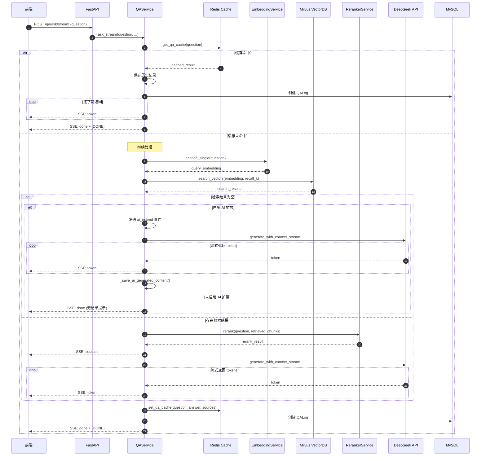

# 流式问答接口 /qa/ask/stream

## 接口概述

| 属性 | 值 |
|------|-----|
| **接口路径** | `POST /api/v1/qa/ask/stream` |
| **功能说明** | 流式返回回答，边生成边推送 |
| **传输协议** | Server-Sent Events (SSE) |

## 请求参数

| 参数名 | 类型 | 必填 | 默认值 | 说明 |
|--------|------|------|--------|------|
| question | string | 是 | - | 用户问题（1-1000字符） |
| session_id | string | 否 | null | 会话 ID，用于多轮对话 |
| top_k | int | 否 | 5 | 检索的文档数量 |
| temperature | float | 否 | 0.3 | 生成温度参数 |
| search_mode | string | 否 | "local" | 搜索模式：local/ai_generated/all |
| enable_ai_extend | bool | 否 | true | 是否启用 AI 扩展 |

## 响应格式 (SSE)

接口通过 Server-Sent Events 流式返回数据，事件格式如下：

| 事件类型 | 说明 | 出现时机 |
|----------|------|---------|
| `sources` | 检索到的参考来源 | 首次发送 |
| `token` | 每个 token 增量文本 | 每个 token 生成时 |
| `ai_extend` | AI 扩展状态 | 启用 AI 扩展时 |
| `done` | 完成，附带完整结果 | 回答生成完成 |
| `error` | 错误信息 | 处理异常时 |

### SSE 事件示例

```sse
data: {"type":"sources","sources":[{"chunk_id":1,"filename":"文档.pdf","content":"RAG是...","similarity":0.85}]}

data: {"type":"token","content":"R"}
data: {"type":"token","content":"A"}
data: {"type":"token","content":"G"}
data: {"type":"token","content":"是"}
...

data: {"type":"done","answer":"RAG是检索增强生成技术...","sources":[...],"response_time_ms":1500,"cache_hit":false}

data: [DONE]
```

---

## 完整处理流程

### 流程概览

```
┌─────────────────────────────────────────────────────────────────────────────┐
│                           流式问答完整处理流程                                │
├─────────────────────────────────────────────────────────────────────────────┤
│                                                                             │
│  ┌─────────┐    ┌─────────────┐    ┌─────────────┐    ┌─────────────────┐  │
│  │  1.缓存 │───►│  2.向量    │───►│  3.Rerank  │───►│  4.流式生成   │  │
│  │  检查   │    │  检索       │    │  重排序     │    │  回答 (SSE)   │  │
│  └─────────┘    └─────────────┘    └─────────────┘    └────────┬────────┘  │
│                                                               │            │
│  ┌─────────┐    ┌─────────────┐    ┌─────────────┐          │            │
│  │  返回   │◄───│  6.保存     │◄───│  5.缓存    │◄─────────┘            │
│  │  结果   │    │  历史记录    │    │  结果      │                      │
│  └─────────┘    └─────────────┘    └─────────────┘                      │
│                                                                             │
│  ─────────────────────────────────────────────────────────────────────────  │
│                                                                             │
│  [AI 扩展模式 - 当本地检索为空时启用]                                         │
│                                                                             │
│  ┌─────────────────────────────────────────────────────────────────────────┐ │
│  │  本地检索为空 ──► 启用 AI 扩展 ──► 直接调用 LLM 生成 ──► 保存到向量库   │ │
│  └─────────────────────────────────────────────────────────────────────────┘ │
│                                                                             │
└─────────────────────────────────────────────────────────────────────────────┘
```

---

## 详细处理步骤

### 第一步：缓存检查

```python
# 使用问题文本的哈希作为缓存键
cached = self.cache.get_qa_cache(question)
if cached:
    # 命中缓存，直接返回
    yield f"data: {{\"type\":\"sources\",\"sources\":{json.dumps(cached_sources)}}}\n\n"
    for char in cached_answer:
        yield f"data: {{\"type\":\"token\",\"content\":{json.dumps(char)}}}\n\n"
    yield f"data: {{\"type\":\"done\",...}}\n\n"
    return
```

**缓存命中时**：
- 流式返回缓存的回答（逐字符发送）
- 响应时间：毫秒级
- 记录缓存命中日志

**缓存未命中**：
- 继续执行向量检索流程

---

### 第二步：向量检索

```python
# 问题向量化
query_embedding = self.embedding_service.encode_single(question)

# 根据是否启用 Reranker 决定召回数量
k = top_k or runtime_config.retrieval_top_k
recall_k = self.reranker.recall_k if self.reranker.enabled else k

# 向量检索
search_results = self.vector_store.search_vectors(
    query_embedding=query_embedding,
    n_results=recall_k,
    where=None,
    source_type=search_mode if search_mode != "all" else None
)
```

```
┌─────────────────────────────────────────────────────────────────────────┐
│                          向量检索流程                                    │
├─────────────────────────────────────────────────────────────────────────┤
│                                                                         │
│   用户问题                                                               │
│       │                                                                  │
│       ▼                                                                  │
│   ┌─────────────────────────────────────────────────────────────────┐  │
│   │              EmbeddingService.encode_single(question)             │  │
│   │              Qwen3-Embedding → 2560 维向量                        │  │
│   └─────────────────────────────────────────────────────────────────┘  │
│       │                                                                  │
│       ▼                                                                  │
│   ┌─────────────────────────────────────────────────────────────────┐  │
│   │              Milvus VectorDB.search_vectors()                    │  │
│   │                                                                │  │
│   │   ANN 检索 (Approximate Nearest Neighbor)                     │  │
│   │   └─► Top-K 候选文档 (recall_k)                               │  │
│   │                                                                │  │
│   │   可选：按 source_type 过滤 (local/ai_generated/all)           │  │
│   └─────────────────────────────────────────────────────────────────┘  │
│       │                                                                  │
│       ▼                                                                  │
│   ┌─────────────────────────────────────────────────────────────────┐  │
│   │              解析检索结果                                        │  │
│   │   - 过滤相似度低于阈值的结果                                      │  │
│   │   - 解析 metadata                                               │  │
│   └─────────────────────────────────────────────────────────────────┘  │
│       │                                                                  │
│       ▼                                                                  │
│   List[Dict] 检索结果                                                   │
│                                                                         │
└─────────────────────────────────────────────────────────────────────────┘
```

---

### 第三步：Rerank 重排序

```python
# Rerank 处理（可选，启用时生效）
rerank_result = self.reranker.rerank(question, retrieved_chunks)
final_chunks = [c.to_dict() for c in rerank_result.candidates]
```

**重排序流程**：

```
┌─────────────────────────────────────────────────────────────────────────┐
│                          Rerank 重排序流程                                │
├─────────────────────────────────────────────────────────────────────────┤
│                                                                         │
│   原始检索结果 (Top 50)                                                  │
│       │                                                                  │
│       ▼                                                                  │
│   ┌─────────────────────────────────────────────────────────────────┐  │
│   │           Qwen3-Reranker (Cross-Encoder)                        │  │
│   │                                                                │  │
│   │   对每个候选 Chunk 计算与问题的相关性分数                        │  │
│   │   Cross-Encoder: 问题 + 文档 → 相关性分数                       │  │
│   │                                                                │  │
│   │   例如：                                                         │  │
│   │   - 问题: "RAG是什么？"                                          │  │
│   │   - Chunk: "RAG是检索增强生成技术..."  →  分数: 0.95             │  │
│   │   - Chunk: "传统搜索引擎..."            →  分数: 0.30             │  │
│   └─────────────────────────────────────────────────────────────────┘  │
│       │                                                                  │
│       ▼                                                                  │
│   按分数排序，取 Top-K (默认 10)                                          │
│       │                                                                  │
│       ▼                                                                  │
│   最终结果 (final_chunks)                                                │
│                                                                         │
└─────────────────────────────────────────────────────────────────────────┘
```

---

### 第四步：流式 LLM 生成

```python
# 构建上下文
context_texts = [chunk["content"] for chunk in final_chunks]

# 流式生成
for token in self.llm.generate_with_context_stream(
    question=question,
    context=context_texts,
    history=conversation_history,
    system_prompt=DEFAULT_SYSTEM_PROMPT,
    temperature=temperature
):
    full_answer += token
    yield f"data: {{\"type\":\"token\",\"content\":{json.dumps(token)}}}\n\n"
```

**流式生成架构**：

```
┌─────────────────────────────────────────────────────────────────────────┐
│                          流式生成架构                                      │
├─────────────────────────────────────────────────────────────────────────┤
│                                                                         │
│   ┌─────────────┐                                                       │
│   │   System    │  系统提示词                                            │
│   │   Prompt    │  "你是一个智能助手，基于给定的上下文回答问题..."         │
│   └──────┬──────┘                                                       │
│          │                                                               │
│          ▼                                                               │
│   ┌─────────────┐     ┌─────────────┐                                   │
│   │  Context    │ ──► │             │                                   │
│   │  上下文     │     │   DeepSeek  │  ◄─── 流式 API                    │
│   └─────────────┘     │   API       │                                   │
│          │            │             │                                   │
│          ▼            │   question  │ ──►┐                              │
│   ┌─────────────┐     │             │     │ 逐 token 返回               │
│   │  Question   │ ──► │             │ ◄──┘                              │
│   │  用户问题    │     └──────┬──────┘                                   │
│   └─────────────┘            │                                           │
│                              ▼                                           │
│   ┌─────────────────────────────────────────────────────────────────┐  │
│   │                      SSE 事件流                                   │  │
│   │  data: {"type":"token","content":"R"}                            │  │
│   │  data: {"type":"token","content":"A"}                            │  │
│   │  data: {"type":"token","content":"G"}                            │  │
│   │  ...                                                              │  │
│   └─────────────────────────────────────────────────────────────────┘  │
│                                                                         │
└─────────────────────────────────────────────────────────────────────────┘
```

---

### 第五步：AI 扩展模式

当本地检索为空且 `enable_ai_extend=true` 时启用：

```python
if not retrieved_chunks:
    if enable_ai_extend:
        yield "data: {\"type\":\"ai_extend\",\"status\":\"generating\"}\n\n"
        
        # 直接调用 LLM 生成（无上下文）
        for token in self.llm.generate_with_context_stream(
            question=question,
            context=[],  # 无上下文
            history=conversation_history,
            system_prompt=DEFAULT_SYSTEM_PROMPT,
            temperature=temperature
        ):
            yield f"data: {{\"type\":\"token\",\"content\":{json.dumps(token)}}}\n\n"
        
        # 保存到向量库
        await _save_ai_generated_content_async(db, question, full_answer)
```

**AI 扩展流程**：

```
┌─────────────────────────────────────────────────────────────────────────┐
│                          AI 扩展模式                                      │
├─────────────────────────────────────────────────────────────────────────┤
│                                                                         │
│   本地检索为空                                                           │
│       │                                                                  │
│       ▼                                                                  │
│   enable_ai_extend = true ?                                             │
│       │                                                                  │
│       ├── Yes ──► 发送 {"type":"ai_extend","status":"generating"}       │
│       │                                                              │
│       ▼                                                                  │
│   ┌─────────────────────────────────────────────────────────────────┐  │
│   │              直接调用 LLM 生成回答（无上下文）                      │  │
│   │                                                                │  │
│   │   system_prompt = DEFAULT_SYSTEM_PROMPT                         │  │
│   │   context = []  ← 无本地文档上下文                               │  │
│   └─────────────────────────────────────────────────────────────────┘  │
│       │                                                                  │
│       ▼                                                                  │
│   验证回答有效性                                                         │
│       │                                                                  │
│       ├── 有效 (len >= 10 且不包含无效模式) ──► 保存到向量库              │
│       │                                                              │
│       └── 无效 ──► 跳过保存                                            │
│                                                                         │
└─────────────────────────────────────────────────────────────────────────┘
```

---

### 第六步：结果保存

```python
# 1. 保存到历史记录
qa_log = QALog(
    question=question,
    answer=full_answer,
    referenced_chunks=[chunk["vector_id"] for chunk in final_chunks],
    response_time_ms=int(elapsed),
    cache_hit=False,
    source_type="local",
    session_id=session_id,
)
db.add(qa_log)

# 2. 保存到缓存
self.cache.set_qa_cache(question, full_answer, sources)

# 3. 发送完成事件
yield f"data: {{\"type\":\"done\",\"answer\":{json.dumps(full_answer)},...}}\n\n"
yield "data: [DONE]\n\n"
```

---

## 调用时序图



---

## 数据流向图

```
┌─────────────────────────────────────────────────────────────────────────────┐
│                              数据流向                                        │
└─────────────────────────────────────────────────────────────────────────────┘

用户问题
    │
    │  question (str)
    ▼
┌─────────────────────────────────────────────────────────────────────────────┐
│  检索阶段                                                                  │
│  ┌─────────────────────────────────────────────────────────────────────┐   │
│  │  question ──► Embedding ──► 2560维向量 ──► Milvus ANN检索            │   │
│  │                                                        │            │   │
│  │                    Top-K 候选 ──► Reranker ──► 最终 Top-K 结果      │   │
│  └─────────────────────────────────────────────────────────────────────┘   │
└─────────────────────────────────────────────────────────────────────────────┘
    │
    │  context_texts (List[str])
    ▼
┌─────────────────────────────────────────────────────────────────────────────┐
│  生成阶段                                                                  │
│  ┌─────────────────────────────────────────────────────────────────────┐   │
│  │  System Prompt + Context + Question ──► DeepSeek API (流式)         │   │
│  │                                                        │            │   │
│  │                            ◄── 逐 token 返回 ── SSE 流式推送        │   │
│  └─────────────────────────────────────────────────────────────────────┘   │
└─────────────────────────────────────────────────────────────────────────────┘
    │
    │  full_answer, sources
    ▼
┌─────────────────────────────────────────────────────────────────────────────┐
│  保存阶段                                                                  │
│  ┌────────────────────────┬────────────────────────────────────────────┐  │
│  │       Redis            │                MySQL                        │  │
│  ├────────────────────────┼────────────────────────────────────────────┤  │
│  │  qa_cache:             │  qa_logs 表:                                │  │
│  │  key = hash(question)  │  - question                                 │  │
│  │  value = {             │  - answer                                   │  │
│  │    answer,             │  - referenced_chunks                        │  │
│  │    sources,            │  - response_time_ms                         │  │
│  │    ...                 │  - cache_hit                                │  │
│  │  }                     │  - source_type                              │  │
│  └────────────────────────┴────────────────────────────────────────────┘  │
└─────────────────────────────────────────────────────────────────────────────┘
```

---

## 搜索模式说明

| 模式 | 说明 | 使用场景 |
|------|------|---------|
| `local` | 仅检索本地导入的文档 | 默认模式，优先使用知识库 |
| `ai_generated` | 检索 AI 生成的内容 | 查询历史 AI 回答 |
| `all` | 检索所有来源 | 全面检索 |

---

## 性能指标

| 指标 | 说明 | 典型值 |
|------|------|-------|
| 缓存命中 | Redis 直接返回 | < 10ms |
| 向量检索 | Milvus ANN 检索 | 50-200ms |
| Rerank | Cross-Encoder 重排 | 100-500ms |
| LLM 生成 | DeepSeek 流式生成 | 1-5s (视回答长度) |
| 总体响应 | 端到端 | 1-6s |

---

## 错误处理

| 错误类型 | 返回事件 | 说明 |
|---------|---------|------|
| 缓存查询失败 | 继续处理 | 降级，不影响主流程 |
| 向量检索失败 | `error` | 返回错误信息 |
| LLM 调用失败 | `error` | 返回错误信息 |
| 数据库写入失败 | 记录日志 | 降级，不阻塞返回 |
