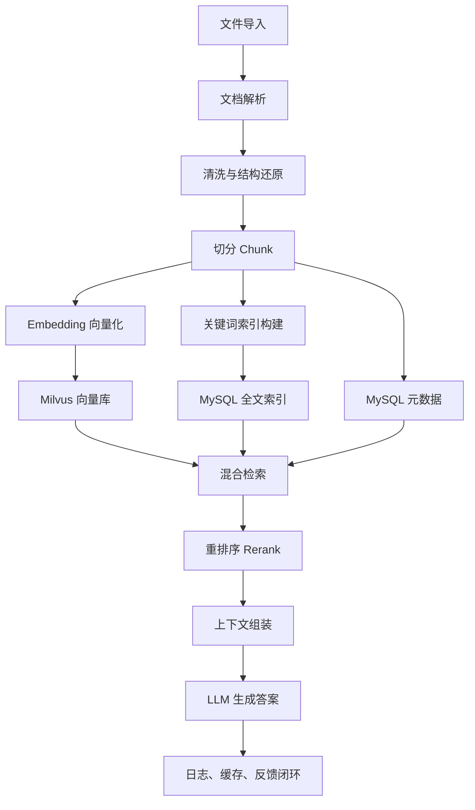
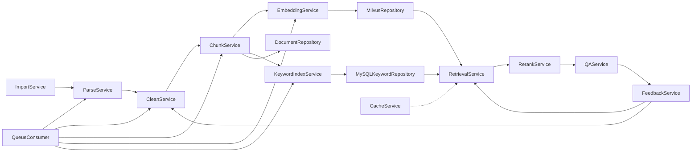

# RAG 知识库系统 - 项目开发总纲

## 项目基本信息


| 项目   | 内容                                                            |
| ---- | ------------------------------------------------------------- |
| 项目名称 | RAG 知识库系统 (RAG Knowledge Base System)                         |
| 项目描述 | 基于 RAG 技术的智能知识库系统，支持多格式文档解析、混合检索与智能问答                         |
| 技术栈  | Python 3.12 + FastAPI + Milvus + MySQL 8.0 + RabbitMQ + Redis |
| 版本号  | 1.0.0                                                         |
| 创建日期 | 2026-05-22                                                    |
| 强制规范 | [规范强制标准.md](./template/规范强制标准.md)                             |


---

## 一、项目描述

RAG（Retrieval-Augmented Generation）知识库系统是一个完整的文档智能处理与问答平台。系统支持 Word、PDF、图片、表格等多种格式文档的解析，通过语义切片和混合检索技术，为用户提供精准的知识问答服务。

### 1.1 项目目标

1. **文档智能解析**：支持结构化和无结构化文档的自动解析、OCR 识别、内容清洗
2. **语义向量化存储**：基于 Qwen3-Embedding 实现文本向量化，存入 Milvus 向量数据库
3. **混合检索能力**：融合向量语义检索与关键词精确检索，通过重排序提升结果质量
4. **智能问答服务**：基于检索增强生成，为用户提供准确的答案和引用来源
5. **持续优化闭环**：通过用户反馈不断优化清洗规则和检索策略

### 1.2 技术栈


| 层级        | 技术                    | 版本    | 说明           |
| --------- | --------------------- | ----- | ------------ |
| 后端框架      | Python 3.12 + FastAPI | 3.12+ | REST API 服务  |
| 向量数据库     | Milvus                | 2.4+  | 向量存储与 ANN 检索 |
| 主数据库      | MySQL                 | 8.0   | 元数据、全文索引     |
| 消息队列      | RabbitMQ              | 3.12+ | 异步任务处理       |
| Embedding | Qwen3-Embedding       | -     | 文本向量化模型      |
| 缓存数据库     | Redis                 | 7.x   | Embedding 缓存 |
| 文档解析      | PyMuPDF + python-docx | -     | PDF/Word 解析  |


### 1.3 服务端口


| 服务         | 端口    | 说明         |
| ---------- | ----- | ---------- |
| 后端API      | 8011  | FastAPI 服务 |
| Milvus     | 19530 | 向量数据库      |
| MySQL      | 3308  | 数据库服务      |
| Redis      | 6379  | 缓存服务       |
| RabbitMQ   | 5672  | 消息队列       |
| RabbitMQ管理 | 15672 | 管理界面       |
| 前端         | 3011  | Vue 开发服务器  |


---

## 二、强制规范

### 2.1 编码规范

**禁止乱码，所有内容必须中文正常显示：**

1. **文档显示**：Markdown 文档中页面、日志、注释必须正常显示中文
2. **后端注释**：所有代码注释必须使用中文，禁止英文或拼音缩写
3. **数据库注释**：所有表名、字段名、约束必须添加中文注释
4. **日志输出**：所有日志必须输出中文
5. **错误提示**：所有用户可见的错误信息必须使用中文
6. **API 文档**：接口描述、参数说明必须使用中文

**编码强制要求：**

- 所有源码文件使用 UTF-8 编码
- 数据库连接必须指定 charset=utf8mb4
- 配置文件必须使用 UTF-8 编码

### 2.2 环境配置规范

**必须支持多环境配置：**


| 环境    | 用途   | 数据库            | Redis          | API 地址                                                   |
| ----- | ---- | -------------- | -------------- | -------------------------------------------------------- |
| local | 开发调试 | localhost:3308 | localhost:6379 | [http://localhost:8011](http://localhost:8011)           |
| dev   | 团队联调 | dev-mysql      | dev-redis      | [http://dev-api.example.com](http://dev-api.example.com) |
| prod  | 正式上线 | prod-mysql     | prod-redis     | [https://api.example.com](https://api.example.com)       |


### 2.3 日志规范

- 所有请求必须包含 traceId、uri、method、costMs、responseCode
- JSON 格式日志，包含时间、级别、追踪 ID、用户 ID、请求信息、响应信息
- 关键业务操作必须落数据库审计记录

### 2.4 API 规范

- 所有接口必须有入参、出参、错误码、中文注释
- 所有接口返回统一格式：code/message/data/traceId/timestamp
- 所有异常返回统一错误格式

---

## 三、系统架构

### 3.1 整体流程




### 3.2 模块划分




| 服务                  | 职责                       |
| ------------------- | ------------------------ |
| ImportService       | 文件上传、Hash 去重、版本管理        |
| ParseService        | 多格式文档解析、结构提取、OCR 处理      |
| CleanService        | 编码修复、噪声过滤、敏感脱敏、质量评分      |
| ChunkService        | 语义切片、Token 约束、Overlap 处理 |
| EmbeddingService    | Qwen3 向量化、Milvus 写入、缓存管理 |
| KeywordIndexService | 分词、倒排索引、BM25 评分          |
| RetrievalService    | 混合检索、RRF 融合、权限过滤         |
| RerankService       | Cross-Encoder 重排序、上下文组装  |
| QAService           | Prompt 构造、LLM 生成、引用绑定    |
| FeedbackService     | 反馈分析、规则优化                |
| QueueConsumer       | RabbitMQ 多队列消费管理         |


---

## 四、开发批次计划


| 批次  | 文档            | 目标                        | 依赖  |
| --- | ------------- | ------------------------- | --- |
| 01  | 01-基础工程.md    | 项目结构、配置、数据库初始化            | 无   |
| 02  | 02-文档导入模块.md  | ImportService、API、文件上传    | 01  |
| 03  | 03-解析服务.md    | ParseService、Word/PDF 解析  | 02  |
| 04  | 04-清洗与切分.md   | CleanService、ChunkService | 03  |
| 05  | 05-向量化与存储.md  | EmbeddingService、Milvus   | 04  |
| 06  | 06-混合检索.md    | RetrievalService、关键词检索    | 05  |
| 07  | 07-重排序与问答.md  | RerankService、QAService   | 06  |
| 08  | 08-异步队列.md    | RabbitMQ、QueueConsumer    | 04  |
| 09  | 09-反馈与优化.md   | FeedbackService、规则优化      | 07  |
| 10  | 10-快速启动与交付.md | 启动脚本、文档、部署配置              | 09  |


---

## 五、统一规范

### 5.1 统一响应格式

```json
{
  "code": 0,
  "message": "success",
  "data": {},
  "traceId": "202605221200000001",
  "timestamp": "2026-05-22T12:00:00+08:00"
}
```

### 5.2 错误响应格式

```json
{
  "code": "BIZ_2001",
  "message": "数据不存在",
  "data": null,
  "traceId": "202605221200000001",
  "timestamp": "2026-05-22T12:00:00+08:00"
}
```

### 5.3 错误码规范


| 前缀        | 范围        | 说明   |
| --------- | --------- | ---- |
| SYS_1xxx  | 1000-1999 | 系统错误 |
| BIZ_2xxx  | 2000-2999 | 业务错误 |
| DOC_3xxx  | 3000-3999 | 文档错误 |
| RET_4xxx  | 4000-4999 | 检索错误 |
| AUTH_9xxx | 9000-9999 | 认证错误 |


---

## 六、项目结构

```
rag-system/
├── backend/                    # 后端项目
│   ├── src/
│   │   ├── main.py           # 应用入口
│   │   ├── config.py         # 配置加载
│   │   ├── app/
│   │   │   ├── api/          # API 路由
│   │   │   │   └── v1/
│   │   │   │       ├── documents.py   # 文档接口
│   │   │   │       ├── retrieval.py   # 检索接口
│   │   │   │       ├── qa.py          # 问答接口
│   │   │   │       └── feedback.py    # 反馈接口
│   │   │   ├── models/       # 数据模型
│   │   │   │   ├── document.py
│   │   │   │   ├── chunk.py
│   │   │   │   └── qa.py
│   │   │   ├── schemas/      # Pydantic 模型
│   │   │   ├── services/     # 业务逻辑
│   │   │   │   ├── import_service.py
│   │   │   │   ├── parse_service.py
│   │   │   │   ├── clean_service.py
│   │   │   │   ├── chunk_service.py
│   │   │   │   ├── embedding_service.py
│   │   │   │   ├── retrieval_service.py
│   │   │   │   ├── rerank_service.py
│   │   │   │   ├── qa_service.py
│   │   │   │   └── feedback_service.py
│   │   │   ├── repositories/  # 数据访问
│   │   │   │   ├── milvus_repository.py
│   │   │   │   └── mysql_repository.py
│   │   │   └── common/       # 公共模块
│   │   │       ├── response.py
│   │   │       ├── exception.py
│   │   │       ├── logging.py
│   │   │       └── middleware.py
│   │   └── core/             # 核心配置
│   │       ├── config.py
│   │       ├── milvus.py
│   │       └── mq.py
│   ├── tests/                 # 测试文件
│   └── resources/            # 配置文件
│       ├── application-local.yml
│       ├── application-dev.yml
│       └── application-prod.yml
│
├── frontend/                   # 前端项目
│   └── src/
│       ├── api/              # API 调用
│       ├── views/            # 页面组件
│       ├── components/       # 公共组件
│       └── stores/           # 状态管理
│
├── scripts/                    # 启动脚本
│   ├── start-all-local.bat
│   ├── start-all-local.sh
│   ├── db-init.bat
│   └── stop-all.bat
│
└── docs/                      # 文档目录
    ├── 00-项目开发总纲.md
    ├── 01-基础工程.md
    ├── 02-文档导入模块.md
    └── ...
```

---

## 七、总体验收标准

### 7.1 功能验收

- 后端 8011 可启动
- Milvus 19530 可连接
- MySQL 3308 连接正常
- Redis 6379 连接正常
- RabbitMQ 5672 可用
- 文档上传功能正常
- 文档解析流程完整
- Chunk 切分符合约束
- 向量入库成功
- 混合检索返回结果
- 问答生成答案
- 反馈记录成功

### 7.2 质量验收

- 单元测试覆盖率 ≥ 80%
- 所有接口返回统一格式
- 代码中文注释完整
- 日志输出中文
- 配置无硬编码敏感信息

---

## 八、版本记录


| 版本    | 日期         | 修改人 | 修改内容 |
| ----- | ---------- | --- | ---- |
| 1.0.0 | 2026-05-22 | 开发者 | 初始版本 |


