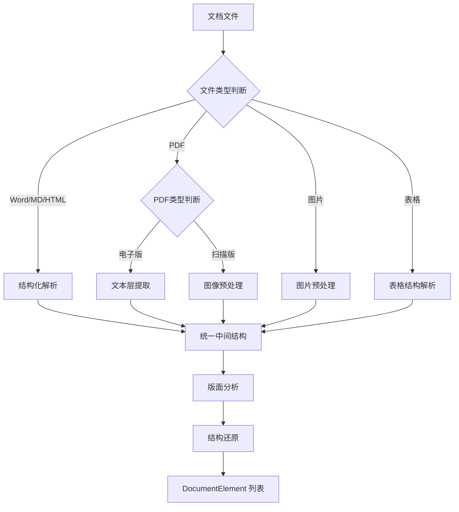

# 第 03 批 - 文档解析服务

## 基本信息


| 项目   | 内容         |
| ---- | ---------- |
| 批次编号 | 03         |
| 批次名称 | 文档解析服务     |
| 依赖批次 | 02-文档导入模块  |
| 预计工时 | 12 小时      |
| 执行日期 | 2026-05-22 |


---

## 一、Cursor 输入文案

```text
你是资深 Python 3.12 后端工程师。请基于 docs/00-项目开发总纲.md、docs/01-基础工程.md 和 docs/02-文档导入模块.md，完成第 03 批开发任务：文档解析服务。

请先阅读：
1. D:/work/agentV1/rag_flow_design.md
2. D:/work/agentV1/docs/00-项目开发总纲.md
3. D:/work/agentV1/docs/01-基础工程.md
4. D:/work/agentV1/docs/02-文档导入模块.md
5. D:/work/agentV1/docs/template/规范强制标准.md  【强制引用】

【强制规范引用】：
请严格遵循 docs/template/规范强制标准.md 中的所有强制规范。

【强制中文显示要求】：
- 所有代码注释必须使用中文。
- 所有日志输出必须使用中文。
- 所有错误提示必须使用中文。
- 所有数据库注释必须使用中文。

【技术栈要求】：
- PyMuPDF（PDF 解析）
- python-docx（Word 解析）
- Pillow（图片处理）
- OCR SDK（文字识别）

【本批次目标】：
1. 实现 DocumentElement 解析元素表
2. 实现 ParseService 文档解析服务
3. 实现 Word 文档结构化解析
4. 实现 PDF 文档解析（电子版 + 扫描版）
5. 实现图片文档 OCR 识别
6. 实现表格结构解析
7. 实现版面分析与结构还原
8. 实现图片多模态描述生成

【具体任务】：
一、数据库模型
1. 创建 document_elements 表（解析元素表）
2. 创建 parse_quality_logs 表（解析质量日志表）

二、解析服务
1. ParseService - 解析调度服务
2. WordParser - Word 文档解析器
3. PdfParser - PDF 文档解析器
4. ImageParser - 图片解析器（含 OCR）
5. TableParser - 表格解析器
6. LayoutAnalyzer - 版面分析器
7. MultimodalDescriber - 图片描述生成器

三、统一中间结构
1. DocumentElement 元素模型
2. 元素类型：title/paragraph/table/image/chart/list/header/footer

四、解析流程
1. 文件类型分流
2. 结构化解析或 OCR 解析
3. 版面分析与结构还原
4. 输出 DocumentElement 列表

【硬性要求】：
- 解析服务必须支持插件化扩展
- 必须处理电子版 PDF 和扫描版 PDF
- 必须处理表格和图片元素
- 必须记录解析质量日志
- 低置信度内容必须标记

【验收必须包含】：
1. 修改文件列表
2. 新增能力说明
3. 解析流程说明
4. API 接口说明（解析状态查询）
5. 验证命令和结果
```

---

## 二、批次概述

### 2.1 目标

本批次实现 RAG 知识库系统的文档解析服务，包括：

1. **多格式解析**：支持 Word、PDF、图片、表格等多种格式的文档解析
2. **结构化提取**：提取标题、段落、列表、表格、图片等结构化元素
3. **OCR 识别**：对扫描版 PDF 和图片进行 OCR 文字识别
4. **版面分析**：分析页面布局，还原阅读顺序
5. **质量控制**：记录解析质量日志，标记低置信度内容

### 2.2 解析流程




### 2.3 范围

**包含：**

- DocumentElement 解析元素表
- ParseService 解析调度服务
- Word/Documentx 文档解析
- PDF 文档解析（电子版 + 扫描版）
- 图片 OCR 识别
- 表格结构解析
- 版面分析与结构还原
- 图片多模态描述生成
- 解析质量日志记录

**不包含：**

- 文本清洗（下一批次）
- 语义切片（下一批次）
- 向量化存储（后续批次）

---

## 三、详细设计

### 3.1 数据库表设计

#### 3.1.1 document_elements 表（解析元素表）

```sql
CREATE TABLE `document_elements` (
  `id` bigint NOT NULL AUTO_INCREMENT COMMENT '元素主键ID',
  `document_id` bigint NOT NULL COMMENT '文档ID',
  `version_id` bigint NOT NULL COMMENT '版本ID',
  `element_id` varchar(64) NOT NULL COMMENT '元素唯一ID',
  `page_no` int DEFAULT NULL COMMENT '页码（Word 可为空）',
  `page_start` int DEFAULT NULL COMMENT '起始页（跨页元素）',
  `page_end` int DEFAULT NULL COMMENT '结束页',
  `element_type` varchar(20) NOT NULL COMMENT '元素类型：title/paragraph/table/image/chart/list/header/footer/code',
  `content` text COMMENT '原始文本内容',
  `enhanced_content` text COMMENT '增强文本内容',
  `reading_order` int DEFAULT 0 COMMENT '阅读顺序',
  `title_level` int DEFAULT NULL COMMENT '标题层级（1-6）',
  `title_path` varchar(500) DEFAULT NULL COMMENT '标题层级路径',
  `parent_path` varchar(500) DEFAULT NULL COMMENT '父级路径',
  `bbox` json DEFAULT NULL COMMENT '元素坐标 {x, y, width, height}',
  `confidence` float DEFAULT 1.0 COMMENT '识别置信度（0-1）',
  `is_merged` tinyint DEFAULT 0 COMMENT '是否跨页合并',
  `table_structure` json DEFAULT NULL COMMENT '表格结构信息',
  `image_description` json DEFAULT NULL COMMENT '图片描述信息',
  `metadata` json DEFAULT NULL COMMENT '元数据',
  `quality_flag` varchar(20) DEFAULT 'good' COMMENT '质量标记：good/warning/bad',
  `created_at` datetime NOT NULL DEFAULT CURRENT_TIMESTAMP COMMENT '创建时间',
  PRIMARY KEY (`id`),
  UNIQUE KEY `uk_element_id` (`element_id`),
  KEY `idx_document_version` (`document_id`, `version_id`),
  KEY `idx_page_no` (`page_no`),
  KEY `idx_element_type` (`element_type`),
  KEY `idx_reading_order` (`reading_order`),
  KEY `idx_quality_flag` (`quality_flag`)
) ENGINE=InnoDB DEFAULT CHARSET=utf8mb4 COLLATE=utf8mb4_unicode_ci COMMENT='文档解析元素表';
```

#### 3.1.2 parse_quality_logs 表（解析质量日志表）

```sql
CREATE TABLE `parse_quality_logs` (
  `id` bigint NOT NULL AUTO_INCREMENT COMMENT '日志主键ID',
  `document_id` bigint NOT NULL COMMENT '文档ID',
  `version_id` bigint NOT NULL COMMENT '版本ID',
  `page_no` int DEFAULT NULL COMMENT '页码',
  `element_id` varchar(64) DEFAULT NULL COMMENT '元素ID（关联 element_id）',
  `check_type` varchar(50) NOT NULL COMMENT '检查类型：ocr/low_confidence/layout/encoding',
  `quality_flag` varchar(20) NOT NULL COMMENT '质量标记：good/warning/bad',
  `confidence` float DEFAULT NULL COMMENT '置信度',
  `issue_description` text COMMENT '问题描述',
  `suggestion` text COMMENT '修复建议',
  `resolved` tinyint NOT NULL DEFAULT 0 COMMENT '是否已解决：0-否 1-是',
  `resolved_at` datetime DEFAULT NULL COMMENT '解决时间',
  `resolved_by` bigint DEFAULT NULL COMMENT '解决人ID',
  `created_at` datetime NOT NULL DEFAULT CURRENT_TIMESTAMP COMMENT '创建时间',
  PRIMARY KEY (`id`),
  KEY `idx_document_version` (`document_id`, `version_id`),
  KEY `idx_page_no` (`page_no`),
  KEY `idx_quality_flag` (`quality_flag`),
  KEY `idx_resolved` (`resolved`)
) ENGINE=InnoDB DEFAULT CHARSET=utf8mb4 COLLATE=utf8mb4_unicode_ci COMMENT='解析质量日志表';
```

### 3.2 统一中间结构 DocumentElement

```python
class DocumentElement:
    """文档元素模型"""

    element_id: str              # 元素唯一 ID
    document_id: int             # 文档 ID
    version_id: int              # 版本 ID
    page_no: Optional[int]       # 页码
    page_start: Optional[int]     # 起始页
    page_end: Optional[int]       # 结束页
    element_type: ElementType     # 元素类型
    content: str                 # 原始内容
    enhanced_content: str         # 增强内容
    reading_order: int            # 阅读顺序
    title_level: Optional[int]    # 标题层级
    title_path: Optional[str]     # 标题路径
    bbox: Optional[BBox]          # 坐标
    confidence: float             # 置信度
    is_merged: bool              # 是否跨页合并
    table_structure: Optional[TableStructure]  # 表格结构
    image_description: Optional[ImageDescription]  # 图片描述
    metadata: dict               # 元数据
    quality_flag: QualityFlag     # 质量标记

class ElementType(str, Enum):
    """元素类型枚举"""
    TITLE = "title"
    PARAGRAPH = "paragraph"
    TABLE = "table"
    IMAGE = "image"
    CHART = "chart"
    LIST = "list"
    CODE = "code"
    HEADER = "header"
    FOOTER = "footer"

class BBox(BaseModel):
    """边界框"""
    x: float
    y: float
    width: float
    height: float

class TableStructure(BaseModel):
    """表格结构"""
    headers: List[List[str]]        # 表头
    rows: List[List[str]]           # 数据行
    merged_cells: List[dict]         # 合并单元格
    row_count: int                  # 总行数
    col_count: int                  # 总列数
    caption: Optional[str]          # 表题

class ImageDescription(BaseModel):
    """图片描述"""
    description: str               # 场景描述
    chart_type: Optional[str]       # 图表类型
    chart_data_summary: Optional[str]  # 图表数据摘要
    alt_text: Optional[str]         # 替代文本
    semantic_tags: List[str]         # 语义标签
```

### 3.3 解析服务设计

#### 3.3.1 ParseService 解析调度服务

```python
class ParseService:
    """文档解析调度服务"""

    def __init__(self):
        self.parsers: Dict[str, BaseParser] = {}
        self._register_parsers()

    def parse(self, version_id: int) -> List[DocumentElement]:
        """解析文档主入口"""
        # 1. 获取版本信息
        # 2. 根据文件类型选择解析器
        # 3. 执行解析
        # 4. 版面分析
        # 5. 结构还原
        # 6. 保存元素
        # 7. 记录质量日志
        pass

    def parse_page(self, version_id: int, page_no: int) -> List[DocumentElement]:
        """解析单页"""
        pass

    def get_parse_status(self, version_id: int) -> ParseStatus:
        """获取解析状态"""
        pass

    def _register_parsers(self):
        """注册解析器"""
        self.parsers["docx"] = WordParser()
        self.parsers["doc"] = WordParser()
        self.parsers["pdf"] = PdfParser()
        self.parsers["txt"] = TextParser()
        self.parsers["md"] = MarkdownParser()
        self.parsers["html"] = HtmlParser()
        self.parsers["xlsx"] = TableParser()
        self.parsers["xls"] = TableParser()
        self.parsers["csv"] = TableParser()
        self.parsers["png"] = ImageParser()
        self.parsers["jpg"] = ImageParser()
        self.parsers["jpeg"] = ImageParser()
```

#### 3.3.2 WordParser Word 文档解析器

```python
class WordParser(BaseParser):
    """Word 文档解析器"""

    def parse(self, file_path: str, version_id: int) -> List[DocumentElement]:
        """解析 Word 文档"""
        elements = []

        # 1. 读取文档结构
        doc = docx.Document(file_path)

        # 2. 提取标题层级
        title_path = []
        for i, para in enumerate(doc.paragraphs):
            # 判断是否为标题
            if para.style.name.startswith('Heading'):
                level = int(para.style.name.replace('Heading ', ''))
                element = self._create_title_element(para, level, i, version_id)
                title_path = title_path[:level-1] + [para.text]
            else:
                element = self._create_paragraph_element(para, i, version_id, title_path)

            if element:
                elements.append(element)

        # 3. 提取表格
        for i, table in enumerate(doc.tables):
            table_element = self._create_table_element(table, i, version_id, title_path)
            elements.append(table_element)

        # 4. 提取图片
        for rel in doc.part.rels.values():
            if "image" in rel.reltype:
                image_element = self._create_image_element(rel, version_id, title_path)
                elements.append(image_element)

        # 5. 处理页眉页脚
        for section in doc.sections:
            if section.header:
                header_element = self._extract_header(section.header, version_id)
                elements.append(header_element)
            if section.footer:
                footer_element = self._extract_footer(section.footer, version_id)
                elements.append(footer_element)

        return elements

    def _create_title_element(self, para, level, order, version_id) -> DocumentElement:
        """创建标题元素"""
        pass

    def _create_paragraph_element(self, para, order, version_id, title_path) -> DocumentElement:
        """创建段落元素"""
        pass

    def _create_table_element(self, table, index, version_id, title_path) -> DocumentElement:
        """创建表格元素"""
        pass
```

#### 3.3.3 PdfParser PDF 文档解析器

```python
class PdfParser(BaseParser):
    """PDF 文档解析器"""

    def parse(self, file_path: str, version_id: int) -> List[DocumentElement]:
        """解析 PDF 文档"""
        elements = []
        doc = fitz.open(file_path)

        # 1. 判断 PDF 类型（电子版/扫描版）
        is_scanned = self._is_scanned_pdf(doc)

        for page_no in range(len(doc)):
            page = doc[page_no]

            if is_scanned:
                # 扫描版 PDF：图像预处理 + OCR
                page_elements = self._parse_scanned_page(page, page_no, version_id)
            else:
                # 电子版 PDF：文本提取
                page_elements = self._parse_text_page(page, page_no, version_id)

            elements.extend(page_elements)

        # 6. 版面分析与结构还原
        elements = self._layout_analysis(elements, len(doc))

        return elements

    def _is_scanned_pdf(self, doc) -> bool:
        """判断是否为扫描版 PDF"""
        # 统计有文本的页面比例
        text_pages = 0
        for page in doc:
            text = page.get_text()
            if text.strip():
                text_pages += 1

        # 如果文本页面比例低于阈值，判定为扫描版
        ratio = text_pages / len(doc)
        return ratio < 0.5

    def _parse_text_page(self, page, page_no, version_id) -> List[DocumentElement]:
        """解析电子版 PDF 页面"""
        elements = []

        # 提取文本块和坐标
        blocks = page.get_text("dict")["blocks"]

        for block in blocks:
            if block["type"] == 0:  # 文本块
                element = self._extract_text_block(block, page_no, version_id)
                if element:
                    elements.append(element)
            elif block["type"] == 1:  # 图像块
                element = self._extract_image_block(block, page_no, version_id)
                if element:
                    elements.append(element)

        return elements

    def _parse_scanned_page(self, page, page_no, version_id) -> List[DocumentElement]:
        """解析扫描版 PDF 页面"""
        elements = []

        # 1. 页面转图像
        mat = fitz.Matrix(2, 2)  # 2x 倍率提高清晰度
        pix = page.get_pixmap(matrix=mat)
        image_bytes = pix.tobytes("png")

        # 2. 图像预处理
        processed_image = self._preprocess_image(image_bytes)

        # 3. 版面分析（检测表格区域、标题区域等）
        layout_regions = self._detect_layout_regions(processed_image)

        # 4. 分区域 OCR
        for region in layout_regions:
            if region["type"] == "table":
                ocr_text = self._ocr_table(region["image"])
            else:
                ocr_text = self._ocr_text(region["image"])

            element = self._create_element_from_ocr(
                ocr_text, region, page_no, version_id
            )
            elements.append(element)

        return elements

    def _preprocess_image(self, image_bytes: bytes) -> np.ndarray:
        """图像预处理"""
        import cv2
        from PIL import Image
        import io

        # 转换为 numpy 数组
        image = Image.open(io.BytesIO(image_bytes))
        img_array = np.array(image)

        # 转灰度
        if len(img_array.shape) == 3:
            gray = cv2.cvtColor(img_array, cv2.COLOR_RGB2GRAY)
        else:
            gray = img_array

        # 去噪
        denoised = cv2.fastNlMeansDenoising(gray)

        # 二值化
        _, binary = cv2.threshold(denoised, 0, 255, cv2.THRESH_BINARY + cv2.THRESH_OTSU)

        # 倾斜校正
        coords = np.column_stack(np.where(binary > 0))
        if len(coords) > 0:
            angle = cv2.minAreaRect(coords)[-1]
            if angle < -45:
                angle = 90 + angle
            (h, w) = binary.shape[:2]
            center = (w // 2, h // 2)
            M = cv2.getRotationMatrix2D(center, angle, 1.0)
            corrected = cv2.warpAffine(binary, M, (w, h), flags=cv2.INTER_CUBIC)
        else:
            corrected = binary

        return corrected

    def _detect_layout_regions(self, image: np.ndarray) -> List[dict]:
        """版面区域检测"""
        import cv2

        regions = []

        # 使用轮廓检测找表格区域
        contours, _ = cv2.findContours(image, cv2.RETR_TREE, cv2.CHAIN_APPROX_SIMPLE)

        for contour in contours:
            x, y, w, h = cv2.boundingRect(contour)
            area = w * h

            # 根据面积和宽高比判断是否为表格
            if area > 10000 and 0.3 < w/h < 3:
                regions.append({
                    "type": "table",
                    "bbox": {"x": x, "y": y, "width": w, "height": h}
                })
            else:
                regions.append({
                    "type": "text",
                    "bbox": {"x": x, "y": y, "width": w, "height": h}
                })

        return regions
```

#### 3.3.4 ImageParser 图片解析器

```python
class ImageParser(BaseParser):
    """图片解析器（含 OCR）"""

    def parse(self, file_path: str, version_id: int) -> List[DocumentElement]:
        """解析图片文档"""
        elements = []

        # 1. 图像预处理
        image = self._preprocess_image(file_path)

        # 2. 方向检测与矫正
        image = self._correct_orientation(image)

        # 3. 版面分析
        layout_regions = self._analyze_layout(image)

        # 4. 多区域 OCR
        full_text = []
        for region in layout_regions:
            if region["type"] == "text":
                text = self._ocr_region(image, region)
                full_text.append(text)

        # 5. 多模态描述生成
        description = self._generate_description(image)

        # 6. 创建元素
        element = DocumentElement(
            element_id=generate_uuid(),
            document_id=version_id,
            version_id=version_id,
            page_no=1,
            element_type=ElementType.IMAGE,
            content="\n".join(full_text),
            enhanced_content=description.get("description", ""),
            confidence=description.get("confidence", 0.9),
            image_description=description,
            reading_order=0
        )
        elements.append(element)

        return elements

    def _generate_description(self, image: np.ndarray) -> dict:
        """生成图片描述（调用多模态模型）"""
        # 调用 Qwen-VL 或 GPT-4V 等多模态模型
        # 此处为预留接口
        return {
            "description": "",
            "chart_type": None,
            "chart_data_summary": None,
            "alt_text": None,
            "semantic_tags": [],
            "confidence": 0.9
        }
```

#### 3.3.5 TableParser 表格解析器

```python
class TableParser(BaseParser):
    """表格解析器"""

    def parse(self, file_path: str, version_id: int) -> List[DocumentElement]:
        """解析表格文档"""
        elements = []

        file_ext = os.path.splitext(file_path)[1].lower()

        if file_ext in [".xlsx", ".xls"]:
            elements = self._parse_excel(file_path, version_id)
        elif file_ext == ".csv":
            elements = self._parse_csv(file_path, version_id)

        return elements

    def _parse_excel(self, file_path: str, version_id: int) -> List[DocumentElement]:
        """解析 Excel 文件"""
        elements = []
        import openpyxl

        wb = openpyxl.load_workbook(file_path, data_only=True)

        for sheet_index, sheet_name in enumerate(wb.sheetnames):
            sheet = wb[sheet_name]

            # 提取表头（第一行）
            headers = []
            for cell in sheet[1]:
                headers.append(str(cell.value) if cell.value else "")

            # 提取数据行
            rows = []
            for row in sheet.iter_rows(min_row=2, values_only=True):
                row_data = [str(cell) if cell else "" for cell in row]
                if any(row_data):  # 跳过空行
                    rows.append(row_data)

            # 创建表格元素
            table_structure = TableStructure(
                headers=[headers],
                rows=rows,
                merged_cells=[],
                row_count=len(rows) + 1,
                col_count=len(headers),
                caption=sheet_name
            )

            element = DocumentElement(
                element_id=generate_uuid(),
                document_id=version_id,
                version_id=version_id,
                page_no=sheet_index + 1,
                element_type=ElementType.TABLE,
                content=self._table_to_text(headers, rows),
                table_structure=table_structure,
                confidence=0.95,
                reading_order=sheet_index
            )
            elements.append(element)

        return elements
```

### 3.4 版面分析器

```python
class LayoutAnalyzer:
    """版面分析器"""

    def analyze(self, elements: List[DocumentElement]) -> List[DocumentElement]:
        """版面分析主入口"""

        # 1. 按 bbox 初步排序
        sorted_elements = self._sort_by_bbox(elements)

        # 2. 识别页眉页脚和页码
        elements = self._identify_headers_footers(sorted_elements)

        # 3. 识别栏结构
        elements = self._identify_columns(elements)

        # 4. 识别标题层级
        elements = self._identify_titles(elements)

        # 5. 建立元素邻接关系
        elements = self._build_adjacency(elements)

        # 6. 按阅读顺序重排
        elements = self._reorder_by_reading(elements)

        # 7. 跨页段落合并
        elements = self._merge_cross_page(elements)

        # 8. 低置信度片段标记
        elements = self._mark_low_confidence(elements)

        return elements

    def _sort_by_bbox(self, elements: List[DocumentElement]) -> List[DocumentElement]:
        """按坐标排序"""
        return sorted(elements, key=lambda e: (e.page_no, e.bbox.y if e.bbox else 0, e.bbox.x if e.bbox else 0))

    def _identify_headers_footers(self, elements: List[DocumentElement]) -> List[DocumentElement]:
        """识别页眉页脚"""
        for element in elements:
            if element.bbox:
                # 假设页眉在页面上方 5% 区域
                if element.bbox.y < 50:  # 假设 dpi 调整后的阈值
                    element.element_type = ElementType.HEADER
                # 页脚在页面下方 5% 区域
                elif element.bbox.y > element.bbox.y + element.bbox.height * 0.95:
                    element.element_type = ElementType.FOOTER
        return elements

    def _merge_cross_page(self, elements: List[DocumentElement]) -> List[DocumentElement]:
        """跨页合并"""
        merged = []
        current_paragraph = None

        for element in elements:
            if element.element_type == ElementType.PARAGRAPH:
                if current_paragraph and self._can_merge(current_paragraph, element):
                    # 合并到当前段落
                    current_paragraph.content += " " + element.content
                    current_paragraph.page_end = element.page_no
                    current_paragraph.is_merged = True
                else:
                    if current_paragraph:
                        merged.append(current_paragraph)
                    current_paragraph = element
            else:
                if current_paragraph:
                    merged.append(current_paragraph)
                    current_paragraph = None
                merged.append(element)

        if current_paragraph:
            merged.append(current_paragraph)

        return merged
```

---

## 四、API 接口

### 4.1 接口列表


| 方法   | 路径                                           | 说明       |
| ---- | -------------------------------------------- | -------- |
| POST | /api/v1/documents/{id}/parse                 | 触发文档解析   |
| GET  | /api/v1/documents/{id}/parse-status          | 查询解析状态   |
| GET  | /api/v1/documents/{id}/elements              | 获取解析元素列表 |
| GET  | /api/v1/documents/{id}/elements/{element_id} | 获取单个元素详情 |
| POST | /api/v1/documents/{id}/reparse               | 重新解析文档   |


### 4.2 接口详情

##### POST /api/v1/documents/{id}/parse

**功能说明：** 触发文档解析任务

**响应示例：**

```json
{
  "code": 0,
  "message": "解析任务已创建",
  "data": {
    "task_id": "uuid-string",
    "document_id": 1,
    "version_id": 1,
    "status": "pending"
  }
}
```

##### GET /api/v1/documents/{id}/parse-status

**功能说明：** 查询文档解析状态

**响应示例：**

```json
{
  "code": 0,
  "message": "success",
  "data": {
    "document_id": 1,
    "version_id": 1,
    "status": 2,
    "status_name": "解析完成",
    "parse_progress": 100,
    "total_pages": 50,
    "total_elements": 320,
    "quality_summary": {
      "good": 300,
      "warning": 15,
      "bad": 5
    },
    "started_at": "2026-05-22T10:00:00+08:00",
    "completed_at": "2026-05-22T10:05:00+08:00",
    "cost_seconds": 300
  }
}
```

---

## 五、目录结构

```
backend/src/app/
├── api/v1/
│   └── parse.py              # 新增：解析接口
├── models/
│   └── parse.py              # 新增：解析相关模型
├── schemas/
│   └── parse.py              # 新增：解析相关 Schema
├── services/
│   └── parse_service.py      # 新增：解析服务
├── parsers/                   # 新增：解析器目录
│   ├── __init__.py
│   ├── base.py               # 解析器基类
│   ├── word_parser.py        # Word 解析器
│   ├── pdf_parser.py         # PDF 解析器
│   ├── image_parser.py       # 图片解析器
│   ├── table_parser.py       # 表格解析器
│   ├── text_parser.py        # 文本解析器
│   └── layout_analyzer.py    # 版面分析器
└── repositories/
    └── parse_repository.py   # 新增：解析仓库
```

---

## 六、测试用例

```python
# tests/test_parse.py
class TestWordParser:
    """Word 文档解析测试"""

    def test_parse_docx(self, tmp_path):
        """测试解析 Word 文档"""
        # 创建测试文档
        from docx import Document
        doc = Document()
        doc.add_heading("测试标题", level=1)
        doc.add_paragraph("这是测试段落内容")
        test_file = tmp_path / "test.docx"
        doc.save(str(test_file))

        # 解析文档
        parser = WordParser()
        elements = parser.parse(str(test_file), version_id=1)

        assert len(elements) > 0
        assert any(e.element_type == "title" for e in elements)
        assert any(e.element_type == "paragraph" for e in elements)

class TestPdfParser:
    """PDF 解析测试"""

    def test_parse_text_pdf(self):
        """测试解析电子版 PDF"""
        pass

    def test_parse_scanned_pdf(self):
        """测试解析扫描版 PDF"""
        pass
```

---

## 七、验收标准

### 7.1 功能验收


| 验收点       | 验收条件               | 状态  |
| --------- | ------------------ | --- |
| Word 解析   | docx 文件结构正确提取      |     |
| PDF 电子版解析 | 文本、坐标、格式正确提取       |     |
| PDF 扫描版解析 | OCR 识别正确           |     |
| 图片 OCR    | 图片文字正确识别           |     |
| 表格解析      | Excel/CSV 表格结构正确提取 |     |
| 版面分析      | 阅读顺序正确还原           |     |
| 跨页合并      | 跨页段落正确合并           |     |
| 质量日志      | 低置信度内容正确标记         |     |
| 解析状态查询    | 解析进度实时查询           |     |


### 7.2 性能验收


| 指标     | 要求      | 说明      |
| ------ | ------- | ------- |
| 解析速度   | < 5s/页  | 电子版 PDF |
| OCR 速度 | < 10s/页 | 扫描版 PDF |
| 内存占用   | < 500MB | 解析过程    |


---

## 八、修改文件清单

### 8.1 新增文件


| 文件路径                                             | 说明          |
| ------------------------------------------------ | ----------- |
| backend/src/app/models/parse.py                  | 解析相关数据模型    |
| backend/src/app/schemas/parse.py                 | 解析相关 Schema |
| backend/src/app/services/parse_service.py        | 解析服务        |
| backend/src/app/parsers/**init**.py              | 解析器包初始化     |
| backend/src/app/parsers/base.py                  | 解析器基类       |
| backend/src/app/parsers/word_parser.py           | Word 解析器    |
| backend/src/app/parsers/pdf_parser.py            | PDF 解析器     |
| backend/src/app/parsers/image_parser.py          | 图片解析器       |
| backend/src/app/parsers/table_parser.py          | 表格解析器       |
| backend/src/app/parsers/text_parser.py           | 文本解析器       |
| backend/src/app/parsers/layout_analyzer.py       | 版面分析器       |
| backend/src/app/repositories/parse_repository.py | 解析仓库        |
| backend/src/app/api/v1/parse.py                  | 解析接口路由      |
| backend/tests/test_parse.py                      | 解析模块测试      |


### 8.2 修改文件


| 文件路径                                 | 修改内容       |
| ------------------------------------ | ---------- |
| backend/src/app/models/**init**.py   | 导出新模型      |
| backend/src/app/schemas/**init**.py  | 导出新 Schema |
| backend/src/app/services/**init**.py | 导出新服务      |
| backend/src/app/api/v1/**init**.py   | 注册解析路由     |


---

## 九、版本记录


| 版本    | 日期         | 修改人 | 修改内容 |
| ----- | ---------- | --- | ---- |
| 1.0.0 | 2026-05-22 | 开发者 | 初始版本 |


