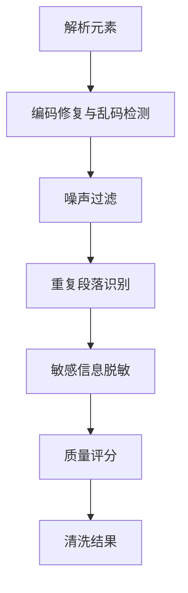
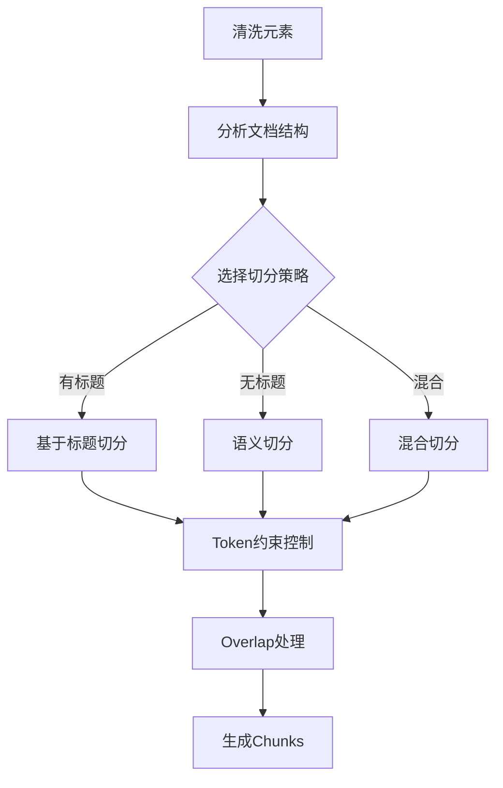

# 第 04 批 - 清洗与切分服务

## 基本信息


| 项目   | 内容         |
| ---- | ---------- |
| 批次编号 | 04         |
| 批次名称 | 清洗与切分服务    |
| 依赖批次 | 03-解析服务    |
| 预计工时 | 10 小时      |
| 执行日期 | 2026-05-22 |


---

## 一、Cursor 输入文案

```text
你是资深 Python 3.12 后端工程师。请基于文档完成第 04 批开发任务：清洗与切分。

请先阅读：
1. D:/work/agentV1/rag_flow_design.md
2. D:/work/agentV1/docs/00-项目开发总纲.md
3. D:/work/agentV1/docs/03-解析服务.md
4. D:/work/agentV1/docs/template/规范强制标准.md  【强制引用】

【强制规范引用】：
请严格遵循 docs/template/规范强制标准.md 中的所有强制规范。

【强制中文显示要求】：
- 所有代码注释必须使用中文。
- 所有日志输出必须使用中文。
- 所有错误提示必须使用中文。

【本批次目标】：
1. 实现清洗规则管理（cleaning_rules 表）
2. 实现 CleanService 清洗服务
3. 实现文本清洗：乱码修复、噪声过滤、脱敏
4. 实现质量评分机制
5. 实现 ChunkService 切分服务
6. 实现语义切片策略
7. 实现 Token 约束控制和 Overlap 处理
8. 实现表格/图表特殊切分

【具体任务】：
一、清洗服务
1. 编码修复与乱码检测
2. 噪声过滤（页眉页脚、水印、广告）
3. 重复段落识别
4. 敏感信息脱敏
5. 质量评分

二、切分服务
1. 按文档结构选择切分策略
2. 语义切片（标题层级/段落边界）
3. Token 约束控制
4. Overlap 处理
5. 图表与标题合并

【配置参数】：
- target_tokens: 600
- max_tokens: 900
- min_tokens: 120
- overlap_tokens: 100

【验收必须包含】：
1. 修改文件列表
2. 新增能力说明
3. 清洗规则说明
4. 切分策略说明
5. 验证命令和结果
```

---

## 二、批次概述

### 2.1 目标

本批次实现 RAG 知识库系统的清洗与切分服务，包括：

1. **清洗服务**：对解析后的文档元素进行清洗处理，包括编码修复、噪声过滤、重复检测、脱敏和质量评分
2. **切分服务**：将清洗后的文档内容切分为适合检索的文本块，支持多种切分策略

### 2.2 清洗流程




### 2.3 切分流程




---

## 三、详细设计

### 3.1 清洗服务设计

#### 3.1.1 CleanService 清洗服务

```python
class CleanService:
    """文档清洗服务"""

    def clean_document(
        self,
        document_id: int,
        version_id: int,
        elements: List[DocumentElement],
        config: Optional[CleaningConfig] = None
    ) -> CleaningResult:
        """
        清洗文档

        Args:
            document_id: 文档ID
            version_id: 版本ID
            elements: 待清洗的元素列表
            config: 清洗配置

        Returns:
            清洗结果
        """
        pass

    def _clean_element(
        self,
        element: DocumentElement,
        context: CleaningContext,
        config: CleaningConfig
    ) -> CleaningReport:
        """清洗单个元素"""
        pass

    def _fix_encoding(self, text: str) -> Tuple[str, List[str]]:
        """编码修复与乱码检测"""
        pass

    def _apply_cleaning_rules(
        self,
        text: str,
        context: CleaningContext
    ) -> Tuple[str, List[str]]:
        """应用清洗规则"""
        pass

    def _desensitize(self, text: str) -> Tuple[str, bool]:
        """敏感信息脱敏"""
        pass

    def _check_duplicate(
        self,
        text: str,
        context: CleaningContext
    ) -> Tuple[bool, float]:
        """重复检测"""
        pass

    def _score_quality(
        self,
        text: str,
        original_confidence: float
    ) -> Tuple[float, str, List[str]]:
        """质量评分"""
        pass
```

#### 3.1.2 清洗配置

```python
class CleaningConfig(BaseModel):
    """清洗配置模型"""
    enable_encoding_fix: bool = True  # 是否启用编码修复
    enable_noise_removal: bool = True  # 是否启用噪声过滤
    enable_duplicate_detection: bool = True  # 是否启用重复检测
    enable_desensitization: bool = True  # 是否启用脱敏
    enable_quality_scoring: bool = True  # 是否启用质量评分
    quality_threshold: float = 0.5  # 质量评分阈值
    duplicate_similarity_threshold: float = 0.85  # 重复相似度阈值
```

#### 3.1.3 脱敏模式

```python
DESENSITIZATION_PATTERNS = {
    "手机号": (r"1[3-9]\d{9}", "138****1234"),
    "身份证号": (r"\d{17}[\dXx]", "310***********1234"),
    "邮箱": (r"[a-zA-Z0-9._%+-]+@[a-zA-Z0-9.-]+\.[a-zA-Z]{2,}", "user@example.com"),
    "银行卡号": (r"\d{16,19}", "622202***********1234"),
    "IP地址": (r"\d{1,3}\.\d{1,3}\.\d{1,3}\.\d{1,3}", "192.168.***.***"),
}
```

#### 3.1.4 噪声模式

```python
NOISE_PATTERNS = {
    "页眉页脚": [
        r"^第\s*\d+\s*页$",
        r"^Page\s+\d+$",
        r"^\d+/\d+$",
    ],
    "水印": [
        r"^草稿$",
        r"^内部资料$",
        r"^机密$",
    ],
    "广告推广": [
        r"立即购买",
        r"点击查看",
        r"推广",
    ],
}
```

---

### 3.2 切分服务设计

#### 3.2.1 ChunkService 切分服务

```python
class ChunkService:
    """文档切分服务"""

    def chunk_document(
        self,
        document_id: int,
        version_id: int,
        elements: List[DocumentElement],
        cleaned_elements: Optional[List[CleanedElement]] = None,
        config: Optional[ChunkConfigRequest] = None
    ) -> ChunkingResult:
        """
        切分文档

        Args:
            document_id: 文档ID
            version_id: 版本ID
            elements: 待切分的元素列表
            cleaned_elements: 清洗后的元素列表
            config: 切分配置

        Returns:
            切分结果
        """
        pass

    def _analyze_structure(self, elements: List[DocumentElement]) -> Dict[str, Any]:
        """分析文档结构"""
        pass

    def _select_strategy(
        self,
        analysis: Dict[str, Any],
        config: ChunkConfigRequest
    ) -> ChunkStrategy:
        """选择切分策略"""
        pass

    def _split_by_title(
        self,
        elements: List[DocumentElement],
        cleaned_map: Dict[str, CleanedElement],
        config: ChunkConfigRequest
    ) -> List[ChunkBuilder]:
        """基于标题的切分"""
        pass

    def _split_by_semantic(
        self,
        elements: List[DocumentElement],
        cleaned_map: Dict[str, CleanedElement],
        config: ChunkConfigRequest
    ) -> List[ChunkBuilder]:
        """语义切分"""
        pass

    def _split_mixed(
        self,
        elements: List[DocumentElement],
        cleaned_map: Dict[str, CleanedElement],
        config: ChunkConfigRequest
    ) -> List[ChunkBuilder]:
        """混合切分"""
        pass

    def _split_table(
        self,
        element: DocumentElement,
        cleaned: Optional[CleanedElement],
        config: ChunkConfigRequest
    ) -> List[ChunkBuilder]:
        """表格特殊切分"""
        pass

    def _apply_overlap(
        self,
        chunks: List[ChunkBuilder],
        config: ChunkConfigRequest
    ) -> List[ChunkBuilder]:
        """Overlap处理"""
        pass
```

#### 3.2.2 切分配置

```python
class ChunkConfigRequest(BaseModel):
    """切分配置请求模型"""
    target_tokens: int = 600  # 目标Token数
    max_tokens: int = 900  # 最大Token数
    min_tokens: int = 120  # 最小Token数
    overlap_tokens: int = 100  # 重叠Token数
    semantic_threshold: float = 0.85  # 语义切分阈值
    split_by_title: bool = True  # 是否按标题切分
    split_by_paragraph: bool = True  # 是否按段落切分
    merge_short_chunks: bool = True  # 是否合并过短片段
    preserve_tables: bool = True  # 是否保留表格完整性
    preserve_images: bool = True  # 是否保留图片完整性
```

#### 3.2.3 切分策略


| 策略          | 适用场景         | 说明                |
| ----------- | ------------ | ----------------- |
| TITLE_BASED | 有明确标题层级结构的文档 | 优先按标题层级切分，保持章节完整性 |
| SEMANTIC    | 无结构或段落较长的文档  | 按语义边界切分，保证内容连贯性   |
| MIXED       | 混合类型文档       | 结合标题和语义特点的混合策略    |


---

## 四、API 接口

### 4.1 清洗接口


| 方法     | 路径                               | 说明     |
| ------ | -------------------------------- | ------ |
| POST   | /api/v1/cleaning/documents/{id}  | 清洗文档   |
| POST   | /api/v1/cleaning/documents/batch | 批量清洗文档 |
| POST   | /api/v1/cleaning/rules           | 创建清洗规则 |
| PUT    | /api/v1/cleaning/rules/{id}      | 更新清洗规则 |
| DELETE | /api/v1/cleaning/rules/{id}      | 删除清洗规则 |
| GET    | /api/v1/cleaning/rules           | 获取规则列表 |
| GET    | /api/v1/cleaning/logs            | 获取清洗日志 |


### 4.2 切分接口


| 方法   | 路径                                       | 说明        |
| ---- | ---------------------------------------- | --------- |
| POST | /api/v1/chunks/documents/{id}            | 切分文档      |
| POST | /api/v1/chunks/documents/batch           | 批量切分文档    |
| GET  | /api/v1/chunks/documents/{id}            | 获取Chunk列表 |
| GET  | /api/v1/chunks/{id}                      | 获取Chunk详情 |
| GET  | /api/v1/chunks/documents/{id}/statistics | 获取切分统计    |


---

## 五、目录结构

```
backend/src/app/
├── schemas/
│   ├── cleaning.py              # 新增：清洗相关Schema
│   └── chunk.py                 # 新增：切分相关Schema
├── services/
│   ├── clean_service.py         # 新增：清洗服务
│   └── chunk_service.py        # 新增：切分服务
└── api/v1/
    ├── cleaning.py              # 新增：清洗接口路由
    └── chunks.py                # 新增：切分接口路由
```

---

## 六、修改文件清单

### 6.1 新增文件


| 文件路径                                      | 说明         |
| ----------------------------------------- | ---------- |
| backend/src/app/schemas/cleaning.py       | 清洗相关Schema |
| backend/src/app/schemas/chunk.py          | 切分相关Schema |
| backend/src/app/services/clean_service.py | 清洗服务       |
| backend/src/app/services/chunk_service.py | 切分服务       |
| backend/src/app/api/v1/cleaning.py        | 清洗接口路由     |
| backend/src/app/api/v1/chunks.py          | 切分接口路由     |
| backend/tests/test_clean.py               | 清洗服务测试     |
| backend/tests/test_chunk.py               | 切分服务测试     |


### 6.2 修改文件


| 文件路径                                 | 修改内容      |
| ------------------------------------ | --------- |
| backend/src/app/schemas/**init**.py  | 导出新Schema |
| backend/src/app/services/**init**.py | 导出新服务     |
| backend/src/app/api/v1/**init**.py   | 注册新路由     |


---

## 七、新增能力说明

### 7.1 清洗服务能力


| 能力     | 说明                       | 状态  |
| ------ | ------------------------ | --- |
| 编码修复   | 修复控制字符、统一空白字符、归一化Unicode | 完成  |
| 乱码检测   | 检测可能的乱码字符和编码问题           | 完成  |
| 噪声过滤   | 删除页眉页脚、水印、广告等噪声内容        | 完成  |
| 重复段落识别 | 精确匹配和模糊匹配检测重复内容          | 完成  |
| 敏感信息脱敏 | 手机号、身份证、邮箱、银行卡等脱敏        | 完成  |
| 质量评分   | 基于多个维度评估文本质量             | 完成  |
| 规则管理   | 规则CRUD管理                 | 完成  |
| 日志记录   | 记录清洗过程和命中规则              | 完成  |


### 7.2 切分服务能力


| 能力        | 说明                     | 状态  |
| --------- | ---------------------- | --- |
| 结构分析      | 分析文档是否有标题、表格、图片等结构     | 完成  |
| 策略选择      | 根据结构自动选择切分策略           | 完成  |
| 基于标题切分    | 按标题层级切分，保持章节完整性        | 完成  |
| 语义切分      | 按语义边界切分，保证内容连贯性        | 完成  |
| 混合切分      | 结合标题和语义特点的混合策略         | 完成  |
| Token约束   | target/max/min Token控制 | 完成  |
| Overlap处理 | 相邻chunk重叠保留上下文         | 完成  |
| 表格特殊切分    | 长表格按行块切分，保留表头表题        | 完成  |
| 图片处理      | 图片保留描述和上下文             | 完成  |
| 过短chunk合并 | 合并低于min_tokens的短片段     | 完成  |


---

## 八、清洗规则说明

### 8.1 预置清洗规则


| 规则名称   | 类型            | 优先级 | 说明       |
| ------ | ------------- | --- | -------- |
| 页眉清洗   | regex_delete  | 10  | 删除页眉标记   |
| 页脚清洗   | regex_delete  | 11  | 删除页脚标记   |
| 水印清洗   | regex_delete  | 12  | 删除水印文字   |
| 空白归一化  | regex_replace | 20  | 统一空白字符   |
| 广告清洗   | regex_delete  | 30  | 删除广告推广信息 |
| 特殊符号清理 | regex_replace | 5   | 删除控制字符   |


### 8.2 脱敏规则


| 类型   | 模式示例                                        | 脱敏结果                                        |
| ---- | ------------------------------------------- | ------------------------------------------- |
| 手机号  | 13812345678                                 | 138****1234                                 |
| 身份证号 | 310101199001011234                          | 310***********1234                          |
| 邮箱   | [test@example.com](mailto:test@example.com) | [user@example.com](mailto:user@example.com) |
| 银行卡号 | 6222021234567890                            | 622202***********                           |
| IP地址 | 192.168.1.1                                 | 192.168.***.***                             |


---

## 九、切分策略说明

### 9.1 策略选择逻辑

```python
def _select_strategy(self, analysis, config):
    # 如果文档有明确的多级标题结构，使用基于标题的切分
    if analysis["has_titles"] and len(analysis["title_levels"]) > 1:
        return ChunkStrategy.TITLE_BASED

    # 如果文档包含表格或图片，使用混合策略
    if analysis["has_tables"] or analysis["has_images"]:
        return ChunkStrategy.MIXED

    # 如果段落平均长度适中，使用语义切分
    if 300 < analysis["avg_paragraph_length"] < 1500:
        return ChunkStrategy.SEMANTIC

    # 默认使用混合策略
    return ChunkStrategy.MIXED
```

### 9.2 Token约束参数


| 参数             | 默认值 | 说明              |
| -------------- | --- | --------------- |
| target_tokens  | 600 | 目标Token数，常规文本目标 |
| max_tokens     | 900 | 最大Token数，超过强制拆分 |
| min_tokens     | 120 | 最小Token数，过短合并   |
| overlap_tokens | 100 | 相邻chunk重叠Token数 |


### 9.3 表格切分策略

- 长表格按行块切分
- 每个块保留表头和表题
- 重叠处理保留最后一行作为下一个块的开始

---

## 十、测试用例

### 10.1 清洗服务测试

```bash
# 运行清洗服务测试
cd backend
pytest tests/test_clean.py -v

# 测试覆盖：
# - test_fix_encoding_basic：基本编码修复
# - test_fix_encoding_with_control_chars：控制字符移除
# - test_desensitize_phone：手机号脱敏
# - test_desensitize_id_card：身份证脱敏
# - test_check_duplicate_exact：精确重复检测
# - test_check_duplicate_similar：相似重复检测
# - test_score_quality_good：高质量评分
# - test_score_quality_short：过短文本评分
# - test_clean_element_full_pipeline：完整清洗流程
```

### 10.2 切分服务测试

```bash
# 运行切分服务测试
cd backend
pytest tests/test_chunk.py -v

# 测试覆盖：
# - test_analyze_structure_with_titles：标题结构分析
# - test_select_strategy_title_based：策略选择
# - test_split_into_sentences：句子拆分
# - test_is_semantic_boundary_chinese：中文语义边界
# - test_merge_short_chunks：过短chunk合并
# - test_apply_overlap：Overlap应用
# - test_split_by_title：基于标题切分
# - test_split_by_semantic：语义切分
# - test_split_mixed_with_table：混合切分含表格
```

---

## 十一、验收标准

### 11.1 功能验收


| 验收点       | 验收条件          | 状态  |
| --------- | ------------- | --- |
| 清洗规则管理    | 规则CRUD功能正常    |     |
| 编码修复      | 控制字符正确移除      |     |
| 乱码检测      | 乱码内容正确标记      |     |
| 噪声过滤      | 页眉页脚水印正确删除    |     |
| 重复检测      | 重复内容正确识别      |     |
| 敏感信息脱敏    | 手机号、身份证等正确脱敏  |     |
| 质量评分      | 评分结果合理        |     |
| 切分策略选择    | 根据文档结构正确选择策略  |     |
| Token约束   | 切分结果符合Token约束 |     |
| Overlap处理 | 相邻chunk有重叠内容  |     |
| 表格切分      | 长表格正确按行块切分    |     |
| API接口     | 接口返回正常        |     |


### 11.2 质量验收


| 验收点    | 验收条件   | 状态  |
| ------ | ------ | --- |
| 代码注释   | 全部使用中文 |     |
| 日志输出   | 全部使用中文 |     |
| 错误提示   | 全部使用中文 |     |
| 测试覆盖   | 核心功能覆盖 |     |
| 单元测试通过 | 全部测试通过 |     |


---

## 十二、验证命令和结果

### 12.1 运行测试

```bash
# 进入后端目录
cd D:/work/agentV1/backend

# 运行所有测试
pytest tests/ -v

# 单独运行清洗测试
pytest tests/test_clean.py -v

# 单独运行切分测试
pytest tests/test_chunk.py -v
```

### 12.2 启动服务

```bash
# 启动后端服务
cd D:/work/agentV1/backend
python -m uvicorn src.main:app --host 127.0.0.1 --port 8011 --reload
```

### 12.3 API验证

```bash
# 获取清洗规则列表
curl -X GET http://localhost:8011/api/v1/cleaning/rules

# 清洗文档（假设document_id=1）
curl -X POST http://localhost:8011/api/v1/cleaning/documents/1

# 切分文档（假设document_id=1）
curl -X POST http://localhost:8011/api/v1/chunks/documents/1

# 获取Chunk列表
curl -X GET "http://localhost:8011/api/v1/chunks/documents/1?page=1&page_size=20"

# 获取切分统计
curl -X GET http://localhost:8011/api/v1/chunks/documents/1/statistics
```

---

## 十三、版本记录


| 版本    | 日期         | 修改人 | 修改内容 |
| ----- | ---------- | --- | ---- |
| 1.0.0 | 2026-05-22 | 开发者 | 初始版本 |


