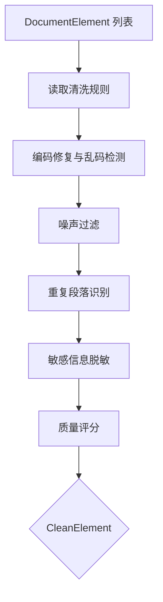
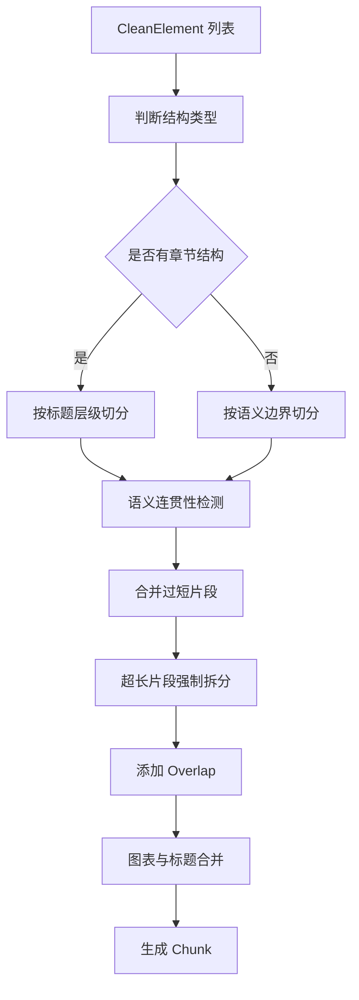

# 第 04 批 - 清洗与切分

## 基本信息


| 项目   | 内容              |
| ---- | --------------- |
| 批次编号 | 04              |
| 批次名称 | 清洗与切分         |
| 依赖批次 | 03-解析服务         |
| 预计工时 | 10 小时          |
| 执行日期 | 2026-05-22      |


---

## 一、Cursor 输入文案

```text
你是资深 Python 3.12 后端工程师。请基于文档完成第 04 批开发任务：清洗与切分。

请先阅读：
1. D:/work/agentV1/rag_flow_design.md
2. D:/work/agentV1/docs/00-项目开发总纲.md
3. D:/work/agentV1/docs/03-解析服务.md
4. D:/work/agentV1/docs/template/规范强制标准.md  【强制引用】

【强制规范引用】：
请严格遵循 docs/template/规范强制标准.md 中的所有强制规范。

【强制中文显示要求】：
- 所有代码注释必须使用中文。
- 所有日志输出必须使用中文。
- 所有错误提示必须使用中文。

【本批次目标】：
1. 实现清洗规则管理（cleaning_rules 表）
2. 实现 CleanService 清洗服务
3. 实现文本清洗：乱码修复、噪声过滤、脱敏
4. 实现质量评分机制
5. 实现 ChunkService 切分服务
6. 实现语义切片策略
7. 实现 Token 约束控制和 Overlap 处理
8. 实现表格/图表特殊切分

【具体任务】：
一、清洗服务
1. 编码修复与乱码检测
2. 噪声过滤（页眉页脚、水印、广告）
3. 重复段落识别
4. 敏感信息脱敏
5. 质量评分

二、切分服务
1. 按文档结构选择切分策略
2. 语义切片（标题层级/段落边界）
3. Token 约束控制
4. Overlap 处理
5. 图表与标题合并

【配置参数】：
- target_tokens: 600
- max_tokens: 900
- min_tokens: 120
- overlap_tokens: 100

【验收必须包含】：
1. 修改文件列表
2. 新增能力说明
3. 清洗规则说明
4. 切分策略说明
5. 验证命令和结果
```

---

## 二、批次概述

### 2.1 目标

本批次实现文档清洗与语义切分服务：

1. **清洗服务**：对解析后的元素进行质量提升，包括乱码修复、噪声过滤、脱敏、质量评分
2. **切分服务**：将清洗后的文档按语义边界切分为适合检索的 Chunk

### 2.2 清洗流程



### 2.3 切分流程



---

## 三、详细设计

### 3.1 数据库表设计

#### 3.1.1 cleaning_rules 表（清洗规则表）

```sql
CREATE TABLE `cleaning_rules` (
  `id` bigint NOT NULL AUTO_INCREMENT COMMENT '规则主键ID',
  `name` varchar(100) NOT NULL COMMENT '规则名称',
  `rule_type` varchar(50) NOT NULL COMMENT '规则类型：regex_delete/regex_replace/struct_delete/quality_control/desensitization',
  `rule_config` json NOT NULL COMMENT '规则配置',
  `priority` int NOT NULL DEFAULT 100 COMMENT '优先级（数字越小越优先）',
  `is_enabled` tinyint NOT NULL DEFAULT 1 COMMENT '是否启用：0-禁用 1-启用',
  `scope` varchar(100) DEFAULT NULL COMMENT '适用范围：all/pdf/docx/image/table',
  `business_scope` varchar(255) DEFAULT NULL COMMENT '业务范围筛选',
  `description` varchar(500) DEFAULT NULL COMMENT '规则说明',
  `effect_count` int NOT NULL DEFAULT 0 COMMENT '生效次数',
  `creator_id` bigint DEFAULT NULL COMMENT '创建人ID',
  `creator_name` varchar(100) DEFAULT NULL COMMENT '创建人姓名',
  `created_at` datetime NOT NULL DEFAULT CURRENT_TIMESTAMP COMMENT '创建时间',
  `updated_at` datetime NOT NULL DEFAULT CURRENT_TIMESTAMP ON UPDATE CURRENT_TIMESTAMP COMMENT '更新时间',
  `is_deleted` tinyint NOT NULL DEFAULT 0 COMMENT '是否删除',
  PRIMARY KEY (`id`),
  KEY `idx_rule_type` (`rule_type`),
  KEY `idx_is_enabled` (`is_enabled`),
  KEY `idx_priority` (`priority`)
) ENGINE=InnoDB DEFAULT CHARSET=utf8mb4 COLLATE=utf8mb4_unicode_ci COMMENT='清洗规则表';
```

#### 3.1.2 cleaning_logs 表（清洗日志表）

```sql
CREATE TABLE `cleaning_logs` (
  `id` bigint NOT NULL AUTO_INCREMENT COMMENT '日志主键ID',
  `document_id` bigint NOT NULL COMMENT '文档ID',
  `version_id` bigint NOT NULL COMMENT '版本ID',
  `element_id` varchar(64) DEFAULT NULL COMMENT '元素ID',
  `rule_id` bigint DEFAULT NULL COMMENT '规则ID',
  `rule_name` varchar(100) DEFAULT NULL COMMENT '规则名称',
  `rule_type` varchar(50) DEFAULT NULL COMMENT '规则类型',
  `action` varchar(20) NOT NULL COMMENT '操作：delete/replace/mask/score',
  `before_content` text COMMENT '处理前内容摘要',
  `after_content` text COMMENT '处理后内容摘要',
  `hit_count` int NOT NULL DEFAULT 1 COMMENT '命中次数',
  `created_at` datetime NOT NULL DEFAULT CURRENT_TIMESTAMP COMMENT '创建时间',
  PRIMARY KEY (`id`),
  KEY `idx_document_version` (`document_id`, `version_id`),
  KEY `idx_rule_id` (`rule_id`),
  KEY `idx_created_at` (`created_at`)
) ENGINE=InnoDB DEFAULT CHARSET=utf8mb4 COLLATE=utf8mb4_unicode_ci COMMENT='清洗日志表';
```

#### 3.1.3 document_chunks 表（Chunk 表）

```sql
CREATE TABLE `document_chunks` (
  `id` bigint NOT NULL AUTO_INCREMENT COMMENT 'Chunk主键ID',
  `document_id` bigint NOT NULL COMMENT '文档ID',
  `version_id` bigint NOT NULL COMMENT '版本ID',
  `chunk_id` varchar(64) NOT NULL COMMENT 'Chunk唯一ID',
  `chunk_index` int NOT NULL COMMENT 'Chunk索引',
  `content` text NOT NULL COMMENT 'Chunk原文',
  `enhanced_content` text COMMENT '增强文本',
  `content_hash` varchar(64) NOT NULL COMMENT '内容Hash',
  `chunk_type` varchar(20) NOT NULL COMMENT 'Chunk类型：paragraph/table/image/chart/code/list',
  `title_path` varchar(500) DEFAULT NULL COMMENT '标题层级路径',
  `chapter_path` varchar(500) DEFAULT NULL COMMENT '章节路径',
  `page_start` int DEFAULT NULL COMMENT '起始页码',
  `page_end` int DEFAULT NULL COMMENT '结束页码',
  `token_count` int NOT NULL DEFAULT 0 COMMENT 'Token数量',
  `char_count` int NOT NULL DEFAULT 0 COMMENT '字符数量',
  `element_ids` json DEFAULT NULL COMMENT '来源元素ID列表',
  `quality_score` float DEFAULT NULL COMMENT '质量评分',
  `table_summary` text COMMENT '表格摘要（长表使用）',
  `table_schema` json DEFAULT NULL COMMENT '表结构（表格使用）',
  `image_description` json DEFAULT NULL COMMENT '图片描述（图片使用）',
  `is_duplicate` tinyint NOT NULL DEFAULT 0 COMMENT '是否重复',
  `duplicate_of` bigint DEFAULT NULL COMMENT '重复的Chunk ID',
  `status` tinyint NOT NULL DEFAULT 0 COMMENT '状态：0-待处理 1-已向量化 9-已删除',
  `vector_id` bigint DEFAULT NULL COMMENT '向量ID',
  `keyword_indexed` tinyint NOT NULL DEFAULT 0 COMMENT '是否已建关键词索引',
  `created_at` datetime NOT NULL DEFAULT CURRENT_TIMESTAMP COMMENT '创建时间',
  `updated_at` datetime NOT NULL DEFAULT CURRENT_TIMESTAMP ON UPDATE CURRENT_TIMESTAMP COMMENT '更新时间',
  PRIMARY KEY (`id`),
  UNIQUE KEY `uk_chunk_id` (`chunk_id`),
  KEY `idx_document_version` (`document_id`, `version_id`),
  KEY `idx_chunk_type` (`chunk_type`),
  KEY `idx_content_hash` (`content_hash`),
  KEY `idx_quality_score` (`quality_score`),
  KEY `idx_status` (`status`),
  KEY `idx_created_at` (`created_at`)
) ENGINE=InnoDB DEFAULT CHARSET=utf8mb4 COLLATE=utf8mb4_unicode_ci COMMENT='文档Chunk表';
```

### 3.2 清洗服务设计

#### 3.2.1 CleanService

```python
class CleanService:
    """文档清洗服务"""

    def __init__(self):
        self.rules: List[CleaningRule] = []
        self._load_rules()

    def clean(self, elements: List[DocumentElement]) -> List[CleanElement]:
        """清洗主入口"""
        cleaned = []

        for element in elements:
            # 1. 编码修复
            content = self._fix_encoding(element.content)

            # 2. 乱码检测
            if self._is_garbled(content):
                element.quality_flag = QualityFlag.WARNING
                element.metadata["garbled_detected"] = True

            # 3. 应用清洗规则
            content = self._apply_rules(content, element)

            # 4. 重复检测
            if self._is_duplicate(content):
                element.metadata["is_duplicate"] = True

            # 5. 敏感信息脱敏
            content = self._desensitize(content, element)

            # 6. 质量评分
            quality_score = self._calculate_quality_score(content, element)

            element.content = content
            element.quality_score = quality_score
            cleaned.append(element)

        return cleaned

    def _fix_encoding(self, content: str) -> str:
        """编码修复"""
        # 修复常见的乱码模式
        replacements = {
            '\ufffd': '',  # Unicode 替换字符
            '\x00': '',    # 空字符
        }
        for old, new in replacements.items():
            content = content.replace(old, new)

        # 尝试检测和修复编码问题
        try:
            # 检测是否为乱码文本
            if self._is_garbled(content):
                # 尝试用不同编码重新解码
                for encoding in ['gbk', 'gb2312', 'utf-8']:
                    try:
                        content = content.encode(encoding).decode('utf-8')
                        break
                    except:
                        continue
        except:
            pass

        return content.strip()

    def _is_garbled(self, content: str) -> bool:
        """检测是否为乱码文本"""
        if not content:
            return False

        # 计算乱码比例
        garbled_chars = 0
        for char in content:
            # 检测乱码字符
            if char in ['\ufffd', '\x00', '\x1a']:
                garbled_chars += 1
            elif ord(char) > 0x10000 and char not in Chinese_chars:
                garbled_chars += 0.5

        ratio = garbled_chars / len(content)
        return ratio > 0.1

    def _apply_rules(self, content: str, element: DocumentElement) -> str:
        """应用清洗规则"""
        for rule in self.rules:
            if not rule.is_enabled:
                continue
            if not self._match_scope(rule, element):
                continue

            if rule.rule_type == RuleType.REGEX_DELETE:
                content = self._apply_regex_delete(content, rule)
            elif rule.rule_type == RuleType.REGEX_REPLACE:
                content = self._apply_regex_replace(content, rule)
            elif rule.rule_type == RuleType.STRUCT_DELETE:
                content = self._apply_struct_delete(content, rule)

        return content

    def _desensitize(self, content: str, element: DocumentElement) -> str:
        """敏感信息脱敏"""
        patterns = [
            (r'\d{11}', lambda m: m.group()[:3] + '****' + m.group()[-4:]),  # 手机号
            (r'\d{15}|\d{18}', lambda m: m.group()[:6] + '********' + m.group()[-4:]),  # 身份证
            (r'[a-zA-Z0-9._%+-]+@[a-zA-Z0-9.-]+\.[a-zA-Z]{2,}', lambda m: m.group()[:2] + '***@***' + m.group().split('@')[-1]),  # 邮箱
        ]

        for pattern, replacement in patterns:
            content = re.sub(pattern, replacement, content)

        return content

    def _calculate_quality_score(self, content: str, element: DocumentElement) -> float:
        """计算质量评分"""
        score = 1.0

        # 1. 乱码扣分
        if self._is_garbled(content):
            score -= 0.3

        # 2. 重复扣分
        if element.metadata.get("is_duplicate"):
            score -= 0.2

        # 3. 长度扣分
        if len(content) < 10:
            score -= 0.2
        elif len(content) > 50000:
            score -= 0.1

        # 4. 置信度参考
        if element.confidence < 0.8:
            score -= (1 - element.confidence) * 0.3

        return max(0.0, min(1.0, score))
```

#### 3.2.2 清洗规则配置

```python
# 预置清洗规则
DEFAULT_CLEANING_RULES = [
    {
        "name": "页眉清洗",
        "rule_type": "regex_delete",
        "rule_config": {
            "patterns": [
                r"^第\s*\d+\s*页$",
                r"^Page\s+\d+$",
                r"^\d+/\d+$"
            ]
        },
        "priority": 10,
        "scope": "all"
    },
    {
        "name": "页脚清洗",
        "rule_type": "regex_delete",
        "rule_config": {
            "patterns": [
                r"^©\s*\d{4}",
                r"^版权所有",
                r"^未经授权"
            ]
        },
        "priority": 11,
        "scope": "all"
    },
    {
        "name": "水印清洗",
        "rule_type": "regex_delete",
        "rule_config": {
            "patterns": [
                r"^草稿$",
                r"^内部资料$",
                r"^机密$"
            ]
        },
        "priority": 12,
        "scope": "all"
    },
    {
        "name": "空白归一化",
        "rule_type": "regex_replace",
        "rule_config": {
            "pattern": r"\s+",
            "replacement": " "
        },
        "priority": 20,
        "scope": "all"
    },
    {
        "name": "广告清洗",
        "rule_type": "regex_delete",
        "rule_config": {
            "patterns": [
                r"立即购买",
                r"点击查看",
                r"广告",
                r"推广"
            ]
        },
        "priority": 30,
        "scope": "all"
    }
]
```

### 3.3 切分服务设计

#### 3.3.1 ChunkService

```python
class ChunkService:
    """文档切分服务"""

    def __init__(self, config: ChunkConfig):
        self.config = config
        self.splitters = {
            "title": TitleChunkSplitter(config),
            "semantic": SemanticChunkSplitter(config),
            "table": TableChunkSplitter(config),
            "code": CodeChunkSplitter(config),
        }

    def chunk(self, elements: List[DocumentElement]) -> List[DocumentChunk]:
        """切分主入口"""
        chunks = []

        # 1. 按结构类型分组
        grouped = self._group_by_structure(elements)

        # 2. 判断文档结构类型
        has_structure = self._has_clear_structure(grouped)

        if has_structure:
            # 有明确章节结构：按标题层级切分
            chunks = self._chunk_by_titles(grouped)
        else:
            # 无明确结构：按语义边界切分
            chunks = self._chunk_by_semantics(grouped)

        # 3. 合并过短片段
        chunks = self._merge_short_chunks(chunks)

        # 4. 拆分超长片段
        chunks = self._split_long_chunks(chunks)

        # 5. 添加 Overlap
        chunks = self._add_overlap(chunks)

        # 6. 图表与标题合并
        chunks = self._merge_with_figures(chunks, elements)

        # 7. 生成元数据
        chunks = self._generate_metadata(chunks)

        return chunks

    def _has_clear_structure(self, grouped: dict) -> bool:
        """判断是否有明确章节结构"""
        title_count = sum(1 for e in grouped.get("title", []) if e.title_level)
        paragraph_count = len(grouped.get("paragraph", []))

        # 如果标题数量超过段落数量的 1/10，认为有明确结构
        return title_count > 0 and title_count / max(paragraph_count, 1) > 0.1

    def _chunk_by_titles(self, grouped: dict) -> List[DocumentChunk]:
        """按标题层级切分"""
        chunks = []
        current_title_path = []
        current_content = []
        current_elements = []

        for element in sorted(grouped.get("all", []), key=lambda e: e.reading_order):
            if element.element_type == ElementType.TITLE:
                # 保存前一个 Chunk
                if current_content:
                    chunk = self._create_chunk(
                        content=" ".join(current_content),
                        elements=current_elements,
                        title_path=" > ".join(current_title_path)
                    )
                    chunks.append(chunk)

                # 更新标题路径
                level = element.title_level or 1
                current_title_path = current_title_path[:level-1] + [element.content]
                current_content = []
                current_elements = []

            elif element.element_type in [ElementType.PARAGRAPH, ElementType.LIST]:
                current_content.append(element.content)
                current_elements.append(element)

            elif element.element_type == ElementType.TABLE:
                # 表格独立 Chunk
                chunk = self._create_chunk(
                    content=self._table_to_text(element),
                    elements=[element],
                    title_path=" > ".join(current_title_path),
                    chunk_type="table"
                )
                chunks.append(chunk)

        # 保存最后一个 Chunk
        if current_content:
            chunk = self._create_chunk(
                content=" ".join(current_content),
                elements=current_elements,
                title_path=" > ".join(current_title_path)
            )
            chunks.append(chunk)

        return chunks

    def _chunk_by_semantics(self, grouped: dict) -> List[DocumentChunk]:
        """按语义边界切分"""
        chunks = []
        current_content = []
        current_elements = []
        current_tokens = 0

        for element in grouped.get("paragraph", []) + grouped.get("list", []):
            element_tokens = self._estimate_tokens(element.content)

            # 检查是否需要切分
            if current_tokens + element_tokens > self.config.max_tokens:
                # 保存当前 Chunk
                if current_content:
                    chunk = self._create_chunk(
                        content=" ".join(current_content),
                        elements=current_elements
                    )
                    chunks.append(chunk)

                # 检查语义断点
                if self._is_semantic_break(element, current_elements):
                    current_content = [element.content]
                    current_elements = [element]
                    current_tokens = element_tokens
                else:
                    # 继续累积（但不超过 max_tokens）
                    current_content.append(element.content)
                    current_elements.append(element)
                    current_tokens = min(current_tokens + element_tokens, self.config.max_tokens)

            else:
                current_content.append(element.content)
                current_elements.append(element)
                current_tokens += element_tokens

        # 保存最后一个 Chunk
        if current_content:
            chunk = self._create_chunk(
                content=" ".join(current_content),
                elements=current_elements
            )
            chunks.append(chunk)

        return chunks

    def _merge_short_chunks(self, chunks: List[DocumentChunk]) -> List[DocumentChunk]:
        """合并过短片段"""
        if not chunks:
            return chunks

        merged = []
        buffer = chunks[0]

        for i in range(1, len(chunks)):
            current = chunks[i]

            # 如果 buffer 过短，尝试合并
            if buffer.token_count < self.config.min_tokens:
                combined_tokens = buffer.token_count + current.token_count

                # 如果合并后不超过 max_tokens
                if combined_tokens <= self.config.target_tokens * 1.5:
                    buffer.content += " " + current.content
                    buffer.elements.extend(current.elements)
                    buffer.token_count = combined_tokens
                    buffer.element_ids.extend(current.element_ids)
                    continue

            # 不能合并，保存 buffer，开始新的
            merged.append(buffer)
            buffer = current

        # 保存最后一个
        if buffer:
            merged.append(buffer)

        return merged

    def _split_long_chunks(self, chunks: List[DocumentChunk]) -> List[DocumentChunk]:
        """拆分超长片段"""
        result = []

        for chunk in chunks:
            if chunk.token_count <= self.config.max_tokens:
                result.append(chunk)
                continue

            # 需要拆分
            sentences = self._split_sentences(chunk.content)
            current_sentences = []
            current_tokens = 0

            for sentence in sentences:
                sentence_tokens = self._estimate_tokens(sentence)

                if current_tokens + sentence_tokens > self.config.max_tokens:
                    # 保存当前 Chunk
                    if current_sentences:
                        new_chunk = self._create_chunk_from_sentences(
                            current_sentences, chunk
                        )
                        result.append(new_chunk)
                    current_sentences = [sentence]
                    current_tokens = sentence_tokens
                else:
                    current_sentences.append(sentence)
                    current_tokens += sentence_tokens

            # 保存最后一个
            if current_sentences:
                new_chunk = self._create_chunk_from_sentences(
                    current_sentences, chunk
                )
                result.append(new_chunk)

        return result

    def _add_overlap(self, chunks: List[DocumentChunk]) -> List[DocumentChunk]:
        """添加 Overlap"""
        if len(chunks) < 2:
            return chunks

        overlap_tokens = self.config.overlap_tokens

        for i in range(len(chunks) - 1):
            current = chunks[i]
            next_chunk = chunks[i + 1]

            # 提取上一个 Chunk 的结尾部分作为 Overlap
            overlap_text = self._extract_tail(
                current.content,
                target_tokens=overlap_tokens
            )

            # 添加到下一个 Chunk 开头
            next_chunk.overlap_content = overlap_text
            next_chunk.content = overlap_text + " " + next_chunk.content

        return chunks

    def _estimate_tokens(self, text: str) -> int:
        """估算 Token 数量（中文约 1.5 字符 = 1 Token，英文约 4 字符 = 1 Token）"""
        chinese_chars = len(re.findall(r'[\u4e00-\u9fff]', text))
        other_chars = len(text) - chinese_chars
        return int(chinese_chars / 1.5 + other_chars / 4)
```

#### 3.3.2 表格切分器

```python
class TableChunkSplitter:
    """表格切分器"""

    def split(self, element: DocumentElement, config: ChunkConfig) -> List[DocumentChunk]:
        """切分表格元素"""
        if not element.table_structure:
            return []

        table = element.table_structure
        chunks = []

        # 计算表格总 Token
        total_tokens = self._estimate_table_tokens(table)

        # 如果表格较小，直接返回
        if total_tokens <= config.max_tokens:
            chunk = self._create_table_chunk(element, table)
            chunks.append(chunk)
            return chunks

        # 长表格：按行块切分，每个块保留表头
        headers = table.headers[0] if table.headers else []

        # 计算每块可以容纳的行数
        header_tokens = self._estimate_tokens(", ".join(headers))
        available_tokens = config.target_tokens - header_tokens

        current_rows = []
        current_tokens = 0

        for i, row in enumerate(table.rows):
            row_tokens = self._estimate_tokens(", ".join(row))

            if current_tokens + row_tokens > available_tokens and current_rows:
                # 保存当前块
                chunk = self._create_table_chunk_block(
                    element, headers, current_rows, i - len(current_rows)
                )
                chunks.append(chunk)

                current_rows = []
                current_tokens = 0

            current_rows.append(row)
            current_tokens += row_tokens

        # 保存最后一个块
        if current_rows:
            chunk = self._create_table_chunk_block(
                element, headers, current_rows, len(table.rows) - len(current_rows)
            )
            chunks.append(chunk)

        return chunks

    def _create_table_chunk(self, element: DocumentElement, table: TableStructure) -> DocumentChunk:
        """创建表格 Chunk"""
        # 生成表格摘要
        summary = self._generate_table_summary(table)

        return DocumentChunk(
            chunk_id=generate_uuid(),
            document_id=element.document_id,
            version_id=element.version_id,
            content=self._table_to_text(table),
            chunk_type="table",
            table_summary=summary,
            table_schema={
                "headers": table.headers,
                "row_count": len(table.rows),
                "col_count": len(table.headers[0]) if table.headers else 0
            }
        )
```

---

## 四、测试用例

```python
# tests/test_chunk.py
class TestChunkService:
    """切分服务测试"""

    def test_chunk_by_title(self):
        """测试按标题层级切分"""
        pass

    def test_chunk_by_semantics(self):
        """测试按语义边界切分"""
        pass

    def test_merge_short_chunks(self):
        """测试合并过短片段"""
        pass

    def test_split_long_chunks(self):
        """测试拆分超长片段"""
        pass

    def test_overlap_handling(self):
        """测试 Overlap 处理"""
        pass

    def test_token_constraint(self):
        """测试 Token 约束"""
        pass
```

---

## 五、验收标准

### 5.1 功能验收


| 验收点          | 验收条件                     | 状态  |
| ------------ | ------------------------ | --- |
| 清洗规则管理      | 规则增删改查                    |     |
| 乱码修复        | 常见乱码模式正确修复               |     |
| 噪声过滤        | 页眉页脚水印正确删除               |     |
| 敏感信息脱敏      | 手机号/身份证/邮箱正确脱敏           |     |
| 质量评分        | 0-1 分质量评分                   |     |
| 按标题切分       | 标题层级边界正确                  |     |
| 语义切分        | 语义连贯片段正确                  |     |
| Token 约束      | 600±300 范围内                 |     |
| Overlap       | 相邻 Chunk 有重叠内容              |     |
| 表格切分        | 长表按行块切分，保留表头            |     |
| 图表合并        | 图表与标题说明合并                |     |

### 5.2 性能验收


| 指标      | 要求      | 说明   |
| ------- | ------- | ---- |
| 清洗速度   | < 100ms/页 |       |
| 切分速度   | < 50ms/千字 |       |

---

## 六、修改文件清单

### 6.1 新增文件


| 文件路径                                    | 说明       |
| ------------------------------------- | -------- |
| backend/src/app/models/cleaning.py         | 清洗相关模型   |
| backend/src/app/models/chunk.py            | Chunk模型   |
| backend/src/app/schemas/cleaning.py         | 清洗Schema  |
| backend/src/app/schemas/chunk.py            | ChunkSchema |
| backend/src/app/services/clean_service.py   | 清洗服务     |
| backend/src/app/services/chunk_service.py   | 切分服务     |
| backend/src/app/splitters/                  | 切分器目录   |
| backend/src/app/splitters/__init__.py        | 切分器初始化  |
| backend/src/app/splitters/base.py           | 切分器基类   |
| backend/src/app/splitters/title_splitter.py | 标题切分器   |
| backend/src/app/splitters/semantic_splitter.py | 语义切分器   |
| backend/src/app/splitters/table_splitter.py | 表格切分器   |
| backend/src/app/repositories/chunk_repository.py | Chunk仓库  |
| backend/tests/test_clean.py                 | 清洗测试     |
| backend/tests/test_chunk.py                 | 切分测试     |

### 6.2 修改文件


| 文件路径                          | 修改内容    |
| --------------------------- | ------- |
| backend/src/app/models/__init__.py   | 导出新模型   |
| backend/src/app/services/__init__.py  | 导出新服务   |

---

## 七、版本记录


| 版本    | 日期         | 修改人 | 修改内容 |
| ----- | ---------- | --- | ---- |
| 1.0.0 | 2026-05-22 | 开发者 | 初始版本 |
