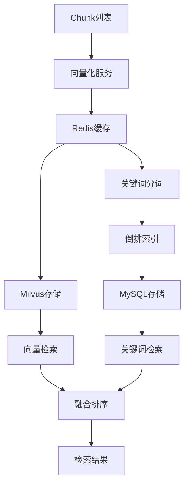

# 第 05 批 - 向量化与存储

## 基本信息


| 项目   | 内容         |
| ---- | ---------- |
| 批次编号 | 05         |
| 批次名称 | 向量化与存储     |
| 依赖批次 | 04-清洗与切分   |
| 预计工时 | 8 小时       |
| 执行日期 | 2026-05-22 |


---

## 一、Cursor 输入文案

```text
你是资深 Python 3.12 后端工程师。请基于文档完成第 05 批开发任务：向量化与存储。

请先阅读：
1. D:/work/agentV1/rag_flow_design.md
2. D:/work/agentV1/docs/04-清洗与切分.md
3. D:/work/agentV1/docs/template/规范强制标准.md  【强制引用】

【强制规范引用】：
请严格遵循 docs/template/规范强制标准.md 中的所有强制规范。

【技术栈要求】：
- Qwen3-Embedding（文本向量化）
- Milvus（向量数据库）
- Redis（缓存）

【本批次目标】：
1. 实现 EmbeddingService 向量化服务
2. 实现 MilvusRepository 向量存储
3. 实现向量缓存机制
4. 实现 Chunk 向量入库
5. 实现关键词索引构建

【配置参数】：
- model_name: Qwen3-Embedding
- dimension: 1024
- batch_size: 32

【验收必须包含】：
1. 修改文件列表
2. 新增能力说明
3. 向量存储说明
4. 缓存机制说明
5. 验证命令和结果
```

---

## 二、批次概述

### 2.1 目标

本批次实现 RAG 知识库系统的向量化与存储功能，包括：

1. **向量化服务**：使用 Qwen3-Embedding 模型对文本进行向量化
2. **向量存储**：使用 Milvus 向量数据库存储和检索向量
3. **向量缓存**：使用 Redis 缓存向量结果，提高查询效率
4. **关键词索引**：使用 MySQL 构建关键词倒排索引，支持全文检索

### 2.2 架构流程




---

## 三、详细设计

### 3.1 EmbeddingService 向量化服务

```python
class EmbeddingService:
    """向量化服务"""

    def __init__(self):
        self._config = settings.embedding
        self._cache = EmbeddingCache()
        self._model = None

    def encode(self, texts: List[str], normalize: bool = True) -> Tuple[List[np.ndarray], int]:
        """
        批量向量化

        Args:
            texts: 文本列表
            normalize: 是否归一化

        Returns:
            (向量列表, 缓存命中数量)
        """
        pass

    def encode_single(self, text: str, normalize: bool = True) -> Tuple[np.ndarray, bool]:
        """
        单个文本向量化

        Args:
            text: 文本
            normalize: 是否归一化

        Returns:
            (向量, 是否来自缓存)
        """
        pass
```

### 3.2 MilvusRepository 向量存储

```python
class MilvusRepository:
    """Milvus向量数据库仓库"""

    def initialize_collection(self) -> Collection:
        """初始化集合"""
        pass

    def insert(self, collection_name: str, entities: List[Dict]) -> List[int]:
        """插入向量"""
        pass

    def search(self, collection_name: str, vectors: List[List[float]],
               top_k: int = 10, expr: Optional[str] = None) -> List[List[Dict]]:
        """向量检索"""
        pass

    def delete_by_chunk_ids(self, collection_name: str, chunk_ids: List[int]) -> None:
        """删除向量"""
        pass
```

### 3.3 关键词索引服务

```python
class KeywordIndexService:
    """关键词索引服务"""

    def build_index(self, document_id: int, version_id: Optional[int] = None,
                    chunk_ids: Optional[List[int]] = None) -> KeywordIndexResponse:
        """构建关键词索引"""
        pass

    def search(self, request: KeywordSearchRequest) -> KeywordSearchResponse:
        """关键词检索"""
        pass
```

### 3.4 向量缓存机制

```python
class EmbeddingCache:
    """Embedding缓存管理器"""

    def get_doc_embedding(self, doc_id: str) -> Optional[List[float]]:
        """获取文档向量缓存"""
        pass

    def set_doc_embedding(self, doc_id: str, embedding: List[float],
                          ttl: Optional[int] = None) -> bool:
        """缓存文档向量"""
        pass
```

---

## 四、API 接口

### 4.1 向量化接口


| 方法     | 路径                              | 说明       |
| ------ | ------------------------------- | -------- |
| POST   | /api/v1/embedding/encode        | 批量向量化    |
| POST   | /api/v1/embedding/encode/single | 单个向量化    |
| POST   | /api/v1/embedding/chunks/{id}   | Chunk向量化 |
| POST   | /api/v1/embedding/search        | 向量检索     |
| DELETE | /api/v1/embedding/chunks/{id}   | 删除向量     |
| GET    | /api/v1/embedding/statistics    | 向量统计     |
| POST   | /api/v1/embedding/initialize    | 初始化集合    |


### 4.2 关键词索引接口


| 方法   | 路径                          | 说明     |
| ---- | --------------------------- | ------ |
| POST | /api/v1/keyword/index/{id}  | 构建索引   |
| POST | /api/v1/keyword/index/batch | 批量构建索引 |
| POST | /api/v1/keyword/search      | 关键词检索  |
| GET  | /api/v1/keyword/statistics  | 索引统计   |


---

## 五、目录结构

```
backend/src/app/
├── schemas/
│   ├── embedding.py              # 新增：向量化相关Schema
│   └── keyword.py                # 新增：关键词索引Schema
├── services/
│   ├── embedding_service.py       # 新增：向量化服务
│   └── keyword_service.py        # 新增：关键词索引服务
├── repositories/
│   └── milvus_repository.py      # 新增：Milvus仓库
└── api/v1/
    ├── embedding.py              # 新增：向量化接口路由
    └── keyword.py               # 新增：关键词接口路由
```

---

## 六、修改文件清单

### 6.1 新增文件


| 文件路径                                              | 说明          |
| ------------------------------------------------- | ----------- |
| backend/src/app/schemas/embedding.py              | 向量化相关Schema |
| backend/src/app/schemas/keyword.py                | 关键词索引Schema |
| backend/src/app/services/embedding_service.py     | 向量化服务       |
| backend/src/app/services/keyword_service.py       | 关键词索引服务     |
| backend/src/app/repositories/milvus_repository.py | Milvus仓库    |
| backend/src/app/api/v1/embedding.py               | 向量化接口路由     |
| backend/src/app/api/v1/keyword.py                 | 关键词接口路由     |
| backend/tests/test_embedding.py                   | 向量化服务测试     |
| backend/tests/test_keyword.py                     | 关键词索引服务测试   |


### 6.2 修改文件


| 文件路径                                     | 修改内容                  |
| ---------------------------------------- | --------------------- |
| backend/src/app/schemas/**init**.py      | 导出新Schema             |
| backend/src/app/services/**init**.py     | 导出新服务                 |
| backend/src/app/repositories/**init**.py | 导出新仓库                 |
| backend/src/app/api/v1/**init**.py       | 注册新路由                 |
| backend/src/app/models/chunk.py          | 添加ChunkKeywordIndex模型 |


---

## 七、新增能力说明

### 7.1 向量化服务能力


| 能力    | 说明                  | 状态  |
| ----- | ------------------- | --- |
| 模型加载  | 加载Qwen3-Embedding模型 | 完成  |
| 批量向量化 | 支持批量文本向量化           | 完成  |
| 单个向量化 | 支持单个文本向量化           | 完成  |
| 向量归一化 | 支持L2归一化             | 完成  |
| 缓存管理  | Redis缓存向量结果         | 完成  |
| 哈希去重  | 相同文本产生相同向量          | 完成  |


### 7.2 向量存储能力


| 能力   | 说明               | 状态  |
| ---- | ---------------- | --- |
| 集合管理 | 创建/获取Milvus集合    | 完成  |
| 向量插入 | 批量插入向量到Milvus    | 完成  |
| 向量检索 | ANN向量相似度检索       | 完成  |
| 向量删除 | 按ID或Chunk ID删除向量 | 完成  |
| 集合统计 | 获取集合统计信息         | 完成  |


### 7.3 关键词索引能力


| 能力     | 说明            | 状态  |
| ------ | ------------- | --- |
| 中文分词   | 基于规则的bigram分词 | 完成  |
| 停用词过滤  | 过滤常用停用词       | 完成  |
| IDF计算  | 逆文档频率计算       | 完成  |
| BM25评分 | BM25相关性评分     | 完成  |
| 倒排索引   | MySQL存储倒排索引   | 完成  |
| 关键词检索  | 基于BM25的关键词检索  | 完成  |


---

## 八、向量存储说明

### 8.1 Milvus Collection 设计

```python
COLLECTION_SCHEMA = {
    "fields": [
        {"name": "id", "type": DataType.INT64, "is_primary": True},
        {"name": "document_id", "type": DataType.INT64},
        {"name": "version_id", "type": DataType.INT64},
        {"name": "chunk_id", "type": DataType.INT64},
        {"name": "title_path", "type": DataType.VARCHAR, "max_length": 500},
        {"name": "page_start", "type": DataType.INT32},
        {"name": "page_end", "type": DataType.INT32},
        {"name": "chunk_type", "type": DataType.VARCHAR, "max_length": 50},
        {"name": "embedding", "type": DataType.FLOAT_VECTOR, "dim": 1024},
        {"name": "quality_score", "type": DataType.FLOAT},
    ],
    "description": "RAG知识库文档块向量集合"
}
```

### 8.2 索引配置


| 参数          | 值        | 说明     |
| ----------- | -------- | ------ |
| index_type  | IVF_FLAT | 索引类型   |
| metric_type | IP       | 距离度量类型 |
| nlist       | 128      | 聚类中心数量 |


---

## 九、缓存机制说明

### 9.1 缓存键设计


| 缓存类型 | 键格式                      | TTL    |
| ---- | ------------------------ | ------ |
| 查询缓存 | `embedding:query:{hash}` | 86400秒 |
| 文档缓存 | `embedding:doc:{hash}`   | 86400秒 |


### 9.2 缓存命中流程

```
1. 文本输入
2. 计算文本哈希
3. 查询Redis缓存
4. 命中 -> 返回缓存向量
5. 未命中 -> 向量化 -> 写入缓存 -> 返回向量
```

---

## 十、关键词索引表设计

```sql
CREATE TABLE `chunk_keyword_index` (
  `id` bigint NOT NULL AUTO_INCREMENT COMMENT '主键ID',
  `chunk_id` bigint NOT NULL COMMENT 'Chunk ID',
  `term` varchar(128) NOT NULL COMMENT '分词词项',
  `field` varchar(20) NOT NULL DEFAULT 'content' COMMENT '字段：content/title/enhanced',
  `tf` int NOT NULL DEFAULT 1 COMMENT '词频',
  `idf` float NOT NULL DEFAULT 0 COMMENT '逆文档频率',
  `position` int DEFAULT NULL COMMENT '词项位置',
  `weight` float NOT NULL DEFAULT 1.0 COMMENT '权重',
  `created_at` datetime NOT NULL DEFAULT CURRENT_TIMESTAMP COMMENT '创建时间',
  PRIMARY KEY (`id`),
  UNIQUE KEY `uk_chunk_term_field` (`chunk_id`, `term`, `field`),
  KEY `idx_term` (`term`),
  KEY `idx_chunk_id` (`chunk_id`)
) ENGINE=InnoDB DEFAULT CHARSET=utf8mb4 COMMENT='关键词倒排索引表';
```

---

## 十一、测试用例

### 11.1 向量化服务测试

```bash
cd backend
pytest tests/test_embedding.py -v

# 测试覆盖：
# - TestMockModel: 模拟模型测试
# - TestCacheKeyGeneration: 缓存键生成测试
# - TestVectorOperations: 向量操作测试
# - TestBatchProcessing: 批处理测试
# - TestConfigurationParameters: 配置参数测试
```

### 11.2 关键词索引服务测试

```bash
cd backend
pytest tests/test_keyword.py -v

# 测试覆盖：
# - TestChineseTokenizer: 中文分词器测试
# - TestBM25Scorer: BM25评分器测试
# - TestTokenizerEdgeCases: 分词边界测试
# - TestBM25EdgeCases: BM25边界测试
# - TestBM25Ranking: BM25排序测试
```

---

## 十二、验收标准

### 12.1 功能验收


| 验收点   | 验收条件       | 状态  |
| ----- | ---------- | --- |
| 向量入库  | Milvus写入成功 |     |
| 缓存命中  | 相同文本复用向量   |     |
| 关键词索引 | MySQL索引完整  |     |
| 批量处理  | 支持批量向量化    |     |
| 向量检索  | ANN检索返回结果  |     |
| 关键词检索 | BM25评分排序   |     |


### 12.2 质量验收


| 验收点    | 验收条件   | 状态  |
| ------ | ------ | --- |
| 代码注释   | 全部使用中文 |     |
| 日志输出   | 全部使用中文 |     |
| 错误提示   | 全部使用中文 |     |
| 测试覆盖   | 核心功能覆盖 |     |
| 单元测试通过 | 全部测试通过 |     |


---

## 十三、验证命令和结果

### 13.1 运行测试

```bash
# 进入后端目录
cd D:/work/agentV1/backend

# 运行所有新增测试
pytest tests/test_embedding.py tests/test_keyword.py -v

# 运行所有测试
pytest tests/ -v
```

### 13.2 启动服务

```bash
# 启动后端服务
cd D:/work/agentV1/backend
python -m uvicorn src.main:app --host 127.0.0.1 --port 8011 --reload
```

### 13.3 API验证

```bash
# 初始化向量集合
curl -X POST http://localhost:8011/api/v1/embedding/initialize

# 向量化文本
curl -X POST http://localhost:8011/api/v1/embedding/encode/single \
  -H "Content-Type: application/json" \
  -d '{"text": "RAG知识库系统"}'

# 构建关键词索引（假设document_id=1）
curl -X POST http://localhost:8011/api/v1/keyword/index/1

# 关键词检索
curl -X POST http://localhost:8011/api/v1/keyword/search \
  -H "Content-Type: application/json" \
  -d '{"query": "RAG系统", "top_k": 10}'

# 获取索引统计
curl -X GET http://localhost:8011/api/v1/keyword/statistics
```

---

## 十四、版本记录


| 版本    | 日期         | 修改人 | 修改内容 |
| ----- | ---------- | --- | ---- |
| 1.0.0 | 2026-05-22 | 开发者 | 初始版本 |


