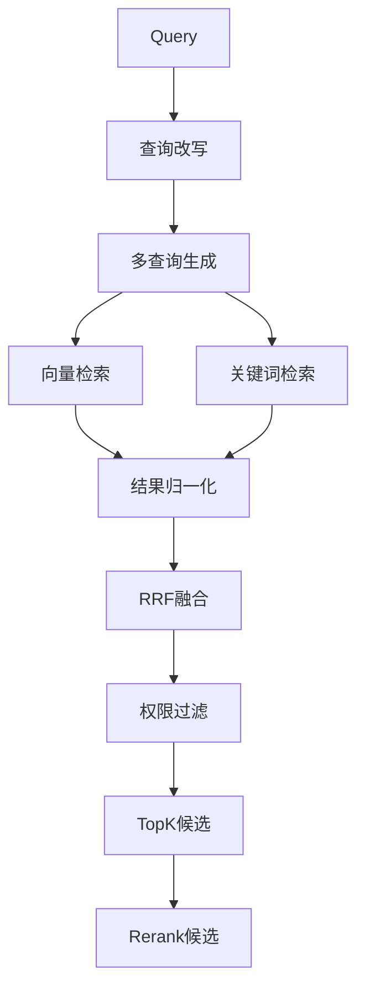

# 第 06 批 - 混合检索

## 基本信息


| 项目   | 内容              |
| ---- | --------------- |
| 批次编号 | 06              |
| 批次名称 | 混合检索         |
| 依赖批次 | 05-向量化与存储         |
| 预计工时 | 10 小时          |
| 执行日期 | 2026-05-22      |


---

## 一、Cursor 输入文案

```text
你是资深 Python 3.12 后端工程师。请基于文档完成第 06 批开发任务：混合检索。

请先阅读：
1. D:/work/agentV1/rag_flow_design.md
2. D:/work/agentV1/docs/05-向量化与存储.md
3. D:/work/agentV1/docs/template/规范强制标准.md  【强制引用】

【强制规范引用】：
请严格遵循 docs/template/规范强制标准.md 中的所有强制规范。

【技术栈要求】：
- Milvus（向量检索）
- MySQL（关键词检索）
- BM25/RRF 算法

【本批次目标】：
1. 实现查询改写服务
2. 实现向量检索（Milvus TopK）
3. 实现关键词检索（MySQL BM25）
4. 实现结果融合（RRF/加权）
5. 实现权限过滤与业务过滤
6. 实现 RetrievalService 检索服务

【配置参数】：
- vector_top_k: 100
- keyword_top_k: 100
- rrf_k: 60

【验收必须包含】：
1. 修改文件列表
2. 新增能力说明
3. 检索流程说明
4. API 接口说明
5. 验证命令和结果
```

---

## 二、详细设计

### 2.1 混合检索流程



### 2.2 查询改写服务

```python
class QueryRewriteService:
    """查询改写服务"""

    def rewrite(self, query: str) -> List[str]:
        """查询改写主入口"""
        queries = []

        # 1. 问题规范化
        normalized = self._normalize(query)

        # 2. 多查询生成
        queries.append(normalized)
        queries.extend(self._generate_similar_queries(normalized, n=3))

        # 3. HyDE 假设答案（可选）
        if self.use_hyde:
            hyde_query = self._generate_hyde(query)
            queries.append(hyde_query)

        # 4. 去重
        queries = list(set(queries))

        return queries

    def _normalize(self, query: str) -> str:
        """问题规范化"""
        # 去除多余空格
        query = re.sub(r'\s+', ' ', query)
        # 统一大小写
        query = query.lower().strip()
        # 去除标点
        query = re.sub(r'[^\w\s\u4e00-\u9fff]', '', query)
        return query

    def _generate_similar_queries(self, query: str, n: int = 3) -> List[str]:
        """生成相似查询"""
        # 使用同义词替换、句式变换等
        # 此处为预留接口
        return []
```

### 2.3 检索服务

```python
class RetrievalService:
    """混合检索服务"""

    def __init__(self, config: RetrievalConfig):
        self.vector_repo = MilvusRepository()
        self.keyword_repo = MySQLKeywordRepository()
        self.config = config

    def search(self, query: str, filters: SearchFilters, top_k: int = 10) -> SearchResult:
        """检索主入口"""

        # 1. 查询改写
        queries = self.rewrite_service.rewrite(query)

        # 2. 向量检索
        vector_results = []
        for q in queries:
            embedding = self.embedding_service.encode([q])[0]
            results = self.vector_repo.search(
                embedding,
                top_k=self.config.vector_top_k,
                filters=filters
            )
            vector_results.extend(results)

        # 3. 关键词检索
        keyword_results = []
        for q in queries:
            results = self.keyword_repo.search(
                q,
                top_k=self.config.keyword_top_k,
                filters=filters
            )
            keyword_results.extend(results)

        # 4. 结果归一化
        normalized_vector = self._normalize_scores(vector_results)
        normalized_keyword = self._normalize_scores(keyword_results)

        # 5. RRF 融合
        fused = self._rrf_fusion(normalized_vector, normalized_keyword)

        # 6. 去重与过滤
        fused = self._deduplicate(fused)

        # 7. 权限过滤
        fused = self._apply_permissions(fused, filters)

        # 8. 返回 TopK
        return fused[:top_k]

    def _rrf_fusion(self, vector_results: List, keyword_results: List) -> List:
        """RRF 融合"""
        fused = {}
        k = self.config.rrf_k

        # 向量结果打分
        for rank, item in enumerate(sorted(vector_results, key=lambda x: x['score'], reverse=True)):
            rrf_score = 1 / (k + rank + 1)
            item_id = item['chunk_id']
            fused[item_id] = {
                **item,
                'rrf_score': fused.get(item_id, {}).get('rrf_score', 0) + rrf_score * 0.6
            }

        # 关键词结果打分
        for rank, item in enumerate(sorted(keyword_results, key=lambda x: x['score'], reverse=True)):
            rrf_score = 1 / (k + rank + 1)
            item_id = item['chunk_id']
            if item_id in fused:
                fused[item_id]['rrf_score'] += rrf_score * 0.4
            else:
                fused[item_id] = {
                    **item,
                    'rrf_score': rrf_score * 0.4
                }

        return sorted(fused.values(), key=lambda x: x['rrf_score'], reverse=True)
```

---

## 三、API 接口

### 3.1 接口列表


| 方法      | 路径                      | 说明      |
| ------- | ----------------------- | ------- |
| POST    | /api/v1/retrieval/search | 混合检索     |
| GET     | /api/v1/retrieval/suggest | 搜索建议    |

### 3.2 接口详情

##### POST /api/v1/retrieval/search

**请求参数：**

```json
{
  "query": "用户问题",
  "filters": {
    "business_id": "xxx",
    "doc_types": ["pdf", "docx"],
    "date_range": {
      "start": "2026-01-01",
      "end": "2026-05-22"
    }
  },
  "top_k": 10,
  "use_rerank": true
}
```

**响应示例：**

```json
{
  "code": 0,
  "message": "success",
  "data": {
    "total": 100,
    "items": [
      {
        "chunk_id": "uuid",
        "document_id": 1,
        "document_name": "文档.pdf",
        "content": "...",
        "title_path": "第一章 > 第一节",
        "page_no": 5,
        "score": 0.85,
        "source": "vector+keyword"
      }
    ]
  }
}
```

---

## 四、验收标准

| 验收点       | 验收条件        | 状态  |
| -------- | ----------- | --- |
| 向量检索      | Milvus TopK 返回   |     |
| 关键词检索     | MySQL BM25 返回    |     |
| 结果融合      | RRF 融合正确      |     |
| 权限过滤      | 按业务/文档过滤     |     |
| 检索性能      | < 500ms        |     |
