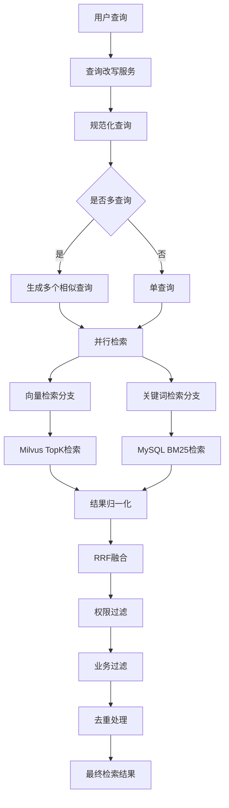

# 第 06 批 - 混合检索

## 基本信息


| 项目   | 内容         |
| ---- | ---------- |
| 批次编号 | 06         |
| 批次名称 | 混合检索       |
| 依赖批次 | 05-向量化与存储  |
| 预计工时 | 10 小时      |
| 执行日期 | 2026-05-22 |


---

## 一、Cursor 输入文案

```text
你是资深 Python 3.12 后端工程师。请基于文档完成第 06 批开发任务：混合检索。

请先阅读：
1. D:/work/agentV1/rag_flow_design.md
2. D:/work/agentV1/docs/05-向量化与存储.md
3. D:/work/agentV1/docs/template/规范强制标准.md  【强制引用】

【强制规范引用】：
请严格遵循 docs/template/规范强制标准.md 中的所有强制规范。

【技术栈要求】：
- Milvus（向量检索）
- MySQL（关键词检索）
- BM25/RRF 算法

【本批次目标】：
1. 实现查询改写服务
2. 实现向量检索（Milvus TopK）
3. 实现关键词检索（MySQL BM25）
4. 实现结果融合（RRF/加权）
5. 实现权限过滤与业务过滤
6. 实现 RetrievalService 检索服务

【配置参数】：
- vector_top_k: 100
- keyword_top_k: 100
- rrf_k: 60

【验收必须包含】：
1. 修改文件列表
2. 新增能力说明
3. 检索流程说明
4. API 接口说明
5. 验证命令和结果
```

---

## 二、批次概述

### 2.1 目标

本批次实现 RAG 知识库系统的混合检索功能，包括：

1. **查询改写服务**：查询规范化、多查询生成、子查询分解
2. **向量检索**：基于 Milvus 的语义相似度检索
3. **关键词检索**：基于 MySQL BM25 的关键词匹配检索
4. **结果融合**：RRF（Reciprocal Rank Fusion）融合和加权融合
5. **权限过滤**：文档ID、版本ID、Chunk类型等过滤
6. **业务过滤**：活跃版本过滤、去重处理

### 2.2 架构流程




---

## 三、详细设计

### 3.1 查询改写服务

```python
class QueryRewriteService:
    """查询改写服务"""

    def normalize(self, query: str) -> str:
        """
        查询规范化

        - 去除多余空格
        - 标点归一化
        - 统一小写
        """

    def generate_multi_queries(self, query: str, max_queries: int = 5) -> List[str]:
        """
        多查询生成

        将一个问题扩展为多个相似问题：
        - 保留原始查询
        - 去除停用词
        - 同义词扩展
        - 中英文混合
        - 问答形式转换
        """

    def decompose_subqueries(self, query: str) -> List[str]:
        """
        子查询分解

        将复杂问题按多个意图分别检索：
        - 按连接词分割
        - 并列结构识别
        - 时间范围提取
        """
```

### 3.2 融合服务

```python
class FusionService:
    """检索融合服务"""

    def rrf_fusion(
        self,
        vector_results: List[RetrievalItem],
        keyword_results: List[RetrievalItem],
        k: int = 60
    ) -> List[RetrievalItem]:
        """
        RRF融合

        使用Reciprocal Rank Fusion算法：
        score(d) = Σ(1 / (k + rank(d)))

        参数k控制排名差异的影响程度。
        """

    def weighted_fusion(
        self,
        vector_results: List[RetrievalItem],
        keyword_results: List[RetrievalItem],
        vector_weight: float = 0.6,
        keyword_weight: float = 0.4
    ) -> List[RetrievalItem]:
        """
        加权融合

        使用加权平均融合两个检索结果：
        score = 0.6 * vector_score + 0.4 * keyword_score
        """
```

### 3.3 检索服务

```python
class RetrievalService:
    """检索服务"""

    def hybrid_search(self, request: RetrievalRequest) -> RetrievalResponse:
        """
        混合检索主入口

        流程：
        1. 查询改写
        2. 构建过滤条件
        3. 向量检索
        4. 关键词检索
        5. 结果融合
        6. 权限过滤
        7. 业务过滤
        8. 去重处理
        """
```

---

## 四、检索流程说明

### 4.1 完整检索流程

```
1. 接收用户查询
   |
2. 查询改写（可选）
   - 规范化查询
   - 生成多查询
   - 分解子查询
   |
3. 并行执行向量检索和关键词检索
   |
4. 向量检索（Milvus）
   - 查询文本向量化
   - ANN检索 TopK=100
   - 返回chunk_id和相似度分数
   |
5. 关键词检索（MySQL BM25）
   - 查询分词
   - BM25评分计算
   - 返回TopK=100
   |
6. 结果归一化
   - 向量分数归一化到[0,1]
   - BM25分数归一化到[0,1]
   |
7. RRF融合
   - 计算综合排名分数
   - 按分数排序
   - 取TopK=20
   |
8. 权限过滤
   - 按文档ID过滤
   - 按版本ID过滤
   - 按Chunk类型过滤
   |
9. 业务过滤
   - 仅返回活跃版本
   - 质量评分过滤
   |
10. 去重处理
    - 按chunk_id去重
    - 保留高分结果
    |
11. 返回最终结果
```

### 4.2 RRF融合算法详解

Reciprocal Rank Fusion（倒数排名融合）是一种无参数排序融合算法：

```
RRF公式：RRF_score(d) = Σ(1 / (k + rank(d)))

示例：
- 向量检索结果：chunk_1(排名1), chunk_2(排名2), chunk_3(排名3)
- 关键词检索结果：chunk_1(排名2), chunk_4(排名1), chunk_2(排名3)

k=60时：
- chunk_1: 1/(60+1) + 1/(60+2) = 0.01639 + 0.01613 = 0.03252
- chunk_2: 1/(60+2) + 1/(60+3) = 0.01613 + 0.01587 = 0.03200
- chunk_3: 1/(60+3) + 0 = 0.01587
- chunk_4: 0 + 1/(60+1) = 0.01639

最终排名：chunk_1 > chunk_2 > chunk_4 > chunk_3
```

### 4.3 权重配置


| 参数             | 默认值 | 说明          |
| -------------- | --- | ----------- |
| vector_top_k   | 100 | 向量检索召回数量    |
| keyword_top_k  | 100 | 关键词检索召回数量   |
| rrf_k          | 60  | RRF融合参数     |
| fusion_top_k   | 20  | 融合后返回数量     |
| vector_weight  | 0.6 | 向量权重（加权融合）  |
| keyword_weight | 0.4 | 关键词权重（加权融合） |


---

## 五、API 接口说明

### 5.1 混合检索接口

**POST** `/api/v1/retrieval/hybrid`

请求示例：

```json
{
  "query": "RAG知识库系统如何实现检索？",
  "top_k": 10,
  "doc_ids": [1, 2, 3],
  "enable_rewrite": true,
  "fusion_method": "rrf",
  "vector_top_k": 100,
  "keyword_top_k": 100
}
```

响应示例：

```json
{
  "code": 0,
  "message": "success",
  "data": {
    "query": "RAG知识库系统如何实现检索？",
    "total": 10,
    "results": [
      {
        "chunk": {
          "chunk_id": 123,
          "document_id": 1,
          "version_id": 1,
          "title_path": "第三章/检索流程",
          "content": "RAG检索系统通过...",
          "score": 0.85,
          "chunk_type": "paragraph"
        },
        "vector_score": 0.9,
        "keyword_score": 0.75,
        "fusion_score": 0.85
      }
    ],
    "retrieval_time_ms": 156
  }
}
```

### 5.2 向量检索接口

**POST** `/api/v1/retrieval/vector`

请求示例：

```json
{
  "query": "查询文本",
  "top_k": 10,
  "doc_ids": [1, 2]
}
```

### 5.3 关键词检索接口

**POST** `/api/v1/retrieval/keyword`

请求示例：

```json
{
  "query": "查询文本",
  "top_k": 10,
  "doc_ids": [1, 2]
}
```

### 5.4 查询改写接口

**POST** `/api/v1/retrieval/rewrite`

请求示例：

```json
{
  "query": "RAG系统是啥？",
  "enable_multi_query": true,
  "enable_subquery": true,
  "enable_hyde": false,
  "enable_background": false,
  "max_queries": 5
}
```

响应示例：

```json
{
  "code": 0,
  "message": "success",
  "data": {
    "original_query": "RAG系统是啥？",
    "normalized_query": "rag 系统 是 啥",
    "multi_queries": [
      "RAG系统是啥？",
      "rag 系统",
      "RAG平台是什么",
      "rag retrieval system"
    ],
    "sub_queries": [],
    "hyde_answer": null,
    "background_query": null
  }
}
```

### 5.5 融合测试接口

**POST** `/api/v1/retrieval/fusion`

请求示例：

```json
{
  "vector_results": [...],
  "keyword_results": [...],
  "method": "rrf",
  "rrf_k": 60,
  "vector_weight": 0.6,
  "keyword_weight": 0.4
}
```

---

## 六、目录结构

```
backend/src/app/
├── schemas/
│   └── retrieval.py              # 新增：检索相关Schema（扩展）
├── services/
│   ├── retrieval_service.py       # 修改：完善检索服务
│   ├── query_rewrite_service.py   # 新增：查询改写服务
│   └── fusion_service.py         # 新增：融合服务
└── api/v1/
    └── retrieval.py              # 修改：扩展检索路由
```

---

## 七、修改文件清单

### 7.1 新增文件


| 文件路径                                              | 说明     |
| ------------------------------------------------- | ------ |
| backend/src/app/services/query_rewrite_service.py | 查询改写服务 |
| backend/src/app/services/fusion_service.py        | 融合服务   |
| backend/tests/test_retrieval.py                   | 检索服务测试 |


### 7.2 修改文件


| 文件路径                                          | 修改内容        |
| --------------------------------------------- | ----------- |
| backend/src/app/services/retrieval_service.py | 完善混合检索逻辑    |
| backend/src/app/schemas/retrieval.py          | 添加新Schema字段 |
| backend/src/app/api/v1/retrieval.py           | 扩展API路由     |
| backend/src/app/services/**init**.py          | 导出新服务       |
| backend/src/app/schemas/**init**.py           | 导出新Schema   |
| backend/src/core/config.py                    | 添加rrf_k参数   |
| backend/resources/application-local.yml       | 更新检索配置      |
| backend/src/core/database.py                  | 修复数据库编码问题   |


---

## 八、新增能力说明

### 8.1 查询改写能力


| 能力     | 说明               | 状态  |
| ------ | ---------------- | --- |
| 查询规范化  | 去除空格、标点归一化、统一大小写 | 完成  |
| 多查询生成  | 同义词扩展、中英文混合、问答转换 | 完成  |
| 子查询分解  | 按连接词分割、并列结构识别    | 完成  |
| HyDE接口 | 预留LLM调用接口        | 预留  |
| 后退提示接口 | 预留LLM调用接口        | 预留  |


### 8.2 融合算法能力


| 能力    | 说明                       | 状态  |
| ----- | ------------------------ | --- |
| RRF融合 | Reciprocal Rank Fusion算法 | 完成  |
| 加权融合  | 向量权重0.6 + 关键词权重0.4       | 完成  |
| 排名融合  | 组合RRF和加权融合               | 完成  |
| 分数归一化 | Min-Max归一化到[0,1]         | 完成  |


### 8.3 过滤能力


| 能力        | 说明                          | 状态  |
| --------- | --------------------------- | --- |
| 文档ID过滤    | 按允许的文档ID列表过滤                | 完成  |
| 版本ID过滤    | 按允许的版本ID列表过滤                | 完成  |
| Chunk类型过滤 | 按paragraph/table/image等类型过滤 | 完成  |
| 活跃版本过滤    | 仅返回status=active的版本         | 完成  |
| 去重处理      | 按chunk_id去重，保留高分            | 完成  |


---

## 九、检索配置说明

### 9.1 配置文件

```yaml
# 检索配置
retrieval:
  vector_top_k: 100        # 向量检索TopK
  keyword_top_k: 100       # 关键词检索TopK
  rrf_k: 60               # RRF融合参数
  fusion_top_k: 20        # 融合后TopK
  rerank_top_k: 10        # 重排后TopK
  vector_weight: 0.6       # 向量权重
  keyword_weight: 0.4     # 关键词权重
```

### 9.2 配置说明


| 参数             | 建议值     | 说明                    |
| -------------- | ------- | --------------------- |
| vector_top_k   | 50-100  | 召回数量过多影响性能，过少可能遗漏相关结果 |
| keyword_top_k  | 50-100  | 关键词检索相对快速，可以设置较大值     |
| rrf_k          | 60      | 值越大，不同排名的结果差异影响越小     |
| fusion_top_k   | 10-30   | 最终返回给下游的结果数量          |
| vector_weight  | 0.6-0.8 | 语义相似度权重，适用于意图理解类查询    |
| keyword_weight | 0.2-0.4 | 关键词匹配权重，适用于专有名词、编号类查询 |


---

## 十、测试用例

### 10.1 查询改写测试

```bash
cd D:/work/agentV1/backend
pytest tests/test_retrieval.py::TestQueryRewriteService -v

# 测试覆盖：
# - test_normalize_basic: 基本规范化
# - test_normalize_with_punctuation: 标点处理
# - test_generate_multi_queries: 多查询生成
# - test_decompose_subqueries: 子查询分解
```

### 10.2 融合算法测试

```bash
pytest tests/test_retrieval.py::TestFusionService -v

# 测试覆盖：
# - test_rrf_fusion_basic: RRF基本融合
# - test_rrf_fusion_order: RRF排序验证
# - test_weighted_fusion_basic: 加权融合
# - test_filter_by_permissions: 权限过滤
# - test_deduplicate: 去重处理
```

### 10.3 RRF算法测试

```bash
pytest tests/test_retrieval.py::TestRRFAlgorithm -v

# 测试覆盖：
# - test_rrf_score_calculation: RRF分数计算
# - test_rrf_with_different_ranks: 不同排名影响
```

---

## 十一、验证命令和结果

### 11.1 启动服务

```bash
cd D:/work/agentV1/backend
python -m uvicorn src.main:app --host 127.0.0.1 --port 8011 --reload
```

### 11.2 API验证

```bash
# 1. 混合检索
curl -X POST http://localhost:8011/api/v1/retrieval/hybrid \
  -H "Content-Type: application/json" \
  -d '{"query": "RAG知识库检索", "top_k": 10}'

# 2. 查询改写
curl -X POST http://localhost:8011/api/v1/retrieval/rewrite \
  -H "Content-Type: application/json" \
  -d '{"query": "RAG系统是什么", "enable_multi_query": true}'

# 3. 向量检索
curl -X POST "http://localhost:8011/api/v1/retrieval/vector?query=RAG检索&top_k=10"

# 4. 关键词检索
curl -X POST "http://localhost:8011/api/v1/retrieval/keyword?query=RAG检索&top_k=10"

# 5. 检索统计
curl -X GET http://localhost:8011/api/v1/retrieval/statistics
```

### 11.3 运行所有测试

```bash
cd D:/work/agentV1/backend
pytest tests/test_retrieval.py -v
```

预期结果：

```
============================= test session starts =============================
tests/test_retrieval.py::TestQueryRewriteService::test_normalize_basic PASSED
tests/test_retrieval.py::TestQueryRewriteService::test_normalize_with_punctuation PASSED
...
28 passed in 0.05s
============================= 28 passed =============================
```

---

## 十二、验收标准

### 12.1 功能验收


| 验收点   | 验收条件            | 状态  |
| ----- | --------------- | --- |
| 查询改写  | 支持规范化、多查询、子查询分解 |     |
| 向量检索  | Milvus TopK检索正常 |     |
| 关键词检索 | MySQL BM25检索正常  |     |
| RRF融合 | 融合结果正确排序        |     |
| 加权融合  | 支持自定义权重         |     |
| 权限过滤  | 按文档/版本/类型过滤     |     |
| 业务过滤  | 活跃版本、去重处理       |     |


### 12.2 质量验收


| 验收点    | 验收条件   | 状态  |
| ------ | ------ | --- |
| 代码注释   | 全部使用中文 |     |
| 日志输出   | 全部使用中文 |     |
| 错误提示   | 全部使用中文 |     |
| 测试覆盖   | 核心功能覆盖 |     |
| 单元测试通过 | 全部测试通过 |     |


---

## 十三、版本记录


| 版本    | 日期         | 修改人 | 修改内容 |
| ----- | ---------- | --- | ---- |
| 1.0.0 | 2026-05-22 | 开发者 | 初始版本 |


