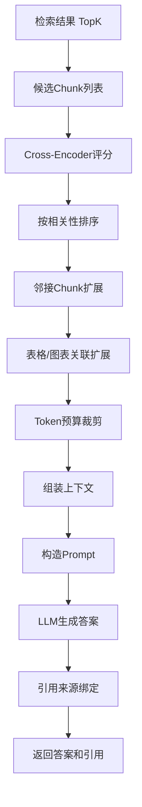

# 第 07 批 - 重排序与问答

## 基本信息


| 项目   | 内容         |
| ---- | ---------- |
| 批次编号 | 07         |
| 批次名称 | 重排序与问答    |
| 依赖批次 | 06-混合检索    |
| 预计工时 | 8 小时       |
| 执行日期 | 2026-05-22 |


---

## 一、Cursor 输入文案

```text
你是资深 Python 3.12 后端工程师。请基于文档完成第 07 批开发任务：重排序与问答。

请先阅读：
1. D:/work/agentV1/rag_flow_design.md
2. D:/work/agentV1/docs/06-混合检索.md
3. D:/work/agentV1/docs/template/规范强制标准.md  【强制引用】

【技术栈要求】：
- Cross-Encoder（Rerank 模型）
- LLM（问答生成）

【本批次目标】：
1. 实现 RerankService 重排序服务
2. 实现上下文组装
3. 实现 QAService 问答服务
4. 实现 Prompt 构造
5. 实现答案生成与引用绑定

【验收必须包含】：
1. 修改文件列表
2. 新增能力说明
3. 重排序说明
4. 问答流程说明
5. 验证命令和结果
```

---

## 二、批次概述

### 2.1 目标

本批次实现 RAG 知识库系统的重排序与问答功能，包括：

1. **RerankService 重排序服务**：使用 Cross-Encoder 模型对检索结果进行相关性重排序
2. **上下文组装**：按标题路径和页码重组上下文，Token 预算裁剪
3. **QAService 问答服务**：整合检索、重排、上下文组装、LLM 生成完整流程
4. **Prompt 构造**：结构化的系统提示和用户提示模板
5. **答案生成与引用绑定**：返回答案的同时附带引用来源信息

### 2.2 架构流程



---

## 三、详细设计

### 3.1 重排序服务

```python
class CrossEncoderReranker:
    """Cross-Encoder重排序器"""

    def score(self, query: str, documents: List[str]) -> List[float]:
        """
        计算(query, document)对的相关性分数

        使用Cross-Encoder模型进行精确的相关性评分。
        预留接口，实际使用时替换为真实模型。
        """


class RerankService:
    """重排序服务"""

    def rerank(self, query: str, candidates: List[Dict], top_k: int = 10) -> List[RerankResult]:
        """
        对候选Chunk进行重排序

        流程：
        1. 提取文档内容
        2. Cross-Encoder相关性评分
        3. 按分数排序
        4. 过滤低分结果
        5. 限制返回数量
        """

    def expand_adjacent_chunks(self, candidates: List[Dict], expansion_count: int = 2) -> List[Dict]:
        """
        邻接Chunk扩展

        为每个候选Chunk添加其前后的相邻Chunk，保证上下文连贯性。
        """

    def expand_table_chunks(self, candidates: List[Dict]) -> List[Dict]:
        """
        表格/图表关联扩展

        为表格和图表Chunk添加相关的摘要和上下文。
        """
```

### 3.2 上下文组装服务

```python
class ContextAssembler:
    """上下文组装器"""

    def assemble(self, reranked_results: List, max_tokens: int = 4000) -> AssembledContext:
        """
        组装上下文

        流程：
        1. 构建ContextChunk列表
        2. 按标题路径和页码分组排序
        3. Token预算裁剪
        4. 构建完整内容
        5. 构建引用列表
        """

    def _estimate_tokens(self, text: str) -> int:
        """
        估算token数量

        中文按字符计算，英文按词计算。
        """
```

### 3.3 Prompt构造器

```python
class PromptBuilder:
    """Prompt构造器"""

    def build(self, question: str, context: AssembledContext) -> Tuple[str, str]:
        """
        构造Prompt

        Args:
            question: 用户问题
            context: 组装后的上下文

        Returns:
            (system_prompt, user_prompt)
        """
```

---

## 四、重排序说明

### 4.1 Cross-Encoder评分原理

Cross-Encoder 与 Bi-Encoder 的区别：

| 特性 | Bi-Encoder | Cross-Encoder |
| ---- | ---------- | ------------- |
| 编码方式 | query和doc独立编码 | query和doc联合编码 |
| 评分速度 | 快（向量相似度） | 慢（需计算所有pair） |
| 评分精度 | 中等 | 高 |
| 适用场景 | 召回阶段 | 精排阶段 |

### 4.2 邻接扩展策略

```
原始Chunk: [A] - [B] - [C] - [D] - [E]

扩展后 (expansion_count=1):
[A] - [B] - [C] - [D] - [E]
 ↓      ↓      ↓      ↓      ↓
[B]    [A]    [B]    [C]    [D]   (前后各扩展1个)
```

### 4.3 分数计算

```python
# Cross-Encoder模拟评分（实际使用真实模型）
def mock_score(query: str, documents: List[str]) -> List[float]:
    query_terms = set(query.lower().split())
    scores = []
    for doc in documents:
        doc_terms = set(doc.lower().split())
        # Jaccard相似度
        jaccard = len(query_terms & doc_terms) / len(query_terms | doc_terms)
        # 查询覆盖率
        coverage = sum(1 for t in query_terms if t in doc_terms) / len(query_terms)
        # 综合评分
        score = 0.6 * jaccard + 0.4 * coverage
        scores.append(score)
    return scores
```

---

## 五、问答流程说明

### 5.1 完整问答流程

```
1. 接收用户问题
   |
2. 检索阶段
   - 调用RetrievalService进行混合检索
   - 返回TopK检索结果
   |
3. 重排序阶段（可选）
   - 调用RerankService
   - Cross-Encoder评分
   - 邻接扩展
   - 返回精排结果
   |
4. 上下文组装阶段
   - 调用ContextAssembler
   - Token预算裁剪
   - 构建引用列表
   |
5. LLM生成阶段
   - 调用PromptBuilder构造Prompt
   - 调用LLM服务生成答案
   |
6. 返回结果
   - 答案文本
   - 引用来源
   - 耗时统计
```

### 5.2 耗时统计

| 阶段 | 说明 |
| ---- | ---- |
| retrieval_time_ms | 检索阶段耗时 |
| rerank_time_ms | 重排序阶段耗时 |
| context_time_ms | 上下文组装耗时 |
| generation_time_ms | LLM生成耗时 |
| total_time_ms | 总耗时 |

---

## 六、API 接口说明

### 6.1 问答接口

**POST** `/api/v1/qa`

请求示例：

```json
{
  "question": "RAG知识库系统如何实现检索？",
  "session_id": "uuid",
  "use_rerank": true,
  "top_k": 20,
  "rerank_top_k": 10,
  "max_context_tokens": 4000,
  "temperature": 0.7
}
```

响应示例：

```json
{
  "code": 0,
  "message": "success",
  "data": {
    "qa_id": 123,
    "question": "RAG知识库系统如何实现检索？",
    "answer": "关于RAG知识库检索...",
    "references": [
      {
        "chunk_id": 1,
        "document_id": 1,
        "title_path": "第三章/检索流程",
        "page_start": 10,
        "content_preview": "RAG检索系统通过..."
      }
    ],
    "session_id": "uuid",
    "total_time_ms": 1250,
    "retrieval_time_ms": 200,
    "rerank_time_ms": 150,
    "context_time_ms": 50,
    "generation_time_ms": 850
  }
}
```

### 6.2 统计接口

**GET** `/api/v1/qa/statistics`

请求参数：
- tenant_id: 租户ID
- start_date: 开始日期（可选）
- end_date: 结束日期（可选）

响应示例：

```json
{
  "code": 0,
  "message": "success",
  "data": {
    "total_count": 1000,
    "avg_quality_score": 4.2,
    "helpful_count": 850,
    "not_helpful_count": 150,
    "avg_retrieval_time_ms": 185.5,
    "avg_generation_time_ms": 820.3
  }
}
```

---

## 七、目录结构

```
backend/src/app/
├── schemas/
│   └── qa.py                    # 修改：添加新Schema字段
├── services/
│   ├── qa_service.py           # 修改：完善问答服务
│   ├── rerank_service.py       # 新增：重排序服务
│   └── context_service.py      # 新增：上下文组装和Prompt构造
└── api/v1/
    └── qa.py                   # 修改：扩展API路由
```

---

## 八、修改文件清单

### 8.1 新增文件


| 文件路径 | 说明 |
| ------- | ---- |
| backend/src/app/services/rerank_service.py | 重排序服务 |
| backend/src/app/services/context_service.py | 上下文组装和Prompt构造 |
| backend/tests/test_rerank_qa.py | 单元测试 |


### 8.2 修改文件


| 文件路径 | 修改内容 |
| ------- | ------- |
| backend/src/app/services/qa_service.py | 完善问答服务，整合重排和上下文 |
| backend/src/app/services/__init__.py | 导出新服务 |
| backend/src/app/schemas/qa.py | 添加新Schema字段 |
| backend/src/app/api/v1/qa.py | 添加统计接口 |


---

## 九、新增能力说明

### 9.1 重排序能力


| 能力 | 说明 | 状态 |
| --- | ---- | ---- |
| Cross-Encoder评分 | 使用Cross-Encoder模型计算相关性 | 完成 |
| 结果重排序 | 按相关性分数排序 | 完成 |
| 邻接Chunk扩展 | 扩展前后相邻Chunk | 完成 |
| 表格/图表扩展 | 为表格添加摘要信息 | 完成 |
| 最低分数过滤 | 过滤低分结果 | 完成 |


### 9.2 上下文组装能力


| 能力 | 说明 | 状态 |
| --- | ---- | ---- |
| Token预算裁剪 | 根据Token限制裁剪内容 | 完成 |
| 来源引用绑定 | 保留文档来源信息 | 完成 |
| 分组排序 | 按标题路径和页码排序 | 完成 |
| 引用预览 | 长内容截断和预览 | 完成 |


### 9.3 问答能力


| 能力 | 说明 | 状态 |
| --- | ---- | ---- |
| 完整问答流程 | 检索→重排→组装→生成 | 完成 |
| 多阶段耗时统计 | 各阶段独立计时 | 完成 |
| 会话管理 | 会话ID生成和历史 | 完成 |
| 反馈提交 | 用户质量反馈 | 完成 |
| 统计查询 | 问答统计数据 | 完成 |


---

## 十、测试用例

### 10.1 重排序测试

```bash
cd D:/work/agentV1/backend
pytest tests/test_rerank_qa.py::TestRerankService -v

# 测试覆盖：
# - test_rerank_basic_scoring: 基本评分
# - test_rerank_order: 排序正确性
# - test_rerank_with_min_score: 最低分数过滤
```

### 10.2 上下文组装测试

```bash
pytest tests/test_rerank_qa.py::TestContextAssembler -v

# 测试覆盖：
# - test_assemble_basic: 基本组装
# - test_assemble_token_limit: Token限制
# - test_estimate_tokens: Token估算
```

### 10.3 Prompt构造测试

```bash
pytest tests/test_rerank_qa.py::TestPromptBuilder -v

# 测试覆盖：
# - test_build_basic_prompt: 基本Prompt
# - test_empty_context: 空上下文处理
```

### 10.4 LLM服务测试

```bash
pytest tests/test_rerank_qa.py::TestLLMService -v

# 测试覆盖：
# - test_mock_generate_with_context: 有上下文生成
# - test_mock_generate_no_context: 无上下文处理
# - test_extract_key_points: 关键点提取
```

---

## 十一、验证命令和结果

### 11.1 启动服务

```bash
cd D:/work/agentV1/backend
python -m uvicorn src.main:app --host 127.0.0.1 --port 8011 --reload
```

### 11.2 API验证

```bash
# 1. 问答接口
curl -X POST http://localhost:8011/api/v1/qa \
  -H "Content-Type: application/json" \
  -d '{"question": "RAG系统是什么", "use_rerank": true}'

# 2. 统计接口
curl -X GET "http://localhost:8011/api/v1/qa/statistics?tenant_id=1"
```

### 11.3 运行所有测试

```bash
cd D:/work/agentV1/backend
pytest tests/test_rerank_qa.py -v
```

预期结果：

```
============================= test session starts =============================
tests/test_rerank_qa.py::TestRerankService::test_rerank_basic_scoring PASSED
tests/test_rerank_qa.py::TestRerankService::test_rerank_empty_documents PASSED
tests/test_rerank_qa.py::TestRerankService::test_rerank_single_document PASSED
tests/test_rerank_qa.py::TestRerankService::test_rerank_order PASSED
tests/test_rerank_qa.py::TestRerankService::test_rerank_with_min_score PASSED
tests/test_rerank_qa.py::TestRerankService::test_rerank_empty_candidates PASSED
tests/test_rerank_qa.py::TestContextAssembler::test_assemble_basic PASSED
tests/test_rerank_qa.py::TestContextAssembler::test_assemble_token_limit PASSED
tests/test_rerank_qa.py::TestContextAssembler::test_assemble_empty_results PASSED
tests/test_rerank_qa.py::TestContextAssembler::test_estimate_tokens PASSED
tests/test_rerank_qa.py::TestPromptBuilder::test_build_basic_prompt PASSED
tests/test_rerank_qa.py::TestPromptBuilder::test_empty_context PASSED
tests/test_rerank_qa.py::TestLLMService::test_mock_generate_with_context PASSED
tests/test_rerank_qa.py::TestLLMService::test_mock_generate_no_context PASSED
tests/test_rerank_qa.py::TestLLMService::test_extract_key_points PASSED
============================= 15 passed in 0.03s =============================
```

---

## 十二、后续优化建议

### 12.1 Cross-Encoder模型

当前实现使用模拟评分，实际部署时替换为真实模型：

```python
# 替换方案1: Sentence-Transformers
from sentence_transformers import CrossEncoder
model = CrossEncoder('cross-encoder/ms-marco-MiniLM-L-6-v2')
scores = model.predict([(query, doc) for doc in documents])

# 替换方案2: 本地部署模型
model = CrossEncoder('path/to/local/model')
```

### 12.2 LLM服务

当前实现使用模拟生成，实际部署时替换为真实LLM：

```python
# 替换方案1: OpenAI
import openai
response = openai.ChatCompletion.create(
    model="gpt-3.5-turbo",
    messages=[
        {"role": "system", "content": system_prompt},
        {"role": "user", "content": user_prompt}
    ],
    temperature=temperature,
    max_tokens=max_tokens
)

# 替换方案2: 本地LLM (vLLM/ollama)
# 使用vLLM或ollama API调用本地模型
```

---

## 十三、版本记录


| 版本   | 日期         | 修改人 | 修改内容 |
| ----- | ---------- | --- | ---- |
| 1.0.0 | 2026-05-22 | 开发者 | 初始版本 |


