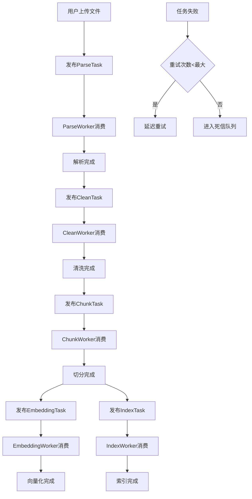

# 第 08 批 - 异步队列

## 基本信息


| 项目   | 内容                           |
| ---- | ---------------------------- |
| 批次编号 | 08                           |
| 批次名称 | 异步队列                         |
| 依赖批次 | 03-解析服务, 04-清洗与切分, 05-向量化与存储 |
| 预计工时 | 8 小时                         |
| 执行日期 | 2026-05-23                   |


---

## 一、批次概述

### 1.1 目标

本批次实现 RAG 知识库系统的异步消息队列功能，包括：

1. **QueueConsumer 消息消费者基类** - 提供通用消费者功能
2. **各 Worker 实现** - ParseWorker、CleanWorker、ChunkWorker、EmbeddingWorker、IndexWorker
3. **消息发布与消费** - 通过 RabbitMQ 实现任务分发
4. **重试机制和死信队列** - 保证任务可靠性和错误处理

### 1.2 队列设计

```
┌─────────────────────────────────────────────────────────────────┐
│                        RabbitMQ                                  │
├─────────────────────────────────────────────────────────────────┤
│                                                                  │
│   ┌──────────────┐     ┌──────────────┐     ┌──────────────┐   │
│   │  rag_exchange │────▶│ parse_queue  │     │ clean_queue  │   │
│   │  (topic)      │     └──────────────┘     └──────────────┘   │
│   │               │────▶│ chunk_queue  │────▶│ embedding    │   │
│   │               │     └──────────────┘     │ _queue       │   │
│   │               │────▶│ index_queue  │     └──────────────┘   │
│   │               │     └──────────────┘                        │
│   └───────────────┼────────────────────────────────────────────┘│
│                    │                                             │
│                    ▼                                             │
│              ┌──────────────┐                                    │
│              │  rag_dlx     │                                    │
│              │  _exchange   │                                    │
│              │  (direct)    │────▶ rag_dlx_queue                │
│              └──────────────┘                                    │
└─────────────────────────────────────────────────────────────────┘
```

### 1.3 消息流转




---

## 二、详细设计

### 2.1 队列配置


| 队列名称                | 路由键             | 说明      |
| ------------------- | --------------- | ------- |
| rag_parse_queue     | rag.parse.#     | 解析任务队列  |
| rag_clean_queue     | rag.clean.#     | 清洗任务队列  |
| rag_chunk_queue     | rag.chunk.#     | 切分任务队列  |
| rag_embedding_queue | rag.embedding.# | 向量化任务队列 |
| rag_index_queue     | rag.index.#     | 索引任务队列  |
| rag_dlx_queue       | dlx             | 死信队列    |


### 2.2 消息格式

```json
{
  "task_id": "uuid-string",
  "task_type": "parse|clean|chunk|embedding|index",
  "document_id": 123,
  "version_id": 456,
  "priority": 5,
  "retry_count": 0,
  "max_retry": 3,
  "created_at": "2026-05-23T12:00:00",
  "payload": {}
}
```

### 2.3 核心组件

#### QueueConsumer 基类

```python
class QueueConsumer(ABC):
    """队列消息消费者基类"""
    
    def process_message(self, message: Dict[str, Any]) -> bool:
        """处理消息的核心方法，子类必须实现"""
        pass
    
    def get_routing_key(self) -> str:
        """获取监听的路由键"""
        pass
```

#### Worker 实现


| Worker          | 队列                  | 功能    |
| --------------- | ------------------- | ----- |
| ParseWorker     | rag_parse_queue     | 文档解析  |
| CleanWorker     | rag_clean_queue     | 文档清洗  |
| ChunkWorker     | rag_chunk_queue     | 文档切分  |
| EmbeddingWorker | rag_embedding_queue | 向量化   |
| IndexWorker     | rag_index_queue     | 关键词索引 |


### 2.4 重试机制

- 默认最大重试次数：3
- 重试延迟：5秒（可配置）
- 超过最大重试次数后进入死信队列

### 2.5 死信队列

- 交换机：`rag_dlx_exchange`（direct类型）
- 队列：`rag_dlx_queue`
- 消息包含：原始消息、错误类型、错误堆栈、失败时间

---

## 三、修改文件清单

### 3.1 新增文件


| 文件路径                                         | 说明           |
| -------------------------------------------- | ------------ |
| `backend/src/app/schemas/queue.py`           | 队列消息Schema定义 |
| `backend/src/app/services/queue_consumer.py` | 消息消费者基类和发布器  |
| `backend/src/app/services/workers.py`        | 各Worker实现    |
| `backend/src/app/services/run_worker.py`     | Worker启动脚本   |
| `backend/src/app/api/v1/queue.py`            | 队列管理API接口    |
| `backend/tests/test_queue.py`                | 队列服务测试       |


### 3.2 修改文件


| 文件路径                                      | 修改内容                 |
| ----------------------------------------- | -------------------- |
| `backend/src/app/schemas/__init__.py`     | 导出队列Schema           |
| `backend/src/app/services/__init__.py`    | 导出队列服务和Worker        |
| `backend/src/app/api/v1/__init__.py`      | 注册队列路由               |
| `backend/src/core/config.py`              | 添加死信队列配置模型           |
| `backend/resources/application-local.yml` | 添加index_queue和死信队列配置 |


---

## 四、新增能力说明

### 4.1 队列管理能力


| 能力   | 说明                                      | 状态  |
| ---- | --------------------------------------- | --- |
| 任务发布 | 支持发布parse/clean/chunk/embedding/index任务 | 完成  |
| 批量发布 | 支持批量发布任务                                | 完成  |
| 队列查询 | 查询队列列表和统计信息                             | 完成  |
| 死信管理 | 查询和清空死信队列                               | 完成  |


### 4.2 Worker能力


| Worker          | 说明                              | 状态  |
| --------------- | ------------------------------- | --- |
| ParseWorker     | 消费解析队列，执行文档解析，完成后自动发布清洗任务       | 完成  |
| CleanWorker     | 消费清洗队列，执行文档清洗，完成后自动发布切分任务       | 完成  |
| ChunkWorker     | 消费切分队列，执行文档切分，完成后同时发布向量化任务和索引任务 | 完成  |
| EmbeddingWorker | 消费向量化队列，执行文本向量化                 | 完成  |
| IndexWorker     | 消费索引队列，执行关键词索引构建                | 完成  |


### 4.3 可靠性能力


| 能力    | 说明                | 状态  |
| ----- | ----------------- | --- |
| 消息持久化 | 消息持久化到磁盘          | 完成  |
| 消费者确认 | 手动确认机制，处理成功才ACK   | 完成  |
| 自动重试  | 失败任务自动重试          | 完成  |
| 死信队列  | 超过最大重试次数的消息进入死信队列 | 完成  |
| 连接重连  | 连接断开自动重连          | 完成  |


---

## 五、Worker实现说明

### 5.1 ParseWorker

```python
class ParseWorker(QueueConsumer):
    """解析任务Worker"""
    
    def process_message(self, message) -> bool:
        # 1. 解析任务消息
        # 2. 调用ParseService执行解析
        # 3. 解析成功后发布CleanTask
        # 4. 返回处理结果
```

### 5.2 CleanWorker

```python
class CleanWorker(QueueConsumer):
    """清洗任务Worker"""
    
    def process_message(self, message) -> bool:
        # 1. 解析任务消息
        # 2. 调用CleanService执行清洗
        # 3. 清洗成功后发布ChunkTask
        # 4. 返回处理结果
```

### 5.3 ChunkWorker

```python
class ChunkWorker(QueueConsumer):
    """切分任务Worker"""
    
    def process_message(self, message) -> bool:
        # 1. 解析任务消息
        # 2. 调用ChunkService执行切分
        # 3. 切分成功后同时发布EmbeddingTask和IndexTask
        # 4. 返回处理结果
```

### 5.4 EmbeddingWorker

```python
class EmbeddingWorker(QueueConsumer):
    """向量化任务Worker"""
    
    def process_message(self, message) -> bool:
        # 1. 解析任务消息
        # 2. 调用EmbeddingService执行向量化
        # 3. 返回处理结果
```

### 5.5 IndexWorker

```python
class IndexWorker(QueueConsumer):
    """索引任务Worker"""
    
    def process_message(self, message) -> bool:
        # 1. 解析任务消息
        # 2. 调用KeywordIndexService构建索引
        # 3. 返回处理结果
```

---

## 六、API接口

### 6.1 任务发布接口


| 方法   | 路径                                | 说明      |
| ---- | --------------------------------- | ------- |
| POST | `/api/v1/queue/publish/parse`     | 发布解析任务  |
| POST | `/api/v1/queue/publish/clean`     | 发布清洗任务  |
| POST | `/api/v1/queue/publish/chunk`     | 发布切分任务  |
| POST | `/api/v1/queue/publish/embedding` | 发布向量化任务 |
| POST | `/api/v1/queue/publish/index`     | 发布索引任务  |
| POST | `/api/v1/queue/publish/batch`     | 批量发布任务  |


### 6.2 队列管理接口


| 方法     | 路径                                        | 说明     |
| ------ | ----------------------------------------- | ------ |
| GET    | `/api/v1/queue/queues`                    | 获取队列列表 |
| GET    | `/api/v1/queue/queues/{queue_name}/stats` | 获取队列统计 |
| GET    | `/api/v1/queue/dlx/messages`              | 获取死信消息 |
| DELETE | `/api/v1/queue/dlx/messages/{id}`         | 删除死信消息 |
| DELETE | `/api/v1/queue/dlx/messages`              | 清空死信队列 |


---

## 七、验证命令和结果

### 7.1 启动Worker

```bash
# 启动单个Worker
cd D:/work/agentV1/backend
$env:PYTHONPATH = "D:/work/agentV1/backend/src"
python -m app.services.run_worker parse    # 启动解析Worker
python -m app.services.run_worker clean    # 启动清洗Worker
python -m app.services.run_worker chunk    # 启动切分Worker
python -m app.services.run_worker embedding # 启动向量化Worker
python -m app.services.run_worker index    # 启动索引Worker

# 启动所有Worker（多进程）
python -m app.services.run_worker all
```

### 7.2 启动API服务

```bash
cd D:/work/agentV1/backend
$env:PYTHONPATH = "D:/work/agentV1/backend/src"
python -m uvicorn src.main:app --host 127.0.0.1 --port 8011 --reload
```

### 7.3 API验证

```bash
# 获取队列列表
curl -X GET http://localhost:8011/api/v1/queue/queues

# 发布解析任务
curl -X POST http://localhost:8011/api/v1/queue/publish/parse \
  -H "Content-Type: application/json" \
  -d '{
    "document_id": 1,
    "version_id": 1,
    "priority": 5
  }'

# 发布清洗任务
curl -X POST http://localhost:8011/api/v1/queue/publish/clean \
  -H "Content-Type: application/json" \
  -d '{
    "document_id": 1,
    "version_id": 1,
    "priority": 5,
    "element_ids": [1, 2, 3]
  }'

# 发布切分任务
curl -X POST http://localhost:8011/api/v1/queue/publish/chunk \
  -H "Content-Type: application/json" \
  -d '{
    "document_id": 1,
    "version_id": 1,
    "priority": 5
  }'

# 发布向量化任务
curl -X POST http://localhost:8011/api/v1/queue/publish/embedding \
  -H "Content-Type: application/json" \
  -d '{
    "document_id": 1,
    "version_id": 1,
    "priority": 5,
    "chunk_ids": [1, 2, 3],
    "batch_size": 32
  }'

# 发布索引任务
curl -X POST http://localhost:8011/api/v1/queue/publish/index \
  -H "Content-Type: application/json" \
  -d '{
    "document_id": 1,
    "version_id": 1,
    "priority": 5,
    "chunk_ids": [1, 2, 3]
  }'

# 获取队列统计
curl -X GET http://localhost:8011/api/v1/queue/queues/rag_parse_queue/stats
```

### 7.4 运行测试

```bash
cd D:/work/agentV1/backend
$env:PYTHONPATH = "D:/work/agentV1/backend/src"
pytest tests/test_queue.py -v
```

---

## 八、配置说明

### 8.1 RabbitMQ配置

```yaml
rabbitmq:
  host: localhost
  port: 5672
  username: guest
  password: guest
  virtual_host: /
  heartbeat: 60
  connection_timeout: 10
  exchange:
    name: rag_exchange
    type: topic
    durable: true
  queues:
    parse_queue:
      name: rag_parse_queue
      routing_key: rag.parse.#
      durable: true
    clean_queue:
      name: rag_clean_queue
      routing_key: rag.clean.#
      durable: true
    chunk_queue:
      name: rag_chunk_queue
      routing_key: rag.chunk.#
      durable: true
    embedding_queue:
      name: rag_embedding_queue
      routing_key: rag.embedding.#
      durable: true
    index_queue:
      name: rag_index_queue
      routing_key: rag.index.#
      durable: true
  dead_letter:
    exchange: rag_dlx_exchange
    queue: rag_dlx_queue
    routing_key: dlx
    durable: true
```

### 8.2 Worker配置


| 配置项                 | 默认值  | 说明       |
| ------------------- | ---- | -------- |
| prefetch_count      | 5-10 | 预取消息数    |
| max_workers         | 1-2  | 最大工作线程数  |
| enable_retry        | true | 是否启用重试   |
| max_retry           | 3    | 最大重试次数   |
| retry_delay_seconds | 5-10 | 重试延迟（秒）  |
| enable_dlx          | true | 是否启用死信队列 |


---

## 九、版本记录


| 版本    | 日期         | 修改人 | 修改内容 |
| ----- | ---------- | --- | ---- |
| 1.0.0 | 2026-05-23 | 开发者 | 初始版本 |


