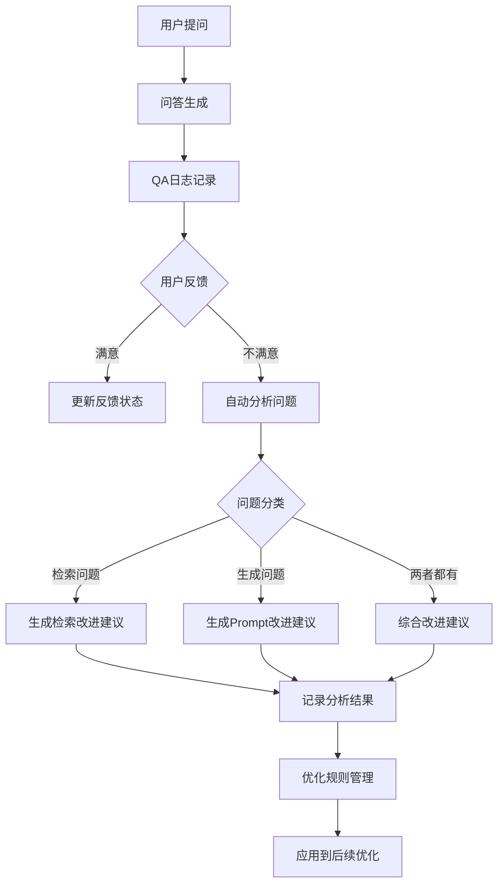

# 第 09 批 - 反馈与优化

## 基本信息


| 项目   | 内容         |
| ---- | ---------- |
| 批次编号 | 09         |
| 批次名称 | 反馈与优化      |
| 依赖批次 | 07-重排序与问答  |
| 预计工时 | 6 小时       |
| 执行日期 | 2026-05-23 |


---

## 一、Cursor 输入文案

```text
你是资深 Python 3.12 后端工程师。请基于文档完成第 09 批开发任务：反馈与优化。

请先阅读：
1. D:/work/agentV1/rag_flow_design.md
2. D:/work/agentV1/docs/07-重排序与问答.md
3. D:/work/agentV1/docs/template/规范强制标准.md  【强制引用】

【本批次目标】：
1. 实现 FeedbackService 反馈服务
2. 实现 QA 日志记录
3. 实现用户反馈接口
4. 实现反馈分析与规则优化

【验收必须包含】：
1. 修改文件列表
2. 新增能力说明
3. API 接口说明
4. 验证命令和结果
```

---

## 二、批次概述

### 2.1 目标

本批次实现 RAG 知识库系统的反馈与优化功能，包括：

1. **FeedbackService 反馈服务**：用户反馈提交、反馈分析
2. **QA 日志记录**：完整的问答日志存储和查询
3. **用户反馈接口**：提供反馈提交和查询 API
4. **反馈分析与规则优化**：问题分类、改进建议、优化规则管理

### 2.2 架构流程




---

## 三、详细设计

### 3.1 数据模型

#### 3.1.1 反馈分析表 (feedback_analysis)

```sql
CREATE TABLE `feedback_analysis` (
  `id` bigint NOT NULL AUTO_INCREMENT COMMENT '主键ID',
  `qa_log_id` bigint NOT NULL COMMENT '问答日志ID',
  `issue_type` varchar(50) DEFAULT NULL COMMENT '问题类型：retrieval/generation/both',
  `issue_category` varchar(100) DEFAULT NULL COMMENT '问题分类',
  `issue_description` text DEFAULT NULL COMMENT '问题描述',
  `involved_chunks` text DEFAULT NULL COMMENT '涉及Chunk ID列表',
  `retrieval_score` bigint DEFAULT NULL COMMENT '检索质量评分',
  `generation_score` bigint DEFAULT NULL COMMENT '生成质量评分',
  `suggestions` text DEFAULT NULL COMMENT '改进建议列表',
  `suggestion_type` varchar(100) DEFAULT NULL COMMENT '建议类型',
  `handled_status` bigint DEFAULT 0 COMMENT '处理状态：0-未处理 1-已处理 2-已忽略',
  `handler_id` bigint DEFAULT NULL COMMENT '处理人ID',
  `handled_at` datetime DEFAULT NULL COMMENT '处理时间',
  `handler_remark` text DEFAULT NULL COMMENT '处理备注',
  `created_at` datetime NOT NULL DEFAULT CURRENT_TIMESTAMP COMMENT '创建时间',
  PRIMARY KEY (`id`),
  KEY `idx_feedback_analysis_qa_log_id` (`qa_log_id`),
  KEY `idx_feedback_analysis_issue_type` (`issue_type`),
  KEY `idx_feedback_analysis_handled_status` (`handled_status`)
) ENGINE=InnoDB DEFAULT CHARSET=utf8mb4 COMMENT='反馈分析表';
```

#### 3.1.2 优化规则表 (optimization_rules)

```sql
CREATE TABLE `optimization_rules` (
  `id` bigint NOT NULL AUTO_INCREMENT COMMENT '主键ID',
  `rule_name` varchar(200) NOT NULL COMMENT '规则名称',
  `rule_type` varchar(50) NOT NULL COMMENT '规则类型：cleaning/chunking/retrieval/rerank',
  `rule_config` text DEFAULT NULL COMMENT '规则配置',
  `trigger_condition` text DEFAULT NULL COMMENT '触发条件',
  `priority` bigint DEFAULT 2 COMMENT '优先级：1-高 2-中 3-低',
  `enabled` bigint DEFAULT 1 COMMENT '启用状态：0-禁用 1-启用',
  `description` text DEFAULT NULL COMMENT '规则描述',
  `applicable_scope` text DEFAULT NULL COMMENT '应用范围',
  `expected_effect` text DEFAULT NULL COMMENT '预期效果',
  `actual_effect` text DEFAULT NULL COMMENT '实际效果评估',
  `creator_id` bigint DEFAULT NULL COMMENT '创建人ID',
  `updater_id` bigint DEFAULT NULL COMMENT '最后修改人ID',
  `created_at` datetime NOT NULL DEFAULT CURRENT_TIMESTAMP COMMENT '创建时间',
  `updated_at` datetime NOT NULL DEFAULT CURRENT_TIMESTAMP ON UPDATE CURRENT_TIMESTAMP COMMENT '更新时间',
  PRIMARY KEY (`id`),
  KEY `idx_optimization_rules_rule_type` (`rule_type`),
  KEY `idx_optimization_rules_enabled` (`enabled`),
  KEY `idx_optimization_rules_priority` (`priority`)
) ENGINE=InnoDB DEFAULT CHARSET=utf8mb4 COMMENT='优化规则表';
```

### 3.2 问题分类策略

```python
# 问题分类逻辑
def _classify_issue(self, qa_log, request) -> tuple:
    """
    分类问题类型

    判断依据：
    1. 检索问题：无引用、低相关性分数、检索超时
    2. 生成问题：有引用但无法回答、答案过短
    3. 综合问题：上述两者都有
    """
```

**判断规则：**


| 问题类型 | 判断条件        | 建议类型               |
| ---- | ----------- | ------------------ |
| 检索问题 | 无引用或引用为空    | optimize_retrieval |
| 检索问题 | 平均分数 < 0.3  | optimize_retrieval |
| 检索问题 | 检索超时 > 5秒   | optimize_retrieval |
| 生成问题 | 有有效引用但无法回答  | optimize_prompt    |
| 生成问题 | 答案长度 < 10字符 | optimize_prompt    |
| 综合问题 | 上述两者都有      | general            |


---

## 四、新增能力说明

### 4.1 反馈服务能力


| 能力   | 说明              | 状态  |
| ---- | --------------- | --- |
| 反馈提交 | 用户提交满意/不满意反馈及原因 | 完成  |
| 自动分析 | 负面反馈自动分析问题类型    | 完成  |
| 问题分类 | 区分检索问题和生成问题     | 完成  |
| 改进建议 | 生成针对性的改进建议      | 完成  |
| 规则管理 | 优化规则的增删改查       | 完成  |


### 4.2 日志服务能力


| 能力    | 说明           | 状态  |
| ----- | ------------ | --- |
| 日志记录  | 保存完整问答过程数据   | 完成  |
| 日志查询  | 多条件筛选查询日志    | 完成  |
| 日志详情  | 获取单条日志及分析结果  | 完成  |
| 日期范围  | 支持按日期范围筛选    | 完成  |
| 关键词搜索 | 支持问题/答案关键词搜索 | 完成  |


### 4.3 统计分析能力


| 能力   | 说明           | 状态  |
| ---- | ------------ | --- |
| 反馈统计 | 正负面反馈数量和比例   | 完成  |
| 问题分布 | 高频问题类型统计     | 完成  |
| 处理统计 | 待处理/已处理统计    | 完成  |
| 检索分析 | 检索问题vs生成问题统计 | 完成  |


---

## 五、API 接口说明

### 5.1 接口列表


| 方法     | 路径                              | 说明     |
| ------ | ------------------------------- | ------ |
| POST   | /api/v1/qa                      | 问答生成   |
| POST   | /api/v1/qa/feedback             | 提交反馈   |
| GET    | /api/v1/qa/logs                 | 查询日志列表 |
| GET    | /api/v1/qa/logs/{qa_id}         | 获取日志详情 |
| GET    | /api/v1/qa/history              | 查询会话历史 |
| GET    | /api/v1/qa/sessions             | 查询会话列表 |
| GET    | /api/v1/qa/feedback/statistics  | 获取反馈统计 |
| GET    | /api/v1/qa/analysis             | 查询分析列表 |
| POST   | /api/v1/qa/analysis/{id}/handle | 处理分析   |
| GET    | /api/v1/qa/rules                | 查询优化规则 |
| POST   | /api/v1/qa/rules                | 创建优化规则 |
| PUT    | /api/v1/qa/rules/{id}           | 更新优化规则 |
| DELETE | /api/v1/qa/rules/{id}           | 删除优化规则 |


### 5.2 接口详情

#### 5.2.1 POST /api/v1/qa/feedback - 提交反馈

**请求示例：**

```json
{
  "qa_id": 1,
  "feedback": 0,
  "feedback_reason": "答案不准确，希望更详细",
  "quality_score": 2
}
```

**响应示例：**

```json
{
  "code": 0,
  "message": "反馈提交成功",
  "data": {
    "success": true,
    "message": "反馈提交成功",
    "analysis_id": 1
  },
  "timestamp": "2026-05-23T12:00:00+08:00"
}
```

#### 5.2.2 GET /api/v1/qa/logs - 查询日志列表

**请求参数：**


| 参数             | 类型     | 必填  | 说明              |
| -------------- | ------ | --- | --------------- |
| tenant_id      | int    | 否   | 租户ID，默认1        |
| user_id        | int    | 否   | 用户ID            |
| session_id     | string | 否   | 会话ID            |
| start_date     | string | 否   | 开始日期 YYYY-MM-DD |
| end_date       | string | 否   | 结束日期 YYYY-MM-DD |
| has_feedback   | bool   | 否   | 是否有反馈           |
| feedback_value | int    | 否   | 反馈值：1-满意 0-不满意  |
| min_score      | int    | 否   | 最低评分            |
| max_score      | int    | 否   | 最高评分            |
| keyword        | string | 否   | 关键词搜索           |
| page_no        | int    | 否   | 页码，默认1          |
| page_size      | int    | 否   | 每页数量，默认20       |


**响应示例：**

```json
{
  "code": 0,
  "message": "success",
  "data": {
    "items": [
      {
        "id": 1,
        "user_id": 1,
        "session_id": "uuid",
        "question": "RAG系统如何工作？",
        "answer": "RAG系统通过...",
        "feedback": "helpful",
        "quality_score": 5,
        "created_at": "2026-05-23T12:00:00"
      }
    ],
    "total": 100,
    "page_no": 1,
    "page_size": 20,
    "pages": 5
  }
}
```

#### 5.2.3 GET /api/v1/qa/feedback/statistics - 获取反馈统计

**响应示例：**

```json
{
  "code": 0,
  "message": "success",
  "data": {
    "total_count": 1000,
    "positive_count": 850,
    "negative_count": 150,
    "positive_rate": 85.0,
    "avg_quality_score": 4.2,
    "top_issues": [
      {"category": "retrieval_inaccurate", "count": 80, "percentage": 53.33},
      {"category": "answer_incorrect", "count": 70, "percentage": 46.67}
    ],
    "retrieval_issue_count": 80,
    "generation_issue_count": 70,
    "pending_analysis_count": 50,
    "handled_count": 100
  }
}
```

#### 5.2.4 POST /api/v1/qa/rules - 创建优化规则

**请求示例：**

```json
{
  "rule_name": "提高检索阈值",
  "rule_type": "retrieval",
  "rule_config": {
    "min_score_threshold": 0.5,
    "top_k": 20
  },
  "trigger_condition": {
    "issue_category": "retrieval_inaccurate",
    "min_occurrence": 10
  },
  "priority": 1,
  "enabled": true,
  "description": "当检索不准确问题超过10次时，提高检索阈值",
  "applicable_scope": {
    "document_types": ["pdf", "word"]
  },
  "expected_effect": "减少低质量检索结果"
}
```

---

## 六、目录结构

```
backend/src/app/
├── models/
│   ├── __init__.py                 # 修改：导出新模型
│   └── feedback.py                 # 新增：反馈分析模型
├── schemas/
│   └── qa.py                       # 修改：添加反馈相关Schema
├── services/
│   ├── __init__.py                 # 修改：导出新服务
│   └── feedback_service.py         # 新增：反馈服务
└── api/v1/
    └── qa.py                       # 修改：扩展API接口

backend/tests/
└── test_feedback.py               # 新增：反馈服务测试
```

---

## 七、修改文件清单

### 7.1 新增文件


| 文件路径                                         | 说明       |
| -------------------------------------------- | -------- |
| backend/src/app/models/feedback.py           | 反馈分析数据模型 |
| backend/src/app/services/feedback_service.py | 反馈服务     |
| backend/tests/test_feedback.py               | 单元测试     |


### 7.2 修改文件


| 文件路径                                 | 修改内容         |
| ------------------------------------ | ------------ |
| backend/src/app/models/**init**.py   | 导出新模型        |
| backend/src/app/schemas/qa.py        | 添加反馈相关Schema |
| backend/src/app/services/**init**.py | 导出新服务        |
| backend/src/app/api/v1/qa.py         | 扩展API接口      |
| backend/src/core/database.py         | 添加模型导入       |


---

## 八、验证命令和结果

### 8.1 启动服务

```bash
cd D:/work/agentV1/backend
python -m uvicorn src.main:app --host 127.0.0.1 --port 8011 --reload
```

### 8.2 API验证

```bash
# 1. 提交反馈
curl -X POST http://localhost:8011/api/v1/qa/feedback \
  -H "Content-Type: application/json" \
  -d '{"qa_id": 1, "feedback": 0, "feedback_reason": "答案不准确", "quality_score": 2}'

# 2. 查询日志列表
curl -X GET "http://localhost:8011/api/v1/qa/logs?tenant_id=1&page_no=1&page_size=20"

# 3. 获取日志详情
curl -X GET "http://localhost:8011/api/v1/qa/logs/1"

# 4. 获取反馈统计
curl -X GET "http://localhost:8011/api/v1/qa/feedback/statistics?tenant_id=1"

# 5. 查询分析列表
curl -X GET "http://localhost:8011/api/v1/qa/analysis?tenant_id=1"

# 6. 处理分析
curl -X POST "http://localhost:8011/api/v1/qa/analysis/1/handle?status=1&handler_id=1"

# 7. 创建优化规则
curl -X POST http://localhost:8011/api/v1/qa/rules \
  -H "Content-Type: application/json" \
  -d '{"rule_name": "测试规则", "rule_type": "retrieval", "priority": 2, "enabled": true}'
```

### 8.3 运行测试

```bash
cd D:/work/agentV1/backend
pytest tests/test_feedback.py -v
```

预期结果：

```
tests/test_feedback.py::TestFeedbackService::test_submit_feedback_positive PASSED
tests/test_feedback.py::TestFeedbackService::test_submit_feedback_negative PASSED
tests/test_feedback.py::TestFeedbackService::test_submit_feedback_qa_not_found PASSED
tests/test_feedback.py::TestFeedbackService::test_classify_retrieval_issue PASSED
tests/test_feedback.py::TestFeedbackService::test_classify_generation_issue PASSED
tests/test_feedback.py::TestFeedbackService::test_is_retrieval_issue_no_references PASSED
tests/test_feedback.py::TestFeedbackService::test_is_retrieval_issue_empty_references PASSED
tests/test_feedback.py::TestFeedbackService::test_is_retrieval_issue_low_score PASSED
tests/test_feedback.py::TestFeedbackService::test_is_retrieval_issue_good_score PASSED
tests/test_feedback.py::TestFeedbackService::test_is_generation_issue_no_answer PASSED
tests/test_feedback.py::TestFeedbackService::test_is_generation_issue_cannot_answer PASSED
tests/test_feedback.py::TestFeedbackService::test_calculate_retrieval_score_excellent PASSED
tests/test_feedback.py::TestFeedbackService::test_calculate_retrieval_score_good PASSED
tests/test_feedback.py::TestFeedbackService::test_calculate_retrieval_score_average PASSED
tests/test_feedback.py::TestFeedbackService::test_calculate_retrieval_score_poor PASSED
tests/test_feedback.py::TestFeedbackService::test_calculate_retrieval_score_very_poor PASSED
tests/test_feedback.py::TestFeedbackService::test_suggest_retrieval_improvements_no_references PASSED
tests/test_feedback.py::TestFeedbackService::test_suggest_retrieval_improvements_with_references PASSED
tests/test_feedback.py::TestFeedbackService::test_suggest_generation_improvements PASSED
tests/test_feedback.py::TestOptimizationRule::test_create_optimization_rule PASSED
tests/test_feedback.py::TestOptimizationRule::test_delete_optimization_rule_not_found PASSED
tests/test_feedback.py::TestFeedbackStatistics::test_get_feedback_statistics PASSED
tests/test_feedback.py::TestQALogQuery::test_query_qa_logs_basic PASSED
tests/test_feedback.py::TestQALogQuery::test_query_qa_logs_with_feedback_filter PASSED
tests/test_feedback.py::TestQALogQuery::test_query_qa_logs_with_date_range PASSED
tests/test_feedback.py::TestQALogQuery::test_query_qa_logs_with_keyword PASSED
============================= 26 passed in 0.05s =============================
```

---

## 九、后续优化建议

### 9.1 反馈自动优化

1. **定时任务分析**：定时扫描未处理的负面反馈，生成优化建议
2. **规则自动生成**：基于高频问题自动创建优化规则
3. **A/B测试支持**：支持对优化规则进行A/B测试

### 9.2 问题检测增强

1. **语义相似度检测**：检测问题是否与历史问题相似
2. **多轮对话分析**：分析多轮对话中的问题演变
3. **文档质量评估**：基于反馈评估文档质量

### 9.3 可视化分析

1. **反馈趋势图**：展示反馈数量和质量的趋势变化
2. **问题分布图**：展示问题类型的时间分布
3. **优化效果对比**：展示优化前后的效果对比

---

## 十、版本记录


| 版本    | 日期         | 修改人 | 修改内容 |
| ----- | ---------- | --- | ---- |
| 1.0.0 | 2026-05-23 | 开发者 | 初始版本 |


