# RAG 知识库流程设计

技术选型：Python 3.12、Qwen3-Embedding、Milvus、MySQL 8.0。

本文基于现有 `rag.md` 和新增需求整理，重点描述从文档导入、解析、切分、存储到混合检索的完整流程。后续开发可以按模块拆分任务、接口和数据表。

## 1. 整体流程

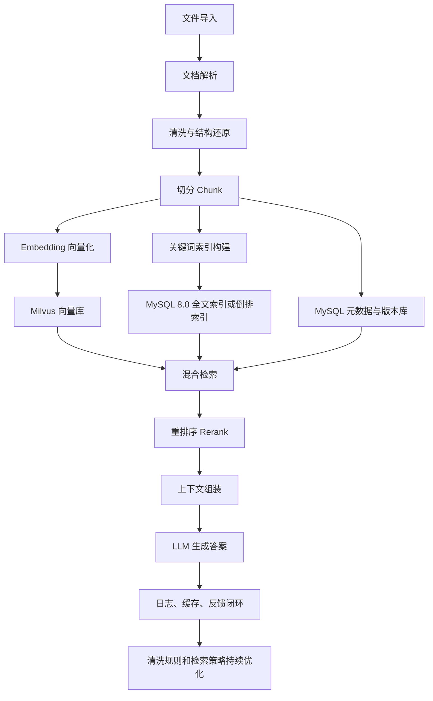


核心原则：

- 有结构文档优先直接解析结构，例如 Word 标题、段落、表格、批注、目录。
- 无结构文档先做页面级拆分、清晰度识别、版面分析和 OCR，再还原阅读顺序。
- 切分策略按文档结构差异动态选择，优先保证语义完整，其次满足 token 约束。
- 检索必须是混合检索：Milvus 向量检索 + MySQL 关键词检索，融合后再重排序。
- 文档版本、清洗规则、解析质量、Chunk 元数据都进入 MySQL，方便回溯和持续优化。

## 2. 导入流程

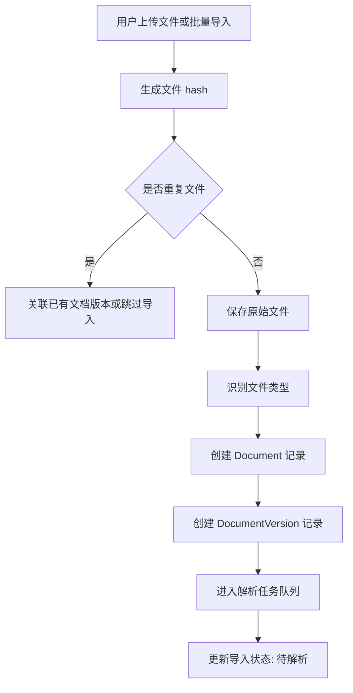


建议保存信息：


| 对象              | 关键字段                                                            |
| --------------- | --------------------------------------------------------------- |
| Document        | document_id、业务归属、文件名、文件类型、当前版本、状态                               |
| DocumentVersion | version_id、document_id、file_hash、storage_path、上传人、上传时间          |
| ImportTask      | task_id、document_id、version_id、status、error_message、retry_count |


## 3. 文件类型识别与解析分流

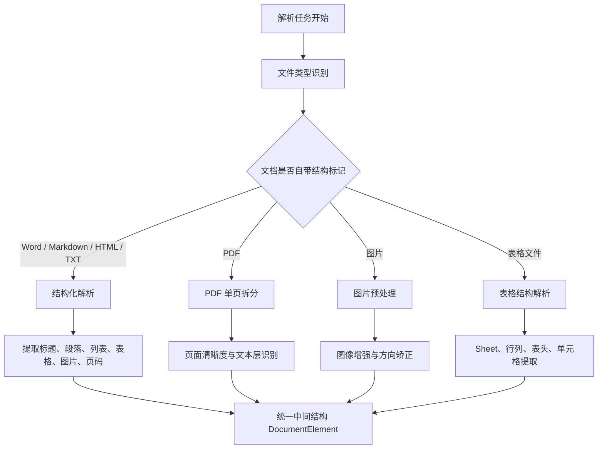


统一中间结构建议：


| 字段                       | 说明                                                   |
| ------------------------ | ---------------------------------------------------- |
| element_id               | 元素唯一 ID                                              |
| document_id / version_id | 文档和版本                                                |
| page_no                  | 页码，Word 可为空或按导出页码计算                                  |
| element_type             | title、paragraph、table、image、chart、list、header、footer |
| text                     | 识别后的文本                                               |
| bbox                     | 页面坐标，用于版面还原                                          |
| reading_order            | 阅读顺序                                                 |
| confidence               | OCR 或结构识别置信度                                         |
| parent_path              | 标题层级路径                                               |


## 4. Word 等有标记文档解析流程

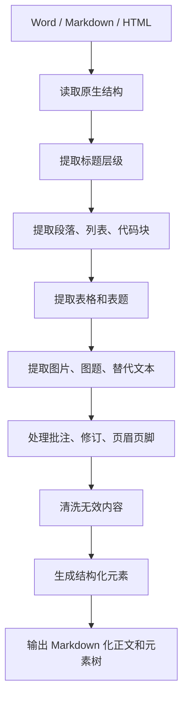


处理建议：

- Word 文档如果有标题样式，优先用标题样式构建 `title_path`。
- 表格保留表头、合并单元格关系和表格标题。
- 图片如果存在题注或前后说明，需要和图片元素建立关联。
- 批注、修订、页眉页脚是否保留由清洗规则控制。

## 5. PDF 与图片无标记文档解析流程

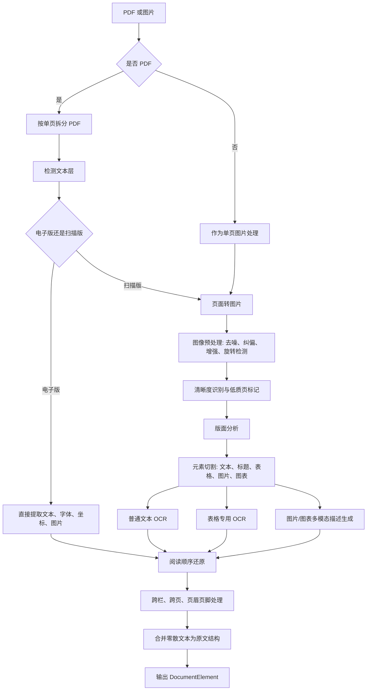


关键补充：

- 清晰度识别：按 DPI、模糊度、倾斜角、噪声、文字高度判断 OCR 风险。
- 电子版 PDF：优先使用文本层和坐标，避免 OCR 引入错误。
- 扫描版 PDF：重点关注 OCR 效果，低置信度页面进入人工复核或二次 OCR。
- 版面分析：支持单栏、双栏、混合栏、跨页表格、页眉页脚、脚注、图片题注。
- 表格和图片使用专用 OCR 或视觉模型，提升复杂区域识别精度。

## 5.1 图片多模态描述生成

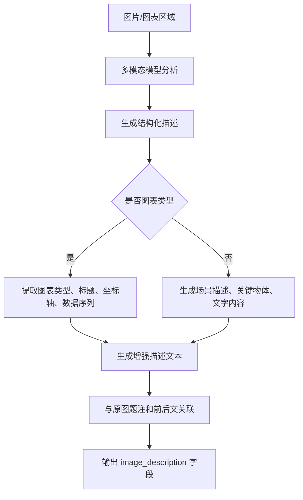


图片描述增强建议：


| 字段                 | 说明                   |
| ------------------ | -------------------- |
| description        | 多模态模型生成的场景/内容描述      |
| chart_type         | 图表类型：折线图、柱状图、饼图、流程图等 |
| chart_data_summary | 图表数据摘要（关键数据点、趋势）     |
| alt_text           | 替代文本（如果原图有）          |
| semantic_tags      | 语义标签：人物、产品、场景等       |


多模态模型选型建议：

- 通用图片：Qwen-VL、GPT-4V、Claude Vision
- 图表理解：专用图表解析模型或带图表理解的通用模型
- 输出格式：结构化 JSON，便于后续检索和引用

## 6. 版面分析与结构还原流程

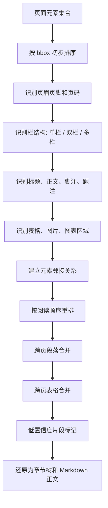


输出要求：

- 每个元素保留 `page_no`、`bbox`、`confidence`，便于引用原文位置。
- 跨页合并要保留来源页范围，例如 `page_start`、`page_end`。
- 低置信度 OCR 内容不要静默入库，应标记并可按业务配置决定是否参与检索。

## 7. 清洗规则流程

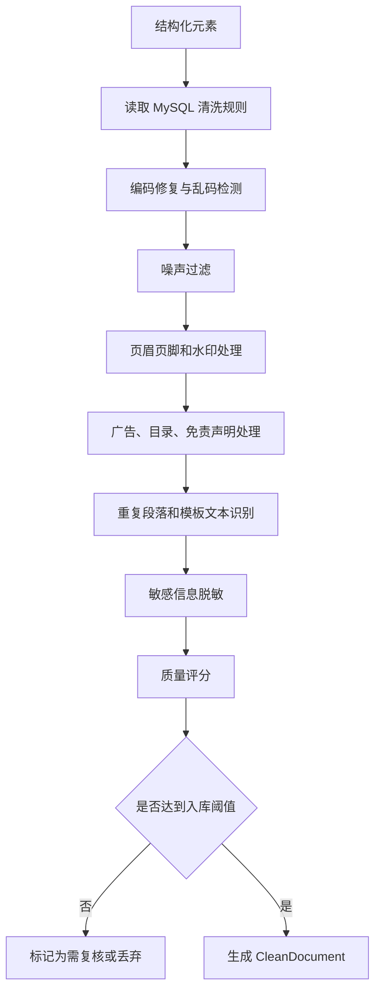


清洗规则建议放在 MySQL：


| 表                     | 说明                       |
| --------------------- | ------------------------ |
| cleaning_rule         | 规则名称、规则类型、正则或配置、启停状态、优先级 |
| cleaning_rule_scope   | 适用业务、文档类型、文件来源           |
| cleaning_rule_version | 规则版本、变更人、变更说明            |
| cleaning_log          | 命中规则、处理前后摘要、处理时间         |


规则类型示例：

- 正则删除：页眉、页脚、固定免责声明。
- 正则替换：空白归一化、异常符号修复。
- 结构删除：目录页、封面页、空白页。
- 质量控制：OCR 置信度低于阈值、乱码比例超过阈值。
- 脱敏规则：手机号、身份证号、邮箱、客户编号。

## 8. 切分总流程

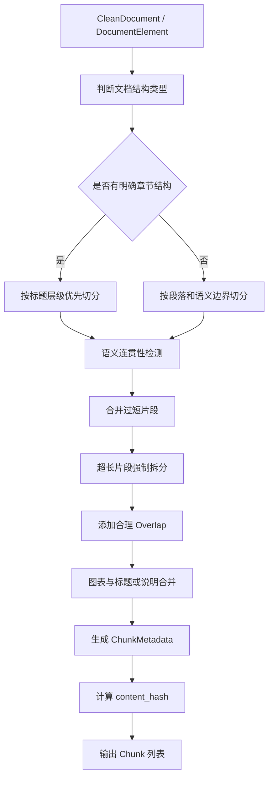


推荐默认参数：


| 参数                 | 建议值    | 说明          |
| ------------------ | ------ | ----------- |
| target_tokens      | 600    | 常规文本目标长度    |
| max_tokens         | 900    | 超过后强制拆分     |
| min_tokens         | 120    | 过短片段尽量向前后合并 |
| overlap_tokens     | 80-120 | 兜底保留上下文     |
| semantic_threshold | 按验证集调参 | 句间语义断点阈值    |


## 9. 不同结构的切片策略

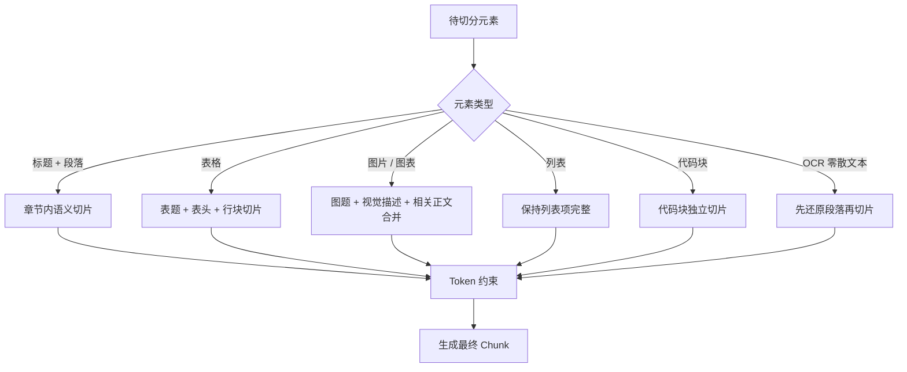


策略补充：

- 语义切片：用模型判断句子间语义连贯性，在主题变化处切断。
- 重叠机制：Overlap 是信息完整性的兜底，不应替代合理的语义边界。
- 图表重要场景：图表标题、图表 OCR 内容、图表前后说明应合并为同一 Chunk 或建立强关联。
- 表格切片：长表按行块拆分，每个块保留表头、表名、章节路径。
- **长表格跨页处理**：跨页表格切片时可能丢失上下文，每个表格 Chunk 必须包含 `table_summary` 字段，描述表格整体内容和目的。
- OCR 文本：先按阅读顺序还原段落，再参与语义切分。

## 9.1 表格处理增强

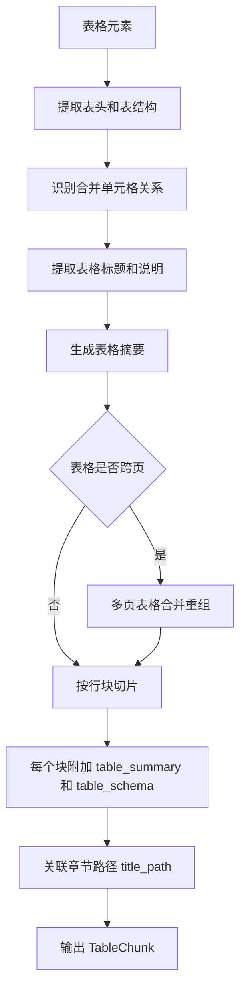


表格摘要字段建议：


| 字段             | 说明                         |
| -------------- | -------------------------- |
| table_summary  | 表格整体内容摘要，1-3 句话描述表格目的和关键数据 |
| table_schema   | 表结构描述：列名、数据类型、含义           |
| table_caption  | 原始表题                       |
| row_count      | 总行数                        |
| is_merged      | 是否包含合并单元格                  |
| spanning_pages | 跨页范围（如果有）                  |


摘要生成策略：

- 使用 LLM 提取表格核心信息：统计了哪些指标、对比了哪些维度
- 每个切片块都附加全局摘要，保证局部内容不丢失全局上下文
- 检索时可通过 table_summary 快速匹配用户查询意图

## 10. 存储流程

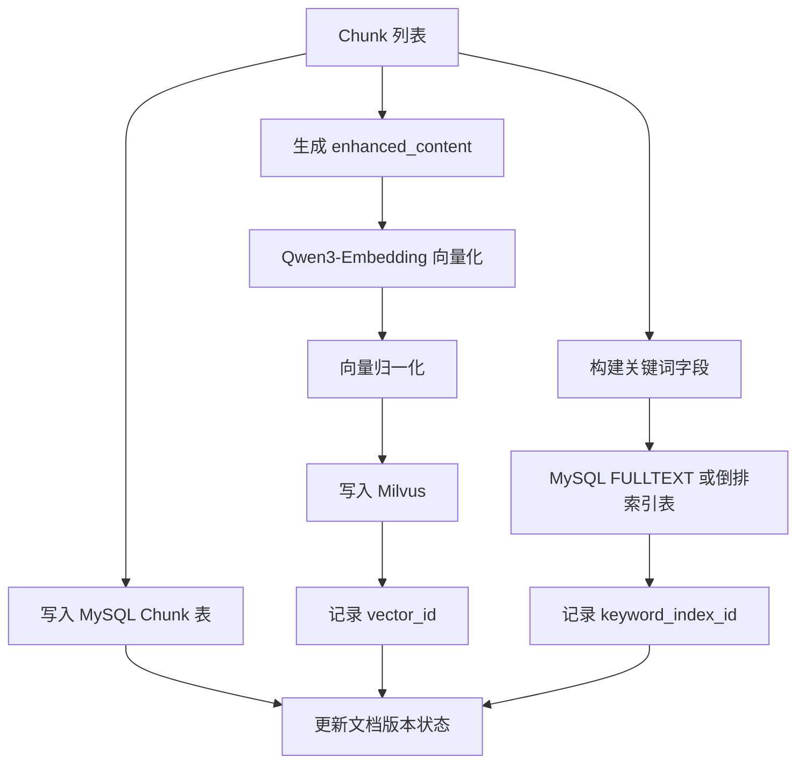


Milvus 建议字段：


| 字段                    | 说明                          |
| --------------------- | --------------------------- |
| vector_id             | 向量 ID                       |
| embedding             | Qwen3-Embedding 向量          |
| document_id           | 文档 ID                       |
| version_id            | 文档版本                        |
| chunk_id              | Chunk ID                    |
| title_path            | 标题路径                        |
| page_start / page_end | 页码范围                        |
| block_type            | paragraph、table、image、chart |
| source_type           | local、ai_generated          |


MySQL 建议表：


| 表                   | 说明                         |
| ------------------- | -------------------------- |
| documents           | 文档主表                       |
| document_versions   | 文档版本表                      |
| document_elements   | 解析元素表，可选保留                 |
| document_chunks     | Chunk 原文、增强文本、hash、页码、标题路径 |
| chunk_keyword_index | 关键词倒排索引，可替代或补充 FULLTEXT    |
| cleaning_rule       | 清洗规则                       |
| parse_quality_log   | 解析质量与 OCR 置信度              |
| qa_logs             | 问答日志和引用来源                  |


关键词检索实现建议：

- 简化方案：MySQL 8.0 `FULLTEXT` + `ngram` parser，对 `title_path`、`content`、`keywords` 建全文索引。
- 可控方案：维护 `chunk_keyword_index(term, chunk_id, tf, field, position)`，业务可以自定义分词、同义词和权重。

## 10.1 Embedding 缓存层设计

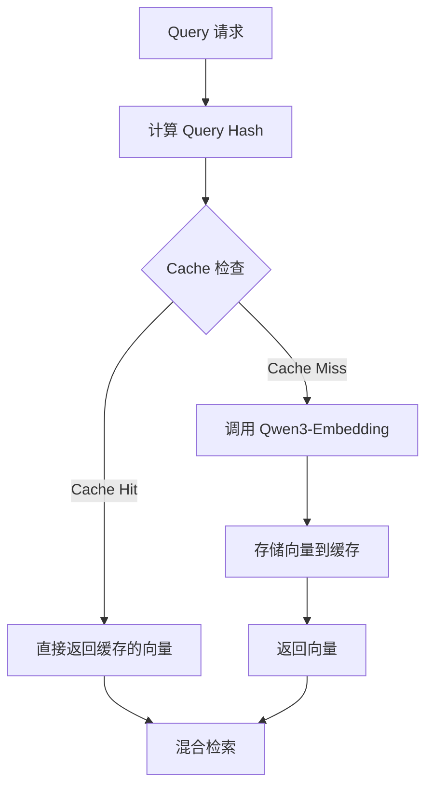


缓存策略建议：


| 缓存维度   | 说明                                       |
| ------ | ---------------------------------------- |
| 查询指纹   | 对 Query 文本做标准化（去停用词、统一大小写）后计算 MD5/SHA256 |
| TTL 设置 | 根据业务查询分布设置，例如 24 小时或 7 天                 |
| 缓存预热   | 对高频 Query 批量预计算 Embedding                |
| 冷热分层   | Redis 热数据 + MySQL/文件冷数据                  |


缓存命中优化：

```python
# Query 标准化示例
def normalize_query(query: str) -> str:
    # 去除多余空格、标点归一化、停用词过滤
    query = re.sub(r'\s+', ' ', query)
    query = query.lower().strip()
    return query
```

缓存层选型建议：


| 方案            | 适用场景      | 优点          | 缺点            |
| ------------- | --------- | ----------- | ------------- |
| Redis Cluster | 高并发、低延迟要求 | 毫秒级响应、支持分布式 | 成本较高、数据量受内存限制 |
| Redis + MySQL | 中等规模、需持久化 | 冷热分层、成本可控   | 架构稍复杂         |
| 本地内存 + Redis  | 单机或小规模集群  | 简单、无网络开销    | 扩展性差          |


缓存失效策略：

- 文档更新时：清除相关 Query 缓存或使用版本号控制
- 定期全量刷新：防止 Embedding 模型更新导致的不一致
- LRU 淘汰：控制缓存大小，防止内存溢出

## 11. 查询改写流程

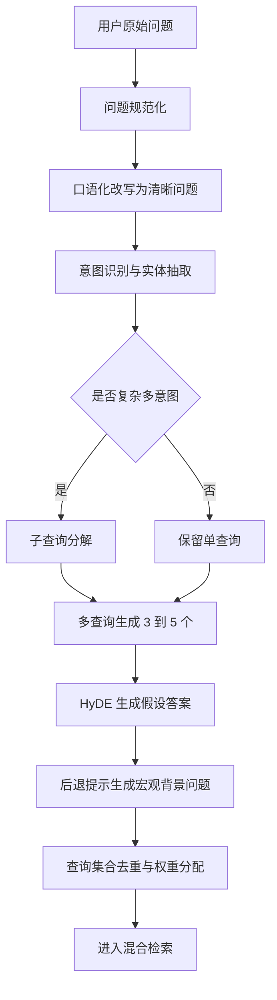


查询增强策略：

- 查询重写：把口语化、含糊问题改成清晰检索表达。
- 多查询生成：一个问题扩展为 3 到 5 个相似问题，提升召回覆盖。
- 子查询分解：复杂问题按多个意图分别检索，然后合并证据。
- HyDE：先让大模型生成假设答案，再用假设答案向量检索。
- 后退提示：把具体问题抽象为宏观背景问题，先检索背景再回答原问题。

## 12. 混合检索流程

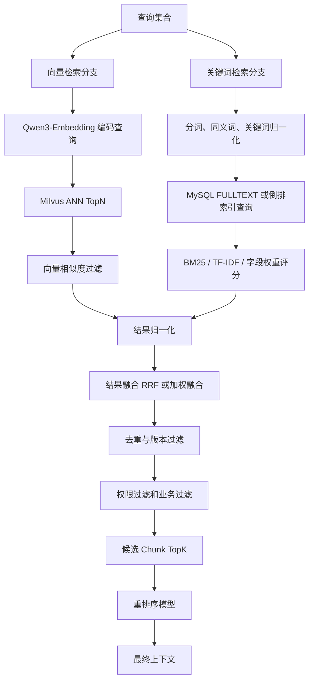


融合建议：


| 阶段    | 建议                                             |
| ----- | ---------------------------------------------- |
| 向量召回  | Milvus Top 50-100，适合语义相似问题                     |
| 关键词召回 | MySQL Top 50-100，适合专有名词、编号、精确短语                |
| 分数归一化 | 将 cosine、BM25 等不同分数转成统一区间                      |
| 结果融合  | 优先用 RRF，也可按业务配置 `0.6 * vector + 0.4 * keyword` |
| 过滤    | 文档版本、权限、业务线、时间范围、OCR 质量                        |
| 重排序   | 对融合候选做 Cross-Encoder Rerank，输出最终 TopK          |


## 13. 重排序与上下文组装流程

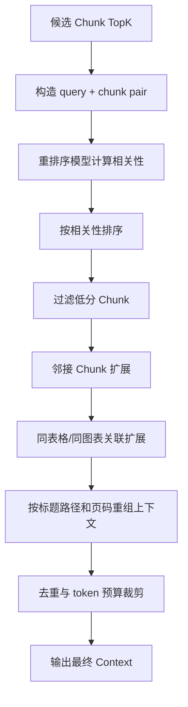


上下文组装要求：

- 保留来源引用：文件名、版本、页码、标题路径、chunk_id。
- 表格和图表内容要完整，不要只取到半张表或只有图题。
- 如果多个 Chunk 来自同一章节，按原文顺序拼接。
- 根据 token 预算动态裁剪，优先保留重排序分高、来源质量高、版本新的证据。

## 14. 回答生成与反馈闭环

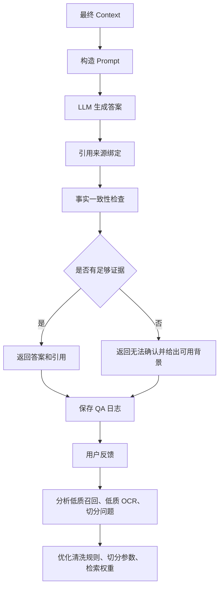


## 15. 文档版本管理流程

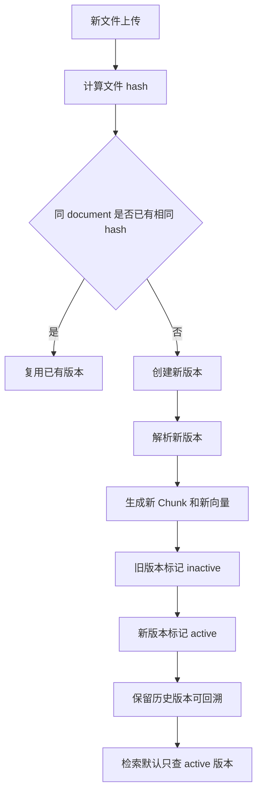


版本策略：

- 每次文件内容变化创建新 `version_id`。
- Milvus 和 MySQL Chunk 都带 `version_id`。
- 默认检索当前 active 版本，历史问答日志保留当时引用的版本。
- 旧版本向量可以软删除，定期物理清理。

## 16. 异常与质量控制流程

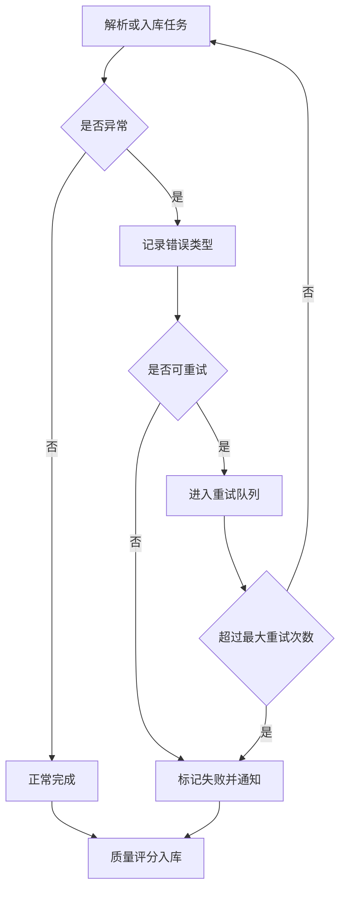


质量指标：


| 指标                     | 说明             |
| ---------------------- | -------------- |
| parse_success_rate     | 文档解析成功率        |
| ocr_confidence_avg     | OCR 平均置信度      |
| low_quality_page_count | 低质页面数量         |
| chunk_count            | 切分数量           |
| avg_chunk_tokens       | 平均 Chunk token |
| retrieval_hit_rate     | 检索命中率          |
| no_answer_rate         | 无法回答比例         |


## 16.1 异步队列与消息中间件设计

当前设计中隐含了队列概念，但未明确消息中间件。以下补充 RabbitMQ 作为异步队列的完整设计：

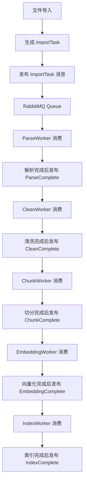


RabbitMQ 配置建议：


| 配置项    | 建议值                                                         |
| ------ | ----------------------------------------------------------- |
| 交换机类型  | topic-exchange，支持多消费者                                       |
| 消息持久化  | durable=true，持久化到磁盘                                         |
| 队列配置   | 按任务类型分区：parse_queue、clean_queue、chunk_queue、embedding_queue |
| 消费者数量  | 根据任务类型配置：解析密集型可多配 Worker                                    |
| 消息 TTL | 根据任务紧急程度设置，避免积压任务过期                                         |
| 死信队列   | 失败消息进入 DLX，记录错误信息供排查                                        |


消息格式建议：

```json
{
  "task_id": "uuid",
  "task_type": "parse|clean|chunk|embedding|index",
  "document_id": "uuid",
  "version_id": "uuid",
  "priority": 1-5,
  "retry_count": 0,
  "created_at": "timestamp",
  "payload": {
    "file_path": "/path/to/file",
    "config": {}
  }
}
```

队列消费策略：


| 策略    | 说明                     |
| ----- | ---------------------- |
| 优先级队列 | 高优先级任务（用户主动刷新）优先处理     |
| 限流控制  | 避免瞬时任务高峰压垮下游服务         |
| 幂等处理  | 消息重复消费时检查任务状态，防止重复处理   |
| 失败重试  | 可重试错误（网络超时）自动重试，最大 N 次 |
| 人工介入  | 不可重试错误（解析失败）标记并通知      |


多租户队列隔离：

- 按业务线或租户创建独立的 VHost
- 不同租户的队列物理隔离，互不影响
- 监控各租户队列积压情况，及时告警

## 17. 推荐开发模块拆分

```mermaid
flowchart LR
    A[ImportService] --> B[ParseService]
    B --> C[CleanService]
    C --> D[ChunkService]
    D --> E[EmbeddingService]
    D --> F[KeywordIndexService]
    E --> G[MilvusRepository]
    F --> H[MySQLKeywordRepository]
    D --> I[DocumentRepository]
    G --> J[RetrievalService]
    H --> J
    J --> K[RerankService]
    K --> L[QAService]
    L --> M[FeedbackService]
    M --> C
    M --> J
    N[QueueConsumer] --> B
    N --> C
    N --> D
    N --> E
    N --> F
    O[CacheService] -.-> J
```


新增服务说明：


| 服务            | 职责                              |
| ------------- | ------------------------------- |
| QueueConsumer | RabbitMQ 消费者，统一管理各 Worker 的消息消费 |
| CacheService  | Embedding 缓存管理、Query 指纹计算、缓存读写  |
| VHostManager  | 多租户 VHost 隔离、资源配额管理             |


优先级建议：

1. 先完成文档导入、版本表、基础解析和 Chunk 入库。
2. 再完成 Qwen3-Embedding + Milvus 向量检索。
3. 接着补 MySQL 关键词检索，形成混合检索闭环。
4. 然后强化 PDF / 图片 OCR、版面分析、表格图片专用处理。
5. 加入 RabbitMQ 异步队列，保障任务可靠性和系统解耦。
6. 加入 Embedding 缓存层，减少高频 Query 重复计算。
7. 最后加入查询改写、多查询、HyDE、后退提示、反馈优化。

